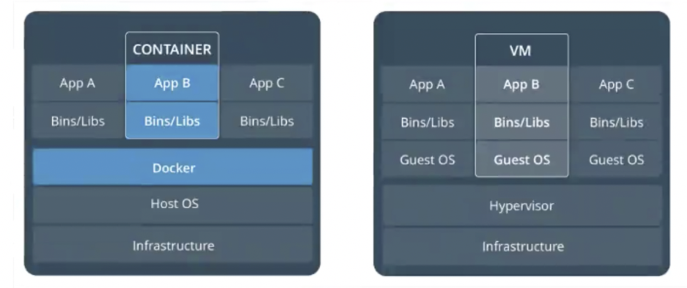
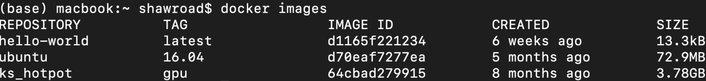
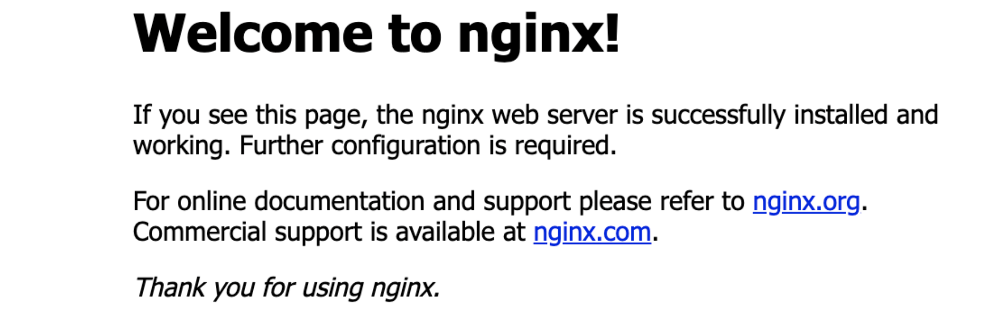

- [Docker容器化技术介绍](#docker容器化技术介绍)
- [Docker中涉及的概念](#docker中涉及的概念)
- [Docker命令](#docker命令)
  - [拉取镜像](#拉取镜像)
  - [查看本地的所有镜像](#查看本地的所有镜像)
  - [查看所有运行的容器](#查看所有运行的容器)
  - [删除一个镜像](#删除一个镜像)
  - [删除一个容器](#删除一个容器)
  - [启动一个容器](#启动一个容器)
  - [将当前容器保存成镜像](#将当前容器保存成镜像)
  - [停止一个容器的运行](#停止一个容器的运行)
  - [给运行的容器指定名字](#给运行的容器指定名字)
  - [将宿主机中的文件传入容器内](#将宿主机中的文件传入容器内)
  - [docker中重启之前的某个容器](#docker中重启之前的某个容器)
- [Docker运行mysql以及jdk](#docker运行mysql以及jdk)
  - [docker中安装mysql](#docker中安装mysql)
  - [Docker中安装jdk](#docker中安装jdk)
- [docker中启动tomcat和nginx](#docker中启动tomcat和nginx)
  - [安装tomcat并启动](#安装tomcat并启动)
  - [安装nginx并启动](#安装nginx并启动)
- [数据卷](#数据卷)
  - [数据卷的简单使用](#数据卷的简单使用)
  - [数据卷实现mysql数据的持久化](#数据卷实现mysql数据的持久化)
- [DockerFile的使用](#dockerfile的使用)
  - [DockerFile基础概念](#dockerfile基础概念)
  - [DockerFile指令(ADD、COPY、ENV、RUN)](#dockerfile指令addcopyenvrun)
  - [DockerFile指令(WORKDIR)](#dockerfile指令workdir)
  - [DockerFile指令(EXPOSE)](#dockerfile指令expose)
  - [DockerFile指令(ENTRYPOINT、CMD)](#dockerfile指令entrypointcmd)
    - [CMD](#cmd)
    - [ENTRYPOINT](#entrypoint)
  - [使用DockerFile来构建SpringBoot](#使用dockerfile来构建springboot)

# Docker容器化技术介绍

&nbsp;&nbsp;&nbsp;&nbsp;&nbsp;&nbsp;&nbsp;Docker的slogan为: Debug your app, not your environment. 这句话完美的诠释了docker要为用户解决的问题。   
&nbsp;&nbsp;&nbsp;&nbsp;&nbsp;&nbsp;&nbsp;接下来对比一下容器化技术和虚拟机技术，如下图所示:



上图中infrastructure为硬件设备。可以看出VM需要多个独立的Guest OS。是对硬件资源的浪费。而容器化技术只需要一层Docker。

# Docker中涉及的概念
&nbsp;&nbsp;&nbsp;&nbsp;&nbsp;&nbsp;&nbsp;镜像：是一个文件的副本，可以被特定的软件(硬件)识别。是一个静态的概念。  
&nbsp;&nbsp;&nbsp;&nbsp;&nbsp;&nbsp;&nbsp;容器：是一个动态的概念。  
&nbsp;&nbsp;&nbsp;&nbsp;&nbsp;&nbsp;&nbsp;镜像和容器的区别可以类比为系统安装中的ISO文件和操作系统的区别。ISO文件是一个静态的东西，我们可以通过ISO去安装一个操作系统，一个运行的操作系统可以理解为是一个容器。

# Docker命令
## 拉取镜像
```shell
docker pull hello-world:tag
```
注意: 在拉取镜像的时候，尽量指定对应的tag，若不指定，则tag默认为latest
## 查看本地的所有镜像
```shell
docker images
```
结果为:




## 查看所有运行的容器
```shell
docker ps   # 查看正在运行的容器
docker ps -a  # 查看正在运行或者运行过的所有容器
```
## 删除一个镜像
```shell
docker rmi hello-world   
```
这里必须先通过docker ps -a 查看一下还有没有容器依赖这个镜像，若有，则删除不了，必须先删除对应的容器。

## 删除一个容器
```shell
docker rm 1524a4391831 
```
后面是容器对应的ID

可以通过组合命令快速删除所有运行或者运行过的容器，即: 先查出所有容器的ID，然后删除。
```shell
docker rm $(docker ps -qa)   
```

## 启动一个容器  

首先，拉取一个centos镜像，然后启动。通过docker ps可以发现，centos启动的容器没有在运行。显然，不太正常。这是因为docker认为启动一个容器之后，如果没事可做，就直接kill掉了。为了解决这种问题，提供以下启动方式:
- 方式一: 以一种交互方式启动
```shell
docker run -it centos  # 执行之后，直接进入centos系统之内
```
接着可以通过ctrl+p+q退出，容器还会在运行，但是当前命令行就可以回到宿主机命令行。
如果想再次进入容器内，可以通过以下命令:
```shell
docker exec -it 容器id /bin/bash  # 就可进入容器,然后重新启动一个交互终端
```
- 方式二: 以守护进程的方式在后台运行
```shell
docker run -it -d centos
```
这种方式是在后台运行一个交互终端，可以通过下面命令进入容器内。
```shell
docker exec -it 容器id /bin/bash
```
## 将当前容器保存成镜像
```shell
docker commit 容器id  镜像名:版本号
```

## 停止一个容器的运行  

方式一: 通过stop方式
```shell
docker stop 9c1957eef46e  # 后面为容器的id
```
方式二: 通过kill方式
```shell
docker kill 9c1957eef46e   # 后面为容器id
```
## 给运行的容器指定名字
```shell
docker run --name mycentos centos
```
## 将宿主机中的文件传入容器内

首先在宿主机内随便生成一个文件,然后将其拷贝到对应容器内。

```shell
echo 'I am shawroad' > a.txt   # 首先在宿主机内随便生成一个文件
docker cp ./a.txt 容器id:/   # 将当前的a.txt文件拷贝到容器的根目录下
```

## docker中重启之前的某个容器
重启之前的容器，是根据之前容器的Name.
```shell
docker start vibrant_maxwell
```

# Docker运行mysql以及jdk
## docker中安装mysql
&nbsp;&nbsp;&nbsp;&nbsp;&nbsp;&nbsp;&nbsp;访问https://hub.docker.com/，然后找自己想要的mysql版本。如果不指定，则为最新版。我们这里拉取5.7.28版本，然后运行。
```shell
docker pull mysql:5.7.28   # 拉取mysql镜像
docker run -e MYSQL_ROOT_PASSWORD=123456 -p 3307:3306 mysql:5.7.28   # 运行
```
分析上述的运行命令 -e是环境变量，指定root用户的密码，-p指定端口 也就是将容器内mysql的端口号3306映射到宿主机的3307端口上。可以通过宿主机访问容器内的mysql。  

&nbsp;&nbsp;&nbsp;&nbsp;&nbsp;&nbsp;&nbsp;上述的两条命令就在容器内运行起来mysql，接下来我们通过下面命令进入容器内，然后访问mysql数据库。
```shell
docker -exec -it 容器id /bin/bash   # 以交互的方式进入
mysql -uroot -p    # 访问mysql数据库
```

&nbsp;&nbsp;&nbsp;&nbsp;&nbsp;&nbsp;&nbsp;当然，也可以在宿主机上访问容器内的数据库，可以通过navicat等软件，也可以通过python程序访问，如下代码所示，访问容器里mysql中xiaolu数据库中的student表,注意端口号的映射。
```python
import pymysql


if __name__ == '__main__':
    db = pymysql.connect(host='localhost', user='root', password='xxxxx',
                         port=3307, database='xiaolu')
    cursor = db.cursor()

    # SQL 查询语句
    sql = "SELECT * FROM student"
    try:
        # 执行SQL语句
        cursor.execute(sql)
        # 获取所有记录列表
        results = cursor.fetchall()
        print(results)

    except:
        print("Error: unable to fetch data")

    # 关闭数据库连接
    db.close()
```

## Docker中安装jdk
&nbsp;&nbsp;&nbsp;&nbsp;&nbsp;&nbsp;&nbsp;首先在dockerhub上找个自己想拉取的jdk镜像，然后拉取:
```shell
docker pull mcr.microsoft.com/java/jdk:8u192-zulu-alpine
```
然后通过下述命令可以进入容器内:
```shell
docker run -it mcr.microsoft.com/java/jdk:8u192-zulu-alpine
```
# docker中启动tomcat和nginx

## 安装tomcat并启动
&nbsp;&nbsp;&nbsp;&nbsp;&nbsp;&nbsp;&nbsp;首先，拉取tomcat镜像，然后启动。如下所示:
```shell
docker pull tomcat:8.5.50-jdk8
docker run -p 8080:8080 tomcat:8.5.50-jdk8
```
在宿主机上访问http://127.0.0.1:8080/，将会得到tomcat给的反馈。

## 安装nginx并启动
&nbsp;&nbsp;&nbsp;&nbsp;&nbsp;&nbsp;&nbsp;首先，拉取nginx镜像，然后启动，如下所示:
```shell
docker pull nginx:1.17.7
docker run -p 80:80 nginx:1.17.7
```
在宿主机上访问http://127.0.0.1:80将会看到nginx给我们的反馈，如下所示:



# 数据卷

## 数据卷的简单使用
&nbsp;&nbsp;&nbsp;&nbsp;&nbsp;&nbsp;&nbsp;数据卷的作用: 在之前的mysql案例中，我们在容器内创建了数据库以及对应的表，这些数据都存储在容器内，如果一旦容器被删除了，则这些数据也就丢失了。为了防止这种数据的丢失，引入了数据卷，就是在容器和宿主机之间建立一个通道，当存储数据集，让直接存储到宿主机上。

举例:
```shell
docker run -it -v /mydatas:/container/datas centos
```
其中/mydatas代表宿主机上的目录，/container/datas代表容器内的目录，这两个目录都不需要手动创建，docker会自动生成。如果以后在容器的那个目录(/container/datas)下创建新的东西，则宿主机上对应的目录(/container)也会产生同样的内容。同样，如果在宿主机上那个目录(/container)下创建新的东西，则容器内对应的目录(/container/datas)下也会产生同样的内容。

原理: 其实数据就只有一份。操作的是同样的数据。

## 数据卷实现mysql数据的持久化
&nbsp;&nbsp;&nbsp;&nbsp;&nbsp;&nbsp;&nbsp;首先，查找mysal的数据存放在哪一块，通过浏览docker hub上的说明文档，发现mysql中的数据存在/var/lib/mysql目录下。然后我们启动mysql,命令如下:
```shell
docker run -p 3306:3306 -e MYSQL_ROOT_PASSWORD=123456 -v /mysql/datas:/var/lib/mysql --name my-mysql mysql:5.7.28
```
其中/mysql/datas为宿主机的目录。此时，如果我们在容器内中操作数据库，数据都会保存到宿主机上。即使这个容器被删除，这个数据也不会丢失。  
&nbsp;&nbsp;&nbsp;&nbsp;&nbsp;&nbsp;&nbsp;如果后续我们换了个mysql容器，我们就可以将宿主机上的那个目录和新容器存数据的目录建立连接(数据卷)。最后，就可以在新容器内看到之前的数据了。

# DockerFile的使用
## DockerFile基础概念
DockerFile:是镜像的描述文件，描述了我们的镜像是怎么一步步构成的。

DockerFile中常见的关键字: 
- FROM: 我们构建的镜像基于哪个镜像来的
- MAINTAINER: 定义作者是谁
- ADD: 拷贝文件并解压
- COPY: 拷贝，注意只是拷贝
- RUN: 运行shell命令
- ENV: 定义环境变量
- CMD: 在启动容器的时候，执行的命令
- WORKDIR: 进入容器之后的落脚点
- EXPOSE: 容器对外保留的端口
- ENTRYPOINT: 在启动容器的时候，执行的命令

简单实现一个Dockerfile 

&nbsp;&nbsp;&nbsp;&nbsp;&nbsp;&nbsp;&nbsp;首先建立一个文件夹my_dockerfile，这里面将存我们建立镜像需要的所有资源，然后在该文件夹下创建一个名为Dockerfile的文件，这个名字是不能随便乱改的，接下来在该文件中写入:
```shell
FROM centos:latest             # 基于centos镜像
MAINTAINER luxiaonlp@163.com   # 作者
COPY ./a.txt /                 # 将当前目录下的a文件拷贝到我们新创建的镜像的根目录下
CMD ['/bin/bash']              # 启动命令行
```
接下来，在当前目录下，执行命令:
```shell
docker build -t mycentos1:v1.0 .
```
注意，上述命令中最后的那个点不能省略，代表的是当前的上下文。

此时，我们的镜像就构造好了，可以通过docker images看到我们的镜像。接着启动:
```shell
docker run -it mycentos1:v1.0 /bin/bash
```
## DockerFile指令(ADD、COPY、ENV、RUN)
&nbsp;&nbsp;&nbsp;&nbsp;&nbsp;&nbsp;&nbsp;实现一个带有java环境的镜像。主要分三步: (1)将jdk拷贝到镜像中；(2) 解压该镜像；（3）配置环境变量。最后的DockerFile文件的内容为:
```shell
FROM centos:latest
MAINTAINER luxiaonlp@163.com
COPY ./jdk-8u60-linux-x64.tar.gz /   # 拷贝
RUN tar -zxf /jdk-8u60-linux-x64.tar.gz   # 解压
ENV JAVA_HOME=jdk1.8.9_60
ENV PATH=$JAVA_HOME/bin:$PATH
CMD ['/bin/bash']
```
可以通过ADD 合并上述的COPY和RUN命令。即删除那两行，直接改为
```shell
ADD ./jdk-8u60-linux-x64.tar.gz /
```
## DockerFile指令(WORKDIR)
```shell
FROM centos:latest
MAINTAINER luxiaonlp@163.com
WORKDIR /datas/   # 创建了一个当前工作目录
ADD ./jdk-8u60-linux-x64.tar.gz ./   # 将jdk的压缩包拷贝并解压当前工作目录中
ENV JAVA_HOME=/datas/jdk1.8.9_60
ENV PATH=$JAVA_HOME/bin:$PATH
CMD ['/bin/bash']
```
除了上述创建一个目录，让后续的操作都在这个目录中进行外，还有一点就是: 这样创建的镜像，如果进入该镜像所对应的容器中时，直接进入的是当前的工作目录。

## DockerFile指令(EXPOSE)
&nbsp;&nbsp;&nbsp;&nbsp;&nbsp;&nbsp;&nbsp;假设我们镜像中包含了tomcat,这样外界还是不能直接访问的，必须将对应容器的8080端口(tomcat的默认端口号)保留出来，然后和宿主机的8080端口实现映射，这个容器内的tomcat才能被访问到。另外，tomcat的运行依赖于java,所以当前镜像中还应该有java环境。因此，Dockerfile文件可以写成:
```shell
FROM centos:latest
MAINTAINER luxiaonlp@163.com
WORKDIR /datas/   # 创建了一个当前工作目录
ADD ./jdk-8u60-linux-x64.tar.gz ./   # 将jdk的压缩包拷贝并解压当前工作目录中
ENV JAVA_HOME=/datas/jdk1.8.9_60
ENV PATH=$JAVA_HOME/bin:$PATH
ADD ./apache-tomcat-8.5.57.tar.gz ./
EXPOSE 8080    # 暴露端口8080
CMD ['./apache-tomcat-8.5.57/bin/catalina.sh', 'run']   # 指定执行命令
```

## DockerFile指令(ENTRYPOINT、CMD)
### CMD
CMD中的命令是容器启动以后，才会执行的。如下面的Dockerfile文件:
```shell
FROM centos:latest
MAINTAINER luxiaonlp@163.com
CMD ["ls", "/"]   # 注意 里面的命令尽量用双引号
```
CMD需要注意的一点: 无论你有多少个CMD,都只执行最后一个CMD。如下面的Dockerfile文件:
```shell
FROM centos:latest
MAINTAINER luxiaonlp@163.com
CMD ["ls", "/"]   # 注意 里面的命令尽量用双引号
CMD ["ls", "/root"]   # 打印root目录下的文件
```
最后的输出，只打印了root目录下的文件，没有输出根目录/下的文件。因此，CMD无论有几个，都只执行最后一个。
### ENTRYPOINT
ENTRYPOINT在一定程度上，和CMD的作用是一样的。比如下面的Dockerfile文件就是输出root目录下的文件名
```shell
FROM centos:latest
MAINTAINER luxiaonlp@163.com
ENTRYPOINT ["ls", "/root"]   # 打印root目录下的文件
```

如果有多个ENTRYPOINT会怎样的？
```shell
FROM centos:latest
MAINTAINER luxiaonlp@163.com
ENTRYPOINT ["ls", "/"]   # 注意 里面的命令尽量用双引号
ENTRYPOINT ["ls", "/root"]   # 打印root目录下的文件
```
也只是执行了最后一条ENTRYPOINT命令。

如果CMD和ENTRYPOINT共存的话，是将CMD命令接在ENTRYPOINT之后的。

## 使用DockerFile来构建SpringBoot
```shell  
FROM centos:latest
MAINTAINER luxiaonlp@163.com
WORKDIR /datas/   # 创建了一个当前工作目录
ADD ./jdk-8u60-linux-x64.tar.gz ./   # 将jdk的压缩包拷贝并解压当前工作目录中
ENV JAVA_HOME=/datas/jdk1.8.9_60
ENV PATH=$JAVA_HOME/bin:$PATH
COPY ./springboot-1.0-SNAPSHOT.jar ./boot.jar   # 将自己项目的jar包拷贝到容器内
EXPOSE 8080
CMD ["java", "-jar", "boot"]
```
构造好dockerfile后，生成镜像:
```shell
docker build -t boot .
```

启动容器:
```shell
docker run -p 8080:8080 boot
```
