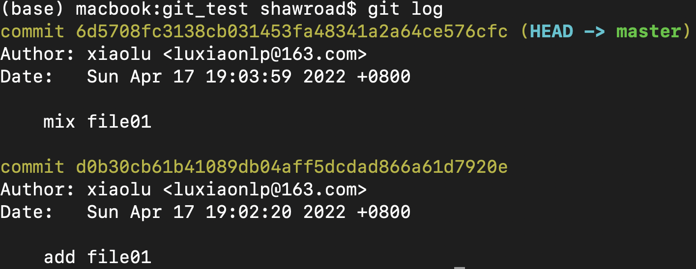

- [git的基本概述](#git的基本概述)
  - [开发中待解决的问题](#开发中待解决的问题)
  - [版本控制器的方式](#版本控制器的方式)
  - [Git工作流程图](#git工作流程图)
- [git常用命令](#git常用命令)
  - [配置用户信息](#配置用户信息)
  - [基本操作指令](#基本操作指令)
  - [分支](#分支)
  
# git的基本概述

## 开发中待解决的问题

1. 代码备份
2. 代码还原
3. 协同开发
4. 追溯问题代码的编写人员和编写时间

## 版本控制器的方式

1. 集中式版本控制工具: 版本库是集中存放在中央服务器的，team里每个人work时从中央服务器下载代 码，是必须联网才能工作，局域网或互联网。个人修改后然后提交到中央版本库。 举例: SVN和CVS
2. 分布式版本控制工具:分布式版本控制系统没有“中央服务器”，每个人的电脑上都是一个完整的版本库，这样工作的时候，无 需要联网了，因为版本库就在你自己的电脑上。 举例: Git

## Git工作流程图


命令如下:

1. clone(克隆): 从远程仓库中克隆代码到本地仓库
2. checkout(检出): 从本地仓库中检出一个仓库分支然后进行修订
3. add(添加): 在提交前先将代码提交到暂存区
4. commit(提交): 提交到本地仓库。本地仓库中保存修改的各个历史版本
5. fetch(抓取): 从远程库，抓取到本地仓库，不进行任何的合并动作，一般操作比较少。
6. pull(拉取): 从远程库拉到本地库，自动进行合并(merge), 然后放到工作区，相当于fetch+merge
7. push(推送): 修改完成后，需要和团队成员共享代码时，将代码推送到远程仓库。

# git常用命令

## 配置用户信息

```shell
git config --global user.name "wangwu"
git config --global user.email "xx@qq.com"
```

配置完后我们也可以看看

```shell
git config --global user.name
git config --global user.email 
```

生成公私钥
```shell
ssh-keygen -t rsa -C "xxxx@qq.com"
```

## 基本操作指令


仓库主要分为三个状态，通常我们创建一个文件是在工作区，这个时候git是没有追踪，假设代码开发完后，我们需要通过git add file  将文件加到暂存区。  接着通过git commit -m 'info' 将暂存区的东西提交到仓库中。

1. 初始化一个本地仓库

   ```shell
   mkdir git_test   # 创建一个文件夹
   cd git_test   # 进入此文件夹
   git init     # 初始化一个仓库
   ```

2. 接着我们创建一个文件 并查看状态   然后再提交到暂存区  最后提交仓库

   ```shell
   touch file01.txt
   git status   # 可以看到file01.txt显示未跟踪
   git add file01.txt
   git status   # 可以看到当前文件处在暂存区。
   git commit -m 'add file01'   # 提交到仓库
   git status    # 此时再看的时候，显示当前没有新的东西待提交。 也就是将file01已经提交到仓库
   ```

3. 另外可以通过git log查看历史提交

   ```shell
   git log
   ```



另外git log还可以配置多个参数 如下:


为了以后可以更方便用，可以将其写成一个shell脚本  直接执行。

4. 版本回退

   ```shell
   git reset --hard commitID  # 即可回退到之前提交的某个id上
   ```

   上述命令让你回到之前的某个版本了，但是你又后悔了，你想回去，但是也忘了最后一次commit的id，可以用git reflog找回。

    ```shell
   git reflog
    ```

   

   ​    然后找到对应的commitID进行还原。

5. 某些文件不想让git管理，可以设置.gitignore

   ```shell
   touch xx.a   # 假设创建的这个文件不想让git管理
   
   vi .gitignore
   # 在gitignore里面  写一行  *.a   即以a结尾的文件不让git管理。
   
   # 此时再执行git status时，就看不到a文件的提示了。
   ```

## 分支

几乎所有的版本控制系统都以某种形式支持分支。 使用分支意味着你可以把你的工作从开发主线上分离开来进行重大的Bug修改、开发新的功能，以免影响开发主线。

1. 查看分支

   

从上述中可以看出，我们目前只有一个主分支。

2. 创建一个开发分支

   

   此时，我们新建了一个dev01分支。   HEAD指的是当前的分支

   

   另外通过log可以看出我们目前两个分支都是最新的状态。

   另外说一下删除分支

   ```shell
   # 第一种方式
   git branch -d 分支名   # 删除分支，需要做各种检查
   
   # 第二种方式
   git branch -D 分支名   # 不做任何检查，强制删除
   ```

3. 切换到开发分支 并新建一个code.txt 并提交。

   

   从上面代码可以看出 目前dev01比master分支领先提交一个code.txt   如果我们code.txt写好了，想合并到master分支，则进行下一步操作。

4. 合并分支

   首先要切回到master分支，然后执行merge操作，即将dev01开发的code.txt合并到master上了。

5. 解决冲突

   当两个分支上对文件的修改可能会存在冲突，例如同时修改了同一个文件的同一行，这时就需要手动解

   决冲突，解决冲突步骤如下：

   \1. 处理文件中冲突的地方

   \2. 将解决完冲突的文件加入暂存区(add)

   \3. 提交到仓库(commit)

   eg: 创建一个文件temp.txt，然后里面指定一个count值，分别用master和sub_fenzi去修改，然后合并。用master修改count=3,   用sub_fenzhi修改count=2，然后合并。

   

   从上图可以看出我们当前在master分支上， 在第二行可以看出sub_fenzhi修改count=2。第一行可以看出master分支修改count=3。

   

   当我将sub_fenzhi分支的内容往master合并的时候，发现合并冲突。打开temp.txt文件可以发现，git将冲突的内容给我们罗列出来了，即将冲突的部分都展示出来了，你可以通过修改temp.txt，然后提交。

   从上面代码中可以看出 我通过手动修改了count=3，然后执行add和commit最终提交到master库中。  最后那个分支图也可以看出 最后合并了。
