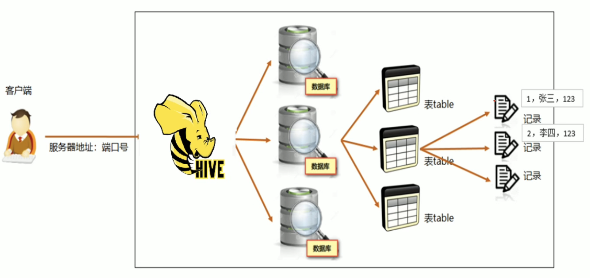

- [HDFS](#hdfs)
  - [介绍](#介绍)
    - [namenode职责](#namenode职责)
    - [datanode职责](#datanode职责)
    - [secondarynamenode](#secondarynamenode)
  - [常用命令](#常用命令)
    - [1. 创建文件夹](#1-创建文件夹)
    - [2. 查看指定目录下内容](#2-查看指定目录下内容)
    - [3. 上传文件到HDFS指定目录下](#3-上传文件到hdfs指定目录下)
    - [4. 查看HDFS文件内容](#4-查看hdfs文件内容)
    - [5. 下载HDFS文件](#5-下载hdfs文件)
    - [6. 拷贝HDFS文件](#6-拷贝hdfs文件)
    - [7. 追加数据到HDFS文件中](#7-追加数据到hdfs文件中)
    - [8. HDFS数据移动操作](#8-hdfs数据移动操作)
  - [HDFS写、读数据流程](#hdfs写读数据流程)
    - [Pipeline管道](#pipeline管道)
    - [ACK应答响应](#ack应答响应)
    - [默认3副本存储策略](#默认3副本存储策略)
    - [写数据](#写数据)
    - [读数据](#读数据)
- [MapReduce](#mapreduce)
  - [思想](#思想)
  - [阶段组成](#阶段组成)
  - [MapReduce数据类型](#mapreduce数据类型)
  - [Demo练习](#demo练习)
  - [详解MapReduce过程](#详解mapreduce过程)
    - [Map阶段执行过程](#map阶段执行过程)
    - [reduce阶段执行过程](#reduce阶段执行过程)
    - [shuffle阶段执行流程](#shuffle阶段执行流程)
- [YARN](#yarn)
  - [三大件介绍](#三大件介绍)
  - [交互流程](#交互流程)
  - [资源调度器Scheduler](#资源调度器scheduler)
    - [FIFO Scheduler 先进先出调度器](#fifo-scheduler-先进先出调度器)
    - [Capacity Scheduler 容量调度器](#capacity-scheduler-容量调度器)
    - [Fair Scheduler 公平调度器](#fair-scheduler-公平调度器)
- [Hive](#hive)
  - [数据仓库](#数据仓库)
  - [Hive介绍](#hive介绍)
  - [Hive结构图](#hive结构图)
  - [三种安装方式](#三种安装方式)
  - [hive数据模型总览](#hive数据模型总览)
  - [库表语法](#库表语法)
    - [针对库的操作](#针对库的操作)
    - [针对表的操作](#针对表的操作)
    - [DML语法](#dml语法)
      - [Load语法规则](#load语法规则)
      - [Insert语法](#insert语法)
      - [select语法](#select语法)
        - [where条件](#where条件)
        - [聚合操作](#聚合操作)
        - [GROUP BY](#group-by)
        - [HAVING](#having)
        - [ORDER BY](#order-by)
        - [LIMIT](#limit)
        - [执行顺序](#执行顺序)
      - [JOIN](#join)
        - [inner join 内连接](#inner-join-内连接)
        - [left join 左连接](#left-join-左连接)
    - [DML函数](#dml函数)
      - [概述](#概述)
        - [1. 查看所有可用函数](#1-查看所有可用函数)
        - [2. 描述函数用法](#2-描述函数用法)
        - [3. 分类](#3-分类)
      - [常用内置函数](#常用内置函数)
        - [String Functions 字符串函数](#string-functions-字符串函数)
        - [Date Functions 日期函数](#date-functions-日期函数)
        - [Mathematical Functions 数学函数](#mathematical-functions-数学函数)
        - [Conditional Functions 条件函数](#conditional-functions-条件函数)

# HDFS

## 介绍


### namenode职责

- NameNode仅存储HDFS的元数据: 文件系统中所有文件的目录树，并跟踪整个集群中的文件，不存储实际数据。
- NameNode知道HDFS中任何**给定文件的块列表及其位置**。使用此信息NameNode知道如何从块中构建文件。
- NameNode**不持久化存储每个文件中各个块所在的datanode的位置信息**，这些信息会在系统启动时从DataNode 重建。
- NameNode是Hadoop集群中的单点故障。单点故障: 局部出现问题，导致整体不能正常运行。
- NameNode所在机器通常会配置大量内存(RAM). 因为其把所有数据保存的内存当中。

### datanode职责

- DataNode负责**最终数据块block的存储**。是集群的**从角色**，也称为Slave。
- DataNode启动时，会将自己**注册**到NameNode并**汇报**自己负责持有的块列表。
- 当某个DataNode关闭时，不会影响数据的可用性。 NameNode将安排由其他DataNode管理的块进行副本复制 。
- DataNode所在机器通常配置有大量的**硬盘**空间，因为实际数据存储在DataNode中。

### secondarynamenode

- Secondary namenode 充当namenode的辅助节点，但不能替代namenode
- 主要是帮助主角色进行元数据文件的合并动作。可以通俗的理解为主角色的“秘书”.


## 常用命令

### 1. 创建文件夹

**hadoop fs -mkdir [-p] [<path> …]**

> path 为待创建的目录
>
> -p选项的行为与Unix mkdir -p非常相似，它会沿着路径创建父目录

实例:

```shell
hadoop fs -mkdir /ifnxs
```

### 2. 查看指定目录下内容

**hadoop fs -ls [-h] [-R] [<path> …]**

> path 指定目录路径
>
> -h 人性化显示文件size
>
> -R 递归查看指定目录及其子目录

实例:

```shell
hadoop fs -ls -h /
```

### 3. 上传文件到HDFS指定目录下

**hadoop fs -put [-f] [-p] <localsrc> … <dst>**

> -f 覆盖目标文件（已存在下）
>
> -p 保留访问和修改时间，所有权和权限
>
> localsrc 本地文件系统（客户端所在机器）
>
> dst 目标文件系统（HDFS）

实例:

```shell
echo 1 > 1.txt
hadoop fs -put 1.txt /ifnxs
```

### 4. 查看HDFS文件内容

**hadoop fs -cat <src> …**

>  读取指定文件全部内容，显示在标准输出控制台
>
>  注意：对于大文件内容读取，慎重

```shell
hadoop fs -cat /ifnxs/1.txt
```

### 5. 下载HDFS文件

**hadoop fs -get [-f] [-p] <src> … <localdst>**

> 下载文件到本地文件系统指定目录，localdst必须是目录
>
> -f 覆盖目标文件（已存在下）
>
> -p 保留访问和修改时间，所有权和权限

```shell
hadoop fs -get /ifnxs/1.txt ./2.txt
```

### 6. 拷贝HDFS文件

**hadoop fs -cp [-f] <src> … <dst>**

>  -f 覆盖目标文件（已存在下）

```shell
hadoop fs -cp /ifnxs/1.txt /ifnxs/3.txt
```

### 7. 追加数据到HDFS文件中

**hadoop fs -appendToFile <localsrc> … <dst>**

> 将所有给定本地文件的内容追加到给定dst文件
>
> dst如果文件不存在，将创建该文件
>
> 如果<localSrc>为-，则输入为从标准输入中读取

```shell
hadoop fs -appendToFile 1.txt 2.txt /ifnxs/1.txt
```

### 8. HDFS数据移动操作

**hadoop fs -mv <src> … <dst>**

> 移动文件到指定文件夹下
>
> 可以使用该命令移动数据，重命名文件的名称

```shell
hadoop fs -mv /ifnxs/1.txt /ifnxs/333.txt
```

[其他命令](https://hadoop.apache.org/docs/r3.3.0/hadoop-project-dist/hadoop-common/FileSystemShell.html)

## HDFS写、读数据流程

了解数据读写之前，想给出三个概念

### Pipeline管道

数据以管道的方式，顺序的沿着一个方向传输，这样能够充分利用每个机器的带宽，避免网络瓶颈和高延迟的连接，最小化推送所有数据的延时。

### ACK应答响应

在HDFS pipeline管道传输数据的过程中，传输的反方向会进行ACK校验，确保数据传输安全，是两两校验实现全局一致。也就是后面的机器和前一个机器进行校验。

### 默认3副本存储策略

默认副本存储策略是由`BlockPlacementPolicyDefault`指定

- 第一块副本: 优先本地客户端，否则随机
- 第二块副本: 不同于第一块副本的不同机架
- 第三块副本: 第二块副本相同机架的不同机器

### 写数据


### 读数据


# MapReduce

## 思想

Mapreduce核心思想: "先分再合，分而治之"

所谓“分而治之”就是把一个复杂的问题，按照一定的“分解”方法分为等价的规模较小的若干部分，然后逐个解决，分别找出各部分的结果，然后把各部分的结果组成整个问题的最终结果。

> Map表示第一阶段，负责"拆分"：即把负责的任务分解为若干个"简单的子任务"来并行处理。可以进行拆分前提是这些小任务可以并行计算，彼此间几乎没有依赖关系。
>
> Reduce表示第二阶段，负责"合并"：即对map阶段的结果进行全局汇总。
>
> 这两个阶段合起来正是MapReduce思想的体现。

## 阶段组成

1. 一个MapReduce编程模型中只能包含一个Map阶段和一个Reduce阶段，或者只有Map阶段。

2. 不能有诸如多个map阶段、多个reduce阶段的情景出现。

3. 如果用户的业务逻辑非常复杂，那就只能多个MapReduce程序串行运行。

   

## MapReduce数据类型

- 注意: 整个MapReduce程序中，数据都是以kv键值对的形式流转的
- 在实际编程解决各种业务问题中，需要考虑每个阶段的输入输出kv分别是什么。
- MapReduce内置了很多默认属性，比如排序、分组等，都和数据的k有关，所以说kv的类型数据确定极其重要。

## Demo练习

1. 计算圆周率π(PI)的值。

   ```shell
   cd /export/server/hadoop-3.3.0/share/hadoop/mapreduce/
   hadoop jar hadoop-mapreduce-examples-3.3.0.jar pi 10 50
   ```

   参数介绍:

   - 第一个参数: pi表示MapReduce程序执行圆周率计算任务
   - 第二个参数: 用于指定map阶段运行的任务task次数，并发度，这里是10
   - 第三个参数: 用于指定每个map任务取样的个数，这里是50  （样本数越多 pi计算越准）

2. wordcount的使用

   map阶段核心: 把输入的数据经过切割，全部标记为1，因此输入就是<单词, 1>.

   shuffle阶段核心: 经过MR程序内部自带默认的排序分组等功能，把key相同的单词会作为一组数据构成新的kv对。

   reduce阶段核心: 处理shuffle完的一组数据，该组数据就是该单词所有的键值对。对所有的1进行累加求和，就是单词的总次数。

   

   

   ```shell
   hadoop fs -mkdir /input   # 创建文件
   hadoop fs -put 1.txt /input   # 将本地的数据上传
   cd /export/server/hadoop-3.3.0/share/hadoop/mapreduce/
   hadoop jar hadoop-mapreduce-examples-3.3.0.jar wordcount /input /output
   ```

   1.txt文件内容:

   ```shell
   hello tome hello allen hello
   allen tom mac apple
   hello allen apple
   hello apple spark allen hadoop spark
   ```

   运行完的结果为:

   ```shell
   allen 4
   apple 3
   hadoop 1
   hello 5
   mac 1
   spark 2
   tom 2
   ```

## 详解MapReduce过程

### Map阶段执行过程


1. **逻辑切片**，默认Split size = Block size（128M）
2. 对切片中的数据按照一定的规则读取解析返回[key,value]对。默认是**按行读取数据**。key是每一行的起始位置偏移量，value是本行的文本内容
3. 调用Mapper类中的**map方法处理数据**
4. 按照一定的规则对Map输出的键值对进行**分区partition**。默认不分区，因为只有一个reducetask。分区的数量就是reducetask运行的数量
5. Map输出数据写入**内存缓冲区**，达到比例溢出到磁盘上。**溢出spill**的时候根据key进行**排序sort**。默认根据key字典序排序
6. 对所有溢出文件进行最终的**merge合并**，成为一个文件

### reduce阶段执行过程

1. ReduceTask会**主动**从MapTask复制拉取属于需要自己处理的数据
2. 把拉取来数据，全部进行**合并merge**，即把分散的数据合并成一个大的数据。再对合并后的数据排序
3. 对排序后的键值对**调用reduce方法**。**键相等**的键值对调用一次reduce方法。最后把这些输出的键值对 写入到HDFS文件中


### shuffle阶段执行流程

1. 将map端的无规则输出按指定的规则“打乱”成具有**一定规则**的数据，以便reduce端接收处理

2. 一般把从Map产生输出开始到Reduce取得数据作为输入之前的过程称作shuffle

3. **Shuffle是MapReduce程序的核心与精髓，也是慢的原因**


上述红色框内都输与shuffle阶段。

# YARN

## 三大件介绍

YARN是一个通用资源管理系统和调度平台。


三大件

**ResourceManager（RM）**

YARN集群中的主角色，决定系统中所有应用程序之间资源分配的**最终权限，即最终仲裁者**。接收用户的作业提交，并通过NM分配、管理各个机器上的计算资源。

**NodeManager（NM）**

YARN中的从角色，一台机器上一个，负责**管理本机器上的计算资源**。根据RM命令，启动Container容器、监视容器的资源使用情况。并且向RM主角色汇报资源使用情况。

**ApplicationMaster（AM）**

用户提交的每个应用程序均包含一个AM。**应用程序内的“老大”**，负责程序内部各阶段的资源申请，监督程序的执行情况。

## 交互流程


1. 用户通过客户端向YARN中ResourceManager提交应用程序（比如hadoop jar提交MR程序）；

2. ResourceManager为该应用程序分配第一个Container（容器），并与对应的NodeManager通信，要求 它在这个Container中启动这个应用程序的ApplicationMaster；

3. ApplicationMaster启动成功之后，首先向ResourceManager注册并保持通信，这样用户可以直接通过 ResourceManager查看应用程序的运行状态（处理了百分之几）；

4. AM为本次程序内部的各个Task任务向RM申请资源，并监控它的运行状态；

5. 一旦 ApplicationMaster 申请到资源后，便与对应的 NodeManager 通信，要求它启动任务；

6. NodeManager 为任务设置好运行环境后，将任务启动命令写到一个脚本中，并通过运行该脚本启动任务；

7. 各个任务通过某个 RPC 协议向 ApplicationMaster 汇报自己的状态和进度，以让ApplicationMaster 随 时掌握各个任务的运行状态，从而可以在任务失败时重新启动任务。在应用程序运行过程中，用户可随时通过 RPC 向 ApplicationMaster 查询应用程序的当前运行状态；

8. 应用程序运行完成后，ApplicationMaster 向 ResourceManager 注销并关闭自己。

   

## 资源调度器Scheduler

### FIFO Scheduler 先进先出调度器

FIFO Scheduler是一个先进先出的思想，即先提交的应用先运行。


该调度器不考虑优先级和范围，适合负载较低的小规模集群。当使用大型共享集群时，它的效率较低。FIFO Scheduler拥有一个控制全局的队列queue，默认queue名称为default，该调度器会获取当前集群上所有的资源信息作用域这个全局的queue。

### Capacity Scheduler 容量调度器

Capacity Scheduler容量调度是**Apache Hadoop3.x默认调度策略**。该策略允许**多个组织共享整个集群资源**，每个组织可以获得集群的一部分计算能力。通过为每个组织分配专门的队列，然后再为每个队列分配一定的集群资源，这样整个集群就可以通过设置多个队列的方式给多个组织提供服务了。


- **层次化的队列设计**

  层次化的管理，可以更容易、更合理分配和限制资源的使用

- **容量保证**

  每个队列上都可以设置一个资源的占比，保证每个队列都不会占用整个集群的资源

- **安全**

  每个队列有严格的访问控制。用户只能向自己的队列里面提交任务，而且不能修改或者访问其他队列的任务

- **弹性分配**

  空闲的资源可以被分配给任何队列。当多个队列出现争用的时候，则会按照权重比例进行平衡

### Fair Scheduler 公平调度器

使所有应用在平均情况下随着时间的流逝可以获得相等的资源份额。


- **分层队列**

  队列可以按层次结构排列以划分资源，并可以配置权重以按特定比例共享集群。

- **基于用户或组的队列映射**

  可以根据提交任务的用户名或组来分配队列。如果任务指定了一个队列,则在该队列中提交任务

- **资源抢占**

  根据应用的配置，抢占和分配资源可以是友好的或是强制的。默认不启用资源抢占

- **保证最小配额**

  可以设置队列最小资源，允许将保证的最小份额分配给队列，保证用户可以启动任务。当队列不能满足最小资源时,可以从其它队列抢占。当队列资源使用不完时,可以给其它队列使用。这对于确保某些用户、组或生产应用始终获得足够的资源

- **允许资源共享**

  即当一个应用运行时,如果其它队列没有任务执行,则可以使用其它队列,当其它队列有应用需要资源时再将占用的队列释放出来。所有的应用都从资源队列中分配资源

- **默认不限制每个队列和用户可以同时运行应用的数量**

  可以配置来限制队列和用户并行执行的应用数量。限制并行执行应用数量不会导致任务提交失败,超出的应用会在队列中等待

# Hive

## 数据仓库

数据仓库(Data Warehouse，简称数仓, DW)，是一个用于存储、分析、报告的数据系统

数据仓库的目的是构建面向分析的集成化数据环境，分析结果为企业提供决策支持。

## Hive介绍

- Hive是一款建立在Hadoop之上的开源数据仓库系统，可以将存储在Hadoop文件中的结构化、半结构化数据文件映射成一张数据库表，基于表提供一种类似SQL的查询模型，称为Hive查询语言(HQL)，用于访问和分析存储在Hadoop文件中的大型数据集。
- Hive核心是将**HQL转换为MapReduce程序，然后将程序提交到Hadoop集群执行**。
- Hive有Facebook实现并开源。


Hive能将数据文件映射成一张表: 映射指文件和表之间的对应关系

Hive的功能职责: 将SQL语法解析编译成MapReduce


## Hive结构图


元数据的存储: 主要存的是文件和表之间的映射关系。

hive默认是有MapReduce执行计算，但是也支持Spark等。

## 三种安装方式

简单说一下Metastore

MetaStore即元数据服务。MetaStore服务的作用是**管理metadata元数据**，对外暴露服务地址，让各种客户端通过连接metastore服务，有metastore再去连接Mysql数据库来存取元数据。有了metastore服务，就可以有多个客户端同时连接，而且这些客户端不需要知道mysql数据库的用户名和密码，只需要连接metastore服务即可。某种程度上也保证了hive元数据的安全。

metastore服务配置有三种模式: 内嵌模式、本地模式、远程模式。可以根据metastore服务是否需要单独配置、单独启动？ metadata是存储在内置的derby中，还是第三方RDBMS，比如mysql。


## hive数据模型总览



## 库表语法

### 针对库的操作

1. 查看库

   ```sql
   show databases;
   ```

2. 创建库

   ```sql
   create database [if not exists] ifnxs [comment "库描述"] [with dbproperties ('createdBy'='dr34m')];
   ```

   - with dbproperties 用于指定一些数据库的属性配置
   - location 可以指定数据库在HDFS存储位置，默认/user/hive/warehouse/dbname.db
   - 例子: `create database test;`

3. 使用库

   ```sql
   use ifnxs;
   ```

4. 删除库

   ```sql
   drop database [if exists] test [cascade];
   ```

   - cascade表示强制删除，默认为restrict，这意味着仅在数据库为空时才删除它

### 针对表的操作

1. 查看表

   ```sql
   show tables [in xxx];  # 后面的in可以指定xxx库 查看某个库下的所有表
   ```

2. 创建表

   ```sql
   create table [if not exists] [xxx.]zzz (col_name data_type [comment "字段描述"], ...)
   [comment "表描述"]
   [row format delimited ...];
   ```

   数据类型: 最常用`string`和`int`

   

   例子:

   ```sql
   create table ifnxs.t_user (
       id int comment "编号",
       name string comment "姓名"
   ) comment "用户表"
   row format delimited
   fields terminated by "\t"; -- 字段之间的分隔符
   ```

   从select创建表

   ```sql
   create table xxx as select id,name from ifnxs.t_user;
   ```

3. 查看表结构

   ```sql
   desc formatted xxx;
   ```

4. 删除表

   ```sql
   drop table [if exists] xxx;
   ```

### DML语法

#### Load语法规则

```sql
LOAD DATA [LOCAL] INPATH 'filepath' [OVERWRITE] INTO TABLE tablename;
```

- **LOCAL指Hiveserver2服务所在机器的本地Linux文件系统**

- 例-本地（复制操作）

  ```sql
  load data local inpath '/root/hivedata/students.txt' into table itheima.student_local;
  # 加载数据students.txt(本地) 到student_local这张表中 
  ```

  

- 例-HDFS（移动操作）

  ```sql
  load data inpath '/students.txt' into table itheima.student_hdfs;
  # 这个是从hdfs上某个目录移到对应目录
  ```

  

#### Insert语法

Hive推荐**清洗数据成为结构化文件，再使用Load语法加载数据到表中**

```sql
insert into table t_1 values(1, "张三");
# 执行这条语句  你会发现非常慢 因为其执行了一个mapreduce程序。
```

一般不单独使用insert。 insert和select配置使用。即将查询的结果插入到新的一张表中。

```sql
insert into table user select id, name from student;
# 从学生表中查出id 和name  插到user中。
```

#### select语法

待操作的数据格式:

```
2021-01-28,Autauga,Alabama,01001,5554,69
2021-01-28,Baldwin,Alabama,01003,17789,21
2021-01-28,Bibb,Alabama,01007,1233,12
...
```

语法:

```sql
SELECT [ALL|DISTINCT] select_expr, select_expr, ...
FROM table_reference
[WHERE where_condition]
[GROUP BY col_list]
[ORDER BY col_list]
[LIMIT [offset,] rows];
```

例子:

```sql
-- 查询所有字段或者指定字段
select * from t_usa_covid19;   
select county, cases, deaths from t_usa_covid19;

-- 查询常数返回 此时返回的结果和表中字段无关
select 1 from t_usa_covid19;

-- 查询当前所属数据库
select current_database(); -- 省去from关键字

-- 返回所有匹配的行 去除重复的结果
select distinct state from t_usa_covid19;

-- 多个字段distinct 整体去重
select distinct county,state from t_usa_covid19;
```

##### where条件

- 比较运算符 `=` `>` `<` `<=` `>=` `!=` `<>`(不等于)

  ```sql
  -- 找出来自于California州的疫情数据
  select * from t_usa_covid19 where state = 'California';
  
  -- where条件中使用函数 找出州名字母长度超过10位的有哪些
  select * from t_usa_covid19 where length(state) >10;
  ```

- 逻辑运算符 `and` `or`

  ```sql
  select * from t_usa_covid19 where length(state)>10 and length(state)<20;
  ```

- 空值判断 `is null`

  ```sql
  select * from t_usa_covid19 where fips is null;
  ```

- `between ... and ...`

  ```sql
  select * from t_usa_covid19 where length(state) between 10 and 20;
  ```

- `in`

  ```sql
  select * from t_usa_covid19 where length(state) in (10,11,13);
  ```

##### 聚合操作

```
count` `sum` `max` `min` `avg
```


```sql
-- 统计美国总共有多少个县county

-- 学会使用as 给查询返回的结果起个别名
select count(county) as county_cnts from t_usa_covid19;

-- 去重distinct
select count(distinct county) as county_cnts from t_usa_covid19;

-- 统计美国加州有多少个县
select count(county) from t_usa_covid19 where state = "California";

-- 统计德州总死亡病例数
select sum(deaths) from t_usa_covid19 where state = "Texas";

-- 统计出美国最高确诊病例数是哪个县
select max(cases) from t_usa_covid19;
```

##### GROUP BY

GROUP BY语句用于结合聚合函数，**根据一个或多个列对结果集进行分组**

```sql
-- 根据state州进行分组 统计每个州有多少个县county
select count(county) from t_usa_covid19 where count_date = "2021-01-28" group by state;

-- 想看一下统计的结果是属于哪一个州的
select state,count(county) as county_nums from t_usa_covid19 where count_date = "2021-01-28" group by state;

-- 被聚合函数应用
select state,count(county),sum(deaths) from t_usa_covid19 where count_date = "2021-01-28" group by state;
```

##### HAVING

由于SQL执行顺序决定where在分组前执行，所以where中不能使用聚合函数，比如下边的错误示范

```sql
-- 错误示范-统计2021-01-28死亡病例数大于10000的州   
select state,sum(deaths) from t_usa_covid19 where count_date = "2021-01-28" and sum(deaths) >10000 group by state;
```

例子:

```sql
-- 先where分组前过滤，再进行group by分组， 分组后每个分组结果集确定 再使用having过滤
select state,sum(deaths) from t_usa_covid19 where count_date = "2021-01-28" group by state having sum(deaths) > 10000;

-- 这样写更好 即在group by的时候聚合函数已经作用得出结果 having直接引用结果过滤 不需要再单独计算一次了
select state,sum(deaths) as cnts from t_usa_covid19 where count_date = "2021-01-28" group by state having cnts> 10000;
```

##### ORDER BY

```sql
-- 根据确诊病例数升序排序 查询返回结果
select * from t_usa_covid19 order by cases;

-- 不写排序规则 默认就是asc升序
select * from t_usa_covid19 order by cases asc;

-- 根据死亡病例数倒序排序 查询返回加州每个县的结果
select * from t_usa_covid19 where state = "California" order by cases desc;
```

##### LIMIT

```sql
-- 没有限制返回2021.1.28 加州的所有记录
select * from t_usa_covid19 where count_date = "2021-01-28" and state ="California";

-- 返回结果集的前5条
select * from t_usa_covid19 where count_date = "2021-01-28" and state ="California" limit 5;

-- 返回结果集从第1行开始 共3行
select * from t_usa_covid19 where count_date = "2021-01-28" and state ="California" limit 2,3;
-- 注意 第一个参数偏移量是从0开始的
```

##### 执行顺序

- `from` > `where` > `group`（含聚合）> `having` > `order` > `select`
- 聚合语句(sum,min,max,avg,count)要比having子句优先执行
- where子句在查询过程中执行优先级别优先于聚合语句(sum,min,max,avg,count)

#### JOIN

- join_table

  ```sql
  table_reference [INNER] JOIN table_factor [join_condition]
  
  | table_reference {LEFT} [OUTER] JOIN table_reference join_condition
  ```

- join_condition

  ```sql
  ON expression
  ```

##### inner join 内连接

其中inner可以省略：inner join == join


```sql
select e.id,e.name,e_a.city,e_a.street
from employee e inner join employee_address e_a
on e.id = e_a.id;

-- 等价于 inner join=join
select e.id,e.name,e_a.city,e_a.street
from employee e join employee_address e_a
on e.id =e_a.id;


-- 等价于 隐式连接表示法
select e.id,e.name,e_a.city,e_a.street
from employee e, employee_address e_a
where e.id =e_a.id;
```

##### left join 左连接

左外连接(Left Outer Join)或者左连接，其中outer可以省略


```sql
select e.id,e.name,e_conn.phno,e_conn.email
from employee e left join employee_connection e_conn
on e.id =e_conn.id;

-- 等价于 left outer join
select e.id,e.name,e_conn.phno,e_conn.email
from employee e left outer join employee_connection e_conn
on e.id =e_conn.id;
```

### DML函数

#### 概述

##### 1. 查看所有可用函数

```sql
show functions
```

##### 2. 描述函数用法

```sql
describe function extended xxxx;
```

例子:

```sql
describe function extended count;
```

##### 3. 分类


#### 常用内置函数

##### String Functions 字符串函数

```sql
select length("itcast");
select reverse("itcast");

select concat("angela","baby");
-- 带分隔符字符串连接函数：concat_ws(separator, [string | array(string)]+)
select concat_ws('.', 'www', array('itcast', 'cn'));

-- 字符串截取函数：substr(str, pos[, len]) 或者  substring(str, pos[, len])
select substr("angelababy",-2); -- pos是从1开始的索引，如果为负数则倒着数
select substr("angelababy",2,2);
-- 分割字符串函数: split(str, regex)
-- split针对字符串数据进行切割  返回是数组array  可以通过数组的下标取内部的元素 注意下标从0开始的
select split('apache hive', ' ');
select split('apache hive', ' ')[0];
select split('apache hive', ' ')[1];
```

##### Date Functions 日期函数

```sql
-- 获取当前日期: current_date
select current_date();

-- 获取当前UNIX时间戳函数: unix_timestamp
select unix_timestamp();

-- 日期转UNIX时间戳函数: unix_timestamp
select unix_timestamp("2011-12-07 13:01:03");

-- 指定格式日期转UNIX时间戳函数: unix_timestamp
select unix_timestamp('20111207 13:01:03','yyyyMMdd HH:mm:ss');

-- UNIX时间戳转日期函数: from_unixtime
select from_unixtime(1618238391);
select from_unixtime(0, 'yyyy-MM-dd HH:mm:ss');

-- 日期比较函数: datediff  日期格式要求'yyyy-MM-dd HH:mm:ss' or 'yyyy-MM-dd'
select datediff('2012-12-08','2012-05-09');

-- 日期增加函数: date_add
select date_add('2012-02-28',10);

-- 日期减少函数: date_sub
select date_sub('2012-01-1',10);

-- 日期格式化
select date_format(current_date(), 'yyyy-MM');
-- 筛选在2022年1月创建的用户
select * from userlist where date_format(create_time, 'yyyy-MM') = '2022-01';
```

##### Mathematical Functions 数学函数

```sql
-- 取整函数: round  返回double类型的整数值部分 （遵循四舍五入）
select round(3.1415926);
-- 指定精度取整函数: round(double a, int d) 返回指定精度d的double类型
select round(3.1415926,4);
-- 取随机数函数: rand 每次执行都不一样 返回一个0到1范围内的随机数
select rand();
-- 指定种子取随机数函数: rand(int seed) 得到一个稳定的随机数序列
select rand(3);
```

##### Conditional Functions 条件函数

```sql
-- if条件判断: if(boolean testCondition, T valueTrue, T valueFalseOrNull)
select if(1=2,100,200);
select if(sex ='男','M','W') from student limit 3;

-- 条件转换函数: CASE a WHEN b THEN c [WHEN d THEN e]* [ELSE f] END
select case 100 when 50 then 'tom' when 100 then 'mary' else 'tim' end;
select case sex when '男' then 'male' else 'female' end from student limit 3;

-- 空值转换函数: nvl(T value, T default_value)
select nvl("allen","itcast");
select nvl(null,"itcast");
```
