- [shell脚本入门](#shell脚本入门)
  - [shell介绍](#shell介绍)
  - [shell运行过程](#shell运行过程)
  - [shell解释器](#shell解释器)
  - [默认解释器](#默认解释器)
  - [shell脚本的书写](#shell脚本的书写)
  - [shell入门demo](#shell入门demo)
  - [多命令处理](#多命令处理)
- [shell变量](#shell变量)
  - [环境变量](#环境变量)
    - [配置文件分类](#配置文件分类)
    - [环境变量类型](#环境变量类型)
    - [常用系统环境变量](#常用系统环境变量)
  - [自定义变量](#自定义变量)
    - [自定义局部变量](#自定义局部变量)
    - [自定义常量](#自定义常量)
    - [自定义全局变量](#自定义全局变量)
  - [特殊变量](#特殊变量)
    - [特殊变量:$n](#特殊变量n)
    - [**特殊变量:$#**](#特殊变量-1)
    - [特殊变量:$*,$@](#特殊变量-2)
    - [特殊变量:$?](#特殊变量-3)
    - [特殊变量:$$](#特殊变量-4)
- [shell环境变量深入](#shell环境变量深入)
  - [自定义系统变量](#自定义系统变量)
    - [创建环境变量步骤](#创建环境变量步骤)
    - [创建环境变量演示](#创建环境变量演示)
  - [环境变量加载流程原理](#环境变量加载流程原理)
    - [shell工作环境分类](#shell工作环境分类)
    - [登录Shell与非登录Shell环境](#登录shell与非登录shell环境)
    - [环境变量初始化流程](#环境变量初始化流程)
  - [环境变量加载流程测试](#环境变量加载流程测试)
    - [切换shell环境执行脚本文件介绍](#切换shell环境执行脚本文件介绍)
    - [shell登录环境执行脚本文件语法](#shell登录环境执行脚本文件语法)
    - [shell非登录环境变量执行脚本文件语法](#shell非登录环境变量执行脚本文件语法)
    - [测试案例](#测试案例)
      - [需求](#需求)
      - [分析](#分析)
      - [演示](#演示)
  - [识别shell环境](#识别shell环境)
    - [语法](#语法)
    - [实验效果](#实验效果)
  - [详细切换shell环境](#详细切换shell环境)
    - [切换shell环境命令介绍](#切换shell环境命令介绍)
    - [切换shell环境命令演示](#切换shell环境命令演示)
- [shell字符串变量](#shell字符串变量)
  - [字符串的三种格式](#字符串的三种格式)
  - [字符串三中格式区别](#字符串三中格式区别)
  - [获取字符串的长度](#获取字符串的长度)
  - [字符串的拼接](#字符串的拼接)
  - [字符串截取语法](#字符串截取语法)
- [shell索引数组变量](#shell索引数组变量)
  - [介绍](#介绍)
  - [数组的定义](#数组的定义)
  - [数组的获取](#数组的获取)
  - [数组的拼接](#数组的拼接)
  - [数组的删除](#数组的删除)
- [shell内置命令](#shell内置命令)
  - [内置命令介绍](#内置命令介绍)
  - [内置命令列表](#内置命令列表)
  - [alias内置命令](#alias内置命令)
    - [alias别名定义语法](#alias别名定义语法)
    - [unalias别名删除](#unalias别名删除)
    - [alias演示](#alias演示)
  - [echo内置命令](#echo内置命令)
    - [echo输出语法](#echo输出语法)
    - [echo输出转移字符](#echo输出转移字符)
  - [read内置命令](#read内置命令)
    - [实例1: 多个变量赋值](#实例1-多个变量赋值)
    - [实例2: 读取一个字符](#实例2-读取一个字符)
    - [实例3: 限制时间输入](#实例3-限制时间输入)
  - [exit内置命令](#exit内置命令)
    - [exit命令介绍](#exit命令介绍)
    - [exit应用场景](#exit应用场景)
    - [实例练习](#实例练习)
  - [declare内置命令](#declare内置命令)
    - [declare命令作用](#declare命令作用)
- [shell运算符](#shell运算符)
  - [expr命令](#expr命令)
  - [算术运算符](#算术运算符)
    - [算术运算符介绍](#算术运算符介绍)
    - [算术运算符演示](#算术运算符演示)
  - [比较运算符](#比较运算符)
    - [整数比较运算符](#整数比较运算符)
    - [字符串比较运算符](#字符串比较运算符)
        - [示例](#示例)
  - [布尔运算符](#布尔运算符)
    - [介绍](#介绍-1)
    - [演示](#演示-1)
  - [逻辑运算符](#逻辑运算符)
    - [介绍](#介绍-2)
    - [演示](#演示-2)
  - [文件测试运算符](#文件测试运算符)
    - [演示](#演示-3)
- [shell整数计算命令](#shell整数计算命令)
  - [expr命令详解](#expr命令详解)
    - [求值表达式](#求值表达式)
    - [字符串语法](#字符串语法)
  - [(())命令详解](#命令详解)
    - [介绍](#介绍-3)
    - [用法](#用法)
  - [let命令详解](#let命令详解)
    - [语法](#语法-1)
    - [实例](#实例)
  - [$[]命令详解](#命令详解-1)
    - [语法](#语法-2)
    - [实例](#实例-1)
  - [bc命令](#bc命令)
    - [语法](#语法-3)
    - [实例](#实例-2)
    - [bc中的内置变量和数学函数](#bc中的内置变量和数学函数)
    - [bc的使用](#bc的使用)
      - [实例1: bc中互动式的数学运算](#实例1-bc中互动式的数学运算)
      - [实例2: shell中非互动式的管道运算](#实例2-shell中非互动式的管道运算)
      - [实例3: shell中非互动式的输入重定向运算](#实例3-shell中非互动式的输入重定向运算)
- [流程控制语句](#流程控制语句)
  - [循环控制语句: if else语句](#循环控制语句-if-else语句)
    - [if语法](#if语法)
    - [if else语法](#if-else语法)
    - [if elif else语法](#if-elif-else语法)
    - [if条件判断句的退出状态](#if条件判断句的退出状态)
      - [介绍](#介绍-4)
      - [退出状态和逻辑运算符的组合](#退出状态和逻辑运算符的组合)
      - [实例](#实例-3)
    - [[额外加]shell内置命令: test](#额外加shell内置命令-test)
      - [整数比较测试](#整数比较测试)
      - [字符串测试](#字符串测试)
      - [文件测试](#文件测试)
      - [语法](#语法-4)
  - [流程控制语句: case](#流程控制语句-case)
  - [流程控制语句: while](#流程控制语句-while)
  - [流程控制语句: until](#流程控制语句-until)
  - [流程控制语句: for](#流程控制语句-for)
    - [循环方式1](#循环方式1)
    - [循环方式2](#循环方式2)
    - [循环方式3](#循环方式3)
  - [流程控制语句: select](#流程控制语句-select)
    - [实例1](#实例1)
    - [实例2](#实例2)
- [函数](#函数)
  - [函数分类](#函数分类)
  - [系统函数](#系统函数)
    - [basename系统函数](#basename系统函数)
    - [dirname系统函数](#dirname系统函数)
  - [自定义函数](#自定义函数)
    - [实例1: 无参无返回值函数](#实例1-无参无返回值函数)
    - [实例2: 无参有返回值函数](#实例2-无参有返回值函数)
    - [实例3: 有参函数](#实例3-有参函数)
  - [shell程序与函数的区别](#shell程序与函数的区别)
- [shell重定向输入暑促](#shell重定向输入暑促)
  - [重定向介绍](#重定向介绍)
    - [标注输入介绍](#标注输入介绍)
    - [标注输出介绍](#标注输出介绍)
    - [默认输入输出文件](#默认输入输出文件)
    - [重定向输入输出介绍](#重定向输入输出介绍)
  - [重定向语法](#重定向语法)
  - [重定向输出](#重定向输出)
    - [正确信息重定向输出](#正确信息重定向输出)
    - [错误信息重定向](#错误信息重定向)
    - [正确和错误信息同时输出](#正确和错误信息同时输出)
  - [重定向输入](#重定向输入)
    - [wc命令语法](#wc命令语法)
    - [逐行读取文件数据](#逐行读取文件数据)
    - [读取终端输入数据的行数](#读取终端输入数据的行数)
- [好工具: cut](#好工具-cut)
  - [语法](#语法-5)
  - [切割提取指定列数据](#切割提取指定列数据)
  - [切割提取指定字符数据](#切割提取指定字符数据)
  - [切割提取指定字节数据](#切割提取指定字节数据)
  - [切割提取指定单词数据](#切割提取指定单词数据)
  - [切割提取bash进程的PID号](#切割提取bash进程的pid号)
  - [切割提取IP地址](#切割提取ip地址)
- [好工具: sed](#好工具-sed)
  - [sed处理数据原理](#sed处理数据原理)
  - [语法](#语法-6)
  - [数据准备](#数据准备)
  - [向文件中添加数据](#向文件中添加数据)
    - [1. 指定行号的前或后面添加数据](#1-指定行号的前或后面添加数据)
    - [2. 指定内容前或后面添加数据](#2-指定内容前或后面添加数据)
    - [3. 在最后一行前或后添加hello](#3-在最后一行前或后添加hello)
  - [删除文件中的数据](#删除文件中的数据)
    - [1. 删除指定行](#1-删除指定行)
    - [2. 删除奇数行](#2-删除奇数行)
    - [3. 删除指定范围的多行数据](#3-删除指定范围的多行数据)
    - [4. 删除指定范围取反的多行数据](#4-删除指定范围取反的多行数据)
    - [5. 删除最后一行](#5-删除最后一行)
    - [6. 删除匹配itheima的行](#6-删除匹配itheima的行)
    - [7. 删除匹配行到最后一行](#7-删除匹配行到最后一行)
    - [8. 删除匹配行及其后面一行](#8-删除匹配行及其后面一行)
    - [9. 删除不匹配的行](#9-删除不匹配的行)
  - [更改文件中的数据](#更改文件中的数据)
    - [1. 将文件的第一行修改为hello](#1-将文件的第一行修改为hello)
    - [2. 将包含itheima的行修改为hello](#2-将包含itheima的行修改为hello)
    - [3. 将最后一行修改为hello](#3-将最后一行修改为hello)
    - [4. 将文件中的itheima替换为hello](#4-将文件中的itheima替换为hello)
    - [5. 将每行中第二个匹配替换](#5-将每行中第二个匹配替换)
    - [6. 替换后的内容写入文件](#6-替换后的内容写入文件)
    - [7. 正则表达式匹配替换](#7-正则表达式匹配替换)
    - [8. 每行末尾拼接test](#8-每行末尾拼接test)
    - [9. 每行行首添加注释](#9-每行行首添加注释)
  - [查询文件或管道中的数据](#查询文件或管道中的数据)
    - [1. 查询含有itcast的行数据](#1-查询含有itcast的行数据)
    - [2. 管道过滤查询](#2-管道过滤查询)
  - [多个sed程序命令执行](#多个sed程序命令执行)
  - [sed高级用法: 缓存区数据交换](#sed高级用法-缓存区数据交换)
    - [模式空间与暂存空间介绍](#模式空间与暂存空间介绍)
    - [关于缓存区sed程度命令](#关于缓存区sed程度命令)
    - [缓存空间数据交换](#缓存空间数据交换)
      - [实例1: 第一行粘贴到最后1行](#实例1-第一行粘贴到最后1行)
      - [实例2: 第一行删除后粘贴到最后一行](#实例2-第一行删除后粘贴到最后一行)
      - [实例3: 第一行数据复制粘贴替换其他行数据](#实例3-第一行数据复制粘贴替换其他行数据)
      - [实例4: 将前3行数据数据复制粘贴到最后一行](#实例4-将前3行数据数据复制粘贴到最后一行)
  - [再加两个例子](#再加两个例子)
    - [给每一行添加空行](#给每一行添加空行)
    - [删除所有的空行](#删除所有的空行)
- [好工具: awk](#好工具-awk)
  - [语法](#语法-7)
  - [awk内置变量](#awk内置变量)
  - [数据准备](#数据准备-1)
  - [默认每行空格切割数据](#默认每行空格切割数据)
  - [打印含有匹配信息的行](#打印含有匹配信息的行)
  - [打印匹配行中第7列数据](#打印匹配行中第7列数据)
  - [打印文件每行属性](#打印文件每行属性)
  - [打印第二行信息](#打印第二行信息)
  - [查找以c开头的资源](#查找以c开头的资源)
  - [打印第一列信息](#打印第一列信息)
  - [打印最后一列信息](#打印最后一列信息)
  - [打印倒数第二列信息](#打印倒数第二列信息)
  - [打印10-20行的第一列](#打印10-20行的第一列)
  - [多分隔符使用](#多分隔符使用)
  - [添加开始与结束内容](#添加开始与结束内容)
  - [使用循环拼接分割后的字符串](#使用循环拼接分割后的字符串)
  - [操作指定数字运算](#操作指定数字运算)
  - [切割ip](#切割ip)
  - [显示空行行号](#显示空行行号)
  - [小结](#小结)
- [好工具: sort](#好工具-sort)
  - [语法](#语法-8)
  - [数据准备](#数据准备-2)
  - [数字升序](#数字升序)
  - [数字升序去重](#数字升序去重)
  - [数字升序去重结果保存到文件](#数字升序去重结果保存到文件)
  - [数字降序去重](#数字降序去重)
  - [多列排序](#多列排序)
  - [小结](#小结-1)
# shell脚本入门

## shell介绍

通过编写Shell命令发送给linux内核去执行, 操作就是计算机硬件. 所以Shell命令是用户操作计算机硬件的桥梁,

Shell是命令,  类似于windows系统Dos命令

Shell是一个门程序设计语言, Shell里面含有变量, 函数, 逻辑控制语句等等

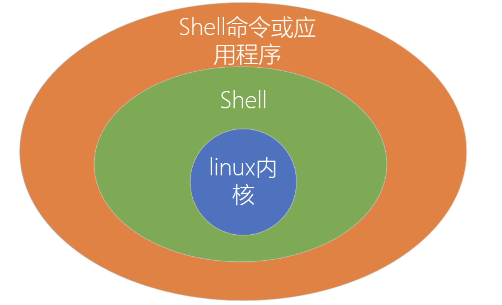

## shell运行过程

当用户下达指令给该操作系统的时候，实际上是把指令告诉shell，经过shell解释，处理后让内核做出相应的动作。 系统的回应和输出的信息也由shell处理，然后显示在用户的屏幕上。

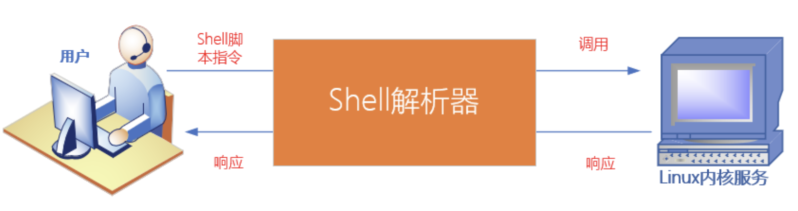

## shell解释器

查看linux系统的shell解析器

```shell
[root@486ac2144c14 ~]# cat /etc/shells 
/bin/sh
/bin/bash
/usr/bin/sh
/usr/bin/bash
```

| 解析器类型    | 介绍                                                         |
| ------------- | ------------------------------------------------------------ |
| /bin/sh       | Bourne Shell,是UNIX最初使用的shell;                          |
| /bin/bash     | Bourne Again Shell它是Bourne Shell的扩展，简称bash，是LinuxOS默认shell,有灵活和强大的编辑接口，同时又很友好的用户界面，交互性很强； |
| /sbin/nologin | 未登录解析器,  shell设置为/sbin/nologin 是用于控制用户禁止登陆系统的, 有时候有些服务，比如邮件服务，大部分都是用来接收主机的邮件而已，并不需要登陆 |
| /bin/dash     | dash（Debian Almquist Shell），也是一种 Unix shell。它比 Bash 小，只需要较少的磁盘空间，但是它的对话性功能也较少，交互性较差。 |
| /bin/csh      | C Shell是C语言风格Shell                                      |
| /bin/tcsh     | 是C Shell的一个扩展版本。                                    |

## 默认解释器

查看默认的解析器

```shell
[root@486ac2144c14 ~]# echo $SHELL
/bin/bash
```

含义:

打印输出当前系统环境使用的Shell解析器类型

echo  用于打印输出数据到终端

`$SHELL`  是全局共享的读取解析器类型环境变量, 全局环境变量时所有的Shell程序都可以读取的变量.

## shell脚本的书写

1. shell脚本文件就是一个文本文件，后缀名建议使用.sh结尾。

2. 首行书写规范，需要指定shell解析器的类型，语法为:

   ```shell
   #!/bin/bash
   ```

​     含义:  设置当前shell脚本文件采用bash解析器运行脚本代码

3.  shell脚本的注释

   单行注释，前面加#号即可，语法:   \# 注释内容

    多行注释，语法:

    ```shell
    :<<!
    注释内容
    注释内容
    !
    ```

## shell入门demo

1. 编写一个打印helloworld字符串的脚本

   ```shell
   #!/bin/bash
   echo "hello world"
   ```

2. 执行脚本的三种方式

   方式一: sh 脚本文件。 就是利用sh命令执行脚本文件,  本质就是使用Shell解析器运行脚本文件

   方式二: bash 脚本文件。就是利用bash命令执行脚本文件,  本质就是使用Shell解析器运行脚本文件

   方式三: ./脚本文件。 但是前提这个脚本得有可执行权限。chmod +x 脚本文件。

   

## 多命令处理

多命令处理就是在Shell脚本文件中编写多个Shell命令 

案例: 创建一个one.txt文件，在文件中写入helloworld

```shell
#!/bin/bash
touch one.txt
echo "helloworld" >> ./one.txt
```

# shell变量

## 环境变量

### 配置文件分类

1. 全局配置文件

   /etc/profile 

   /etc/profile.d/*.sh 

   /etc/bashrc

2. 个人配置文件

   当前用户/.bash_profile 

   当前用户/.bashrc

一般情况下，我们都是直接针对全局配置进行操作。

### 环境变量类型

在Linux系统中，环境变量按照其作用范围不同大致可以分为系统级环境变量和用户级环境变量。

- 系统级环境变量：Shell环境加载全局配置文件中的变量共享给所有用户所有Shell程序使用, 全局共享 

- 用户级环境变量：Shell环境加载个人配置文件中的变量共享给当前用户的Shell程序使用, 登录用户使用

查看当前shell系统环境变量

```shell
[root@486ac2144c14 ~]# env
HOSTNAME=486ac2144c14
TERM=xterm
PATH=/usr/local/sbin:/usr/local/bin:/usr/sbin:/usr/bin:/sbin:/bin
PWD=/root
SHLVL=1
HOME=/root
_=/usr/bin/env
OLDPWD=/
...
```

查看Shell变量(系统环境变量+自定义变量+函数)

```shell
[root@486ac2144c14 ~]# set
BASH=/bin/bash
BASHOPTS=checkwinsize:cmdhist:expand_aliases:extquote:force_fignore:histappend:hostcomplete:interactive_comments:progcomp:promptvars:sourcepath
BASH_ALIASES=()
BASH_ARGC=()
BASH_ARGV=()
BASH_CMDS=()
...
```

### 常用系统环境变量

| 变量名称 | 含义                                                         |
| -------- | ------------------------------------------------------------ |
| PATH     | 与windows环境变量PATH功能一样，设置命令的搜索路径，以冒号为分割 |
| HOME     | 当前用户主目录：/root                                        |
| SHELL    | 当前shell解析器类型：/bin/bash                               |
| HISTFILE | 显示当前用户执行命令的历史列表文件：/root/.bash_history      |
| PWD      | 显示当前所在路径：/root                                      |
| OLDPWD   | 显示之前的路径                                               |
| HOSTNAME | 显示当前主机名：itheima                                      |
| HOSTTYPE | 显示主机的架构，是i386、i686、还是x86、x64等：x86_64         |
| ==LANG== | 设置当前系统语言环境：zh_CN.UTF-8                            |

1. 假设要查看用户历史的命令，操作如下

   ```shell
   [root@486ac2144c14 ~]# echo $HISTFILE
   /root/.bash_history
   [root@486ac2144c14 ~]# head -n 5 /root/.bash_history
   ls
   ls
   cd 
   ls
   cat /etc/shells 
   ```
   
2. 假设要看系统环境变量

   ```shell
   [root@486ac2144c14 ~]# echo $PATH
   /usr/local/sbin:/usr/local/bin:/usr/sbin:/usr/bin:/sbin:/bin
   ```

## 自定义变量

自定义变量就是自己定义的变量

### 自定义局部变量

定义的语法:

```shell
var_name=value
```

变量定义的规则:

1. 变量名称可以有字母,数字和下划线组成, 但是不能以数字开头
2. 等号两侧不能有空格
3. 在bash环境中, 变量的默认类型都是字符串类型, 无法直接进行数值运算
4. 变量的值如果有空格, 必须使用双引号括起来
5. 不能使用Shell的关键字作为变量名称

查询变量值的语法:

```shell
# 语法1: 直接使用变量名查询
$var_name

# 语法2： 使用花括号
${var_name}

# 区别是: 花括号的方式适合拼接字符串
```

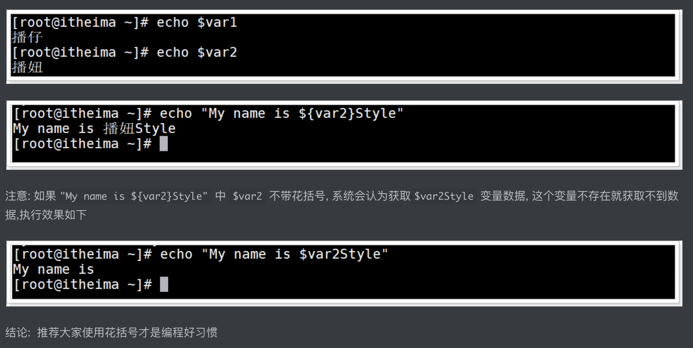

变量的删除的语法:

```shell
unset var_name
```

### 自定义常量

常量就是变量设置值以后不可以修改的变量叫常量, 也叫只读变量

语法:

```shell
readonly var_name
```

demo演示:

```shell
[root@486ac2144c14 ~]# name=lisi
[root@486ac2144c14 ~]# readonly name
[root@486ac2144c14 ~]# name=wangwu
bash: name: readonly variable
[root@486ac2144c14 ~]# echo $name
lisi

# 可以发现上述的name修改成只读后，再进行赋值的时候，会报错。
```

### 自定义全局变量

父子Shell环境介绍:

> 例如:  有2个Shell脚本文件 A.sh 和 B.sh

> 如果 在A.sh脚本文件中执行了B.sh脚本文件, 那么A.sh就是父Shell环境, B.sh就是子Shell环境

自定义全局变量介绍:

> 就是在当前脚本文件中定义全局变量, 这个全局变量可以在当前Shell环境与子Shell环境中都可以使用

自定义全局变量的语法:

```shell
export var_name1 var_name2
```

例子: 测试全局变量在子shell中是否可用，在父shell中是否可用？

首先创建两个shell文件: fu.sh   zi.sh

然后在fu.sh 文件中编写以下内容

```shell
#!/bin/bash
name=lisi
export name
echo "My name is ${name}"
bash zi.sh
```

在再zi.sh文件中编写以下内容

```shell
#!/bin/bash
echo "Your name is ${name}"
```

最终的结果为:

My name is lis

Your name is lisi

可以发现在子shell文件中 是可以访问父shell的变量

## 特殊变量

### 特殊变量:$n

语法: $n   这个n可以是任何数字

含义:

用于接收脚本文件执行时传入的参数

$0 用于获取当前脚本文件名称的

$1~$9, 代表获取第一输入参数到第9个输入参数

第10个以上的输入参数获取参数的格式: ${数字}, 否则无法获取

例子如下:

```shell
# 编写一个test.sh  内容如下:
#!/bin/bash
# 命令1: 打印当前脚本文件名字
echo "脚本的名字为:$0"
# 命令2: 打印第1个输入参数
echo "第一个参数为: $1"
# 命令3: 打印第2个输入参数
echo "第二个参数为: $2"
# 命令4: 打印第10个输入参数
echo "第十个参数为: ${10}"
```

执行结果如下:

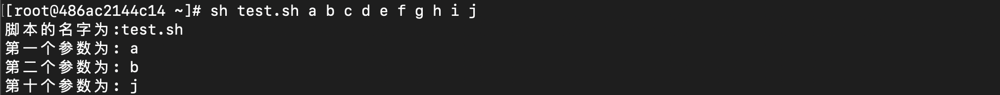

### **特殊变量:$#**

语法: $#

含义: 获取所有输入参数的个数

例子

写的代码如下:

```shel
#!/bin/bash
echo "参数的个数为:$#"
```

执行结果如下:


### 特殊变量:$*,$@

语法: $*    $#

含义: 都是获取所有输入参数, 用于以后输出所有参数

**$*和$@的区别**

1. 不使用双引号括起来, 功能一样

   $和$@获取所有输入参数,格式为: $1 $2 ... $n 

2. 使用双引号括起来     

   "$"获取的所有参数拼接为一个字符串, 格式为: "$1 $2 ... $n" 

   "$@"获取一组参数列表对象, 格式为: "$1" "$2" ... "$n"

   使用循环打印所有输入参数可以看出区别

循环语法:

```shell
for var in 列表变量
do # 循环开始
   命令  # 循环体
done    # 循环结束
```

例子:

代码如下:

```shell
#!/bin/bash

# 直接输出所有输入参数
echo '使用$*直接输出:'$*
echo '使用$@直接输出:'$@

# 给两个命令带上引号  循环遍历看看结果
echo '循环遍历输出$*所有参数'
for item in "$*"
do 
    echo $item
done

echo '循环遍历输出$@所有参数'
for item in "$@"
do 
    echo $item
done

echo '试试不带引号 循环打印'
for item in $@
do 
    echo $item
done
```

执行输出结果为：

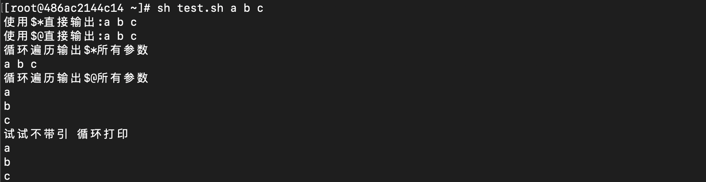

这里补充个东西: echo去打印东西的时候  双引号和单引号的区别，单引号是直接输出，双引号是会将变量的值打印出来的。

### 特殊变量:$?

语法: $?

含义: 用于获取上一个Shell命令的退出状态码, 或者是函数的返回值

> 每个Shell命令的执行都有一个返回值, 这个返回值用于说明命令执行是否成功一般来说, 返回0代表命令执行成功, 非0代表执行失败

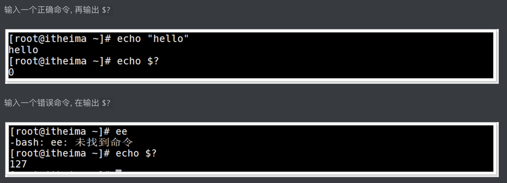

### 特殊变量:$$

语法: $$

含义: 用于获取当前shell环境的进程ID号。

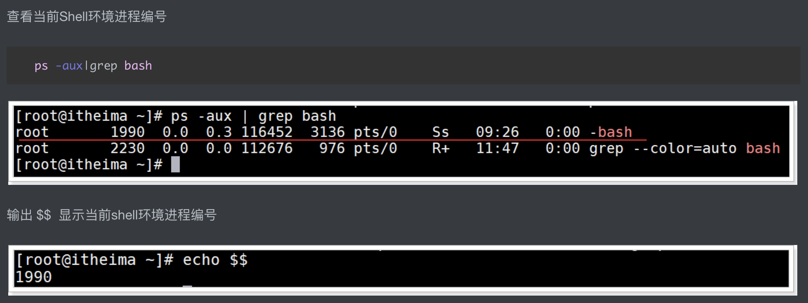

# shell环境变量深入

## 自定义系统变量

全局配置文件/etc/profile应用场景

当前用户进入Shell环境初始化的时候会加载全局配置文件/etc/profile里面的环境变量, 供给所有Shell程序使用

以后只要是所有Shell程序或命令使用的变量, 就可以定义在这个文件中

案例演示

/etc/profile定义存储自定义系统级环境变量数据

### 创建环境变量步骤

1. 编辑/etc/profile全局配置文件

   \# 增加命令: 定义变量VAR1=VAR1 并导出为环境变量

   \# 扩展: vim里面的命令模式使用G快速定位到文件末尾位置, 使用gg定位到文件首行位置

2. 重载配置文件/etc/profile, 因为配置文件修改后要立刻加载里面的数据就需要重载, 语法source  /etc/profile
3. 在Shell环境中读取系统级环境变量VAR1

### 创建环境变量演示

1. 编辑/etc/profile文件

   ```shell
   vim /etc/profile
   ```

2. 添加设置变量VAR1=VAR1并导出成为环境变量, 在/etc/profile文件末尾添加如下命令

   ```shell
   # 创建环境变量
   VAR1=VAR1
   export VAR1
   ```

3. 保存/etc/profile退出

4. 重新加载/etc/profile文件数据更新系统环境变量

   ```shell
   source /etc/profile
   ```

   注意:如果这一步不执行，无法读取更新的环境变量

5. 输出环境变量

   ```shell
   echo $VAR1
   ```

   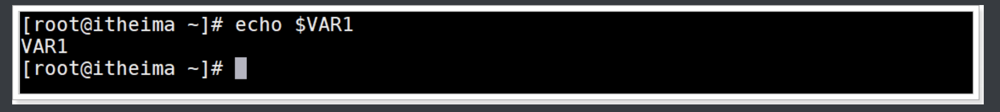

## 环境变量加载流程原理

### shell工作环境分类

交互式与非交互式shell

交互式Shell

> 与用户进行交互, 互动. 效果就是用户输入一个命令, Shell环境立刻反馈响应.

非交互式Shell

> 不需要用户参与就可以执行多个命令. 比如一个脚本文件含有多个命令,直接执行并给出结果

### 登录Shell与非登录Shell环境

| 类型名称        | 含义                                             |
| --------------- | ------------------------------------------------ |
| shell登录环境   | 需要用户名\密码登录的Shell环境                   |
| shell非登录环境 | 不需要用户名,密码进入的Shell环境 或 执行脚本文件 |

> 注意：不同的工作环境加载环境变量流程不一样

### 环境变量初始化流程

1. 全局配置文件

   /etc/profile 

   /etc/profile.d/*.sh

   /etc/bashrc

2. 个人配置文件 

   当前用户/.bash_profile 

   当前用户/.bashrc

环境变量加载初始化过程

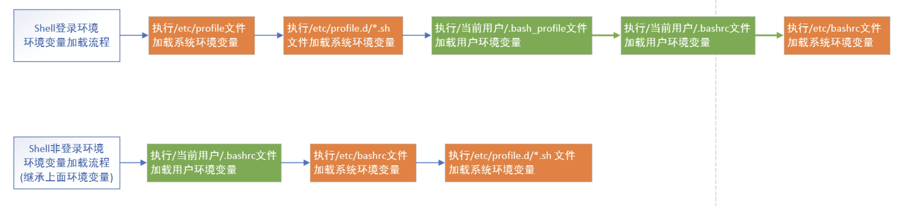

## 环境变量加载流程测试

### 切换shell环境执行脚本文件介绍

在执行一个脚本文件时可以指定具体Shell环境进行执行脚本文件, 这个就是切换Shell环境执行脚本

### shell登录环境执行脚本文件语法

```shell
sh/bash  -l/--login 脚本文件    # 前面用sh或者bash都行  后面用-l或者--login都行
```

> 含义: 先加载Shell登录环境流程初始化环境变量, 再执行脚本文件


### shell非登录环境变量执行脚本文件语法

```shell
bash               # 首先加载Shell非登录环境
sh/bash 脚本文件    # 然后直接执行脚本文件
```

> 含义: 先执行加载Shell非登录环境流程初始化环境变量, 再执行脚本文件

### 测试案例

#### 需求

Shell登录环境会运行/etc/profile

Shell非登录环境会运行/.bashrc

在/etc/profile与/当前用户/.bashrc文件分别设置环境变量数据，然后在shell脚本文件中输出环境变量数据，最后切换不同环境执行shell脚本文件观察验证上面的流程运行

#### 分析

1. 清理工作, 清理/etc/profile文件中VAR1环境变量进行删除, 并且重载这个配置文件

2. 编辑/etc/profile, 增加环境变量VAR1=VAR1

3. 编辑/root/.bashrc, 增加环境变量VAR2=VAR2

4. 创建demo1.sh文件, 读取环境变量数据进行打印

   ```shell
   # 输出环境变量VAR1
   # 输出环境变量VAR2
   ```

5. 以Shell非登录环境执行demo1.sh脚本文件, 观察只会输出VAR2, 不会输出VAR1

6. 以Shell登录环境执行demo1.sh脚本文件, 观察会输出VAR2和VAR1

#### 演示

编辑/etc/profile文件

```Shell
vim /etc/profile
```

编辑添加如下内容，保存退出

```shell
VAR1=VAR1
export VAR1
```

在root目录下，编辑.bashrc文件，然后添加VAR2

```shell
vim .bashrc

# 在文件.bashrc加入
VAR2=VAR2
export VAR2
```

创建一个demo1.sh，添加以下内容

```shell
#!/bin/bash
echo $VAR1
echo $VAR2
```

非登录shell环境变量，执行脚本文件

```shell
bash     
bash demo1.sh
```

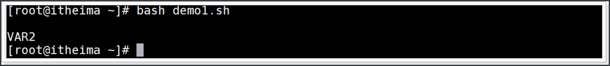

> Shell非登录环境会加载文件 `当前用户/.bashrc`  的环境变量数据
>
> 所以这里会输出VAR2的环境变量数据

登录shell环境，执行脚本文件

```shell
bash -l demo1.sh
```

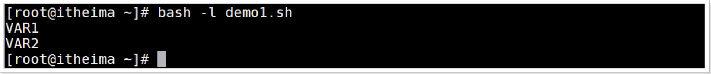

> Shell登录环境会加载文件 `etc/profile`和`当前用户/.bashrc`  的环境变量数据
>
> 所以这里会输出VAR1和VAR2的环境变量数据

问题: 那么以到底将环境变量定义到哪里呢？/etc/profile与/etc/bashrc的区别？

答: 需要登录的执行的shell脚本读取的环境变量配置在：/etc/profile、/当前用户/.bash_profile

不需要登录的用户执行的shell脚本读取的环境变量配置在：/当前用户/.bashrc、/etc/bashrc

## 识别shell环境

如何识别shell登录环境与非登录环境？

### 语法

使用$0识别环境语法

```shell
echo $0
```

> 输出 `-bash` 代表：shell登录环境
>
> 输出 `bash` 代表：  shell非登录环境
>
> 注意：这个 `$0` 环境变量如果用在子shell中(shell脚本文件)输出Shell脚本本身的文件名 

bash命令语法

```shell
bash
```

> bash命令：用于切换为Shell非登录环境

### 实验效果

直接登录linux系统使用的是登录环境

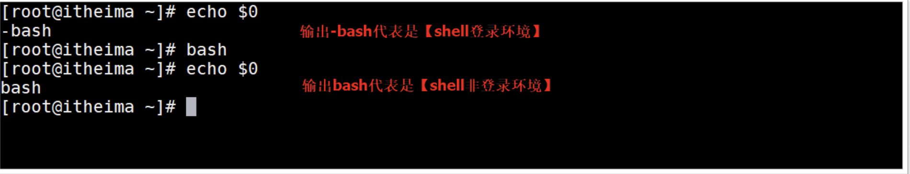

## 详细切换shell环境

### 切换shell环境命令介绍

1. 直接登录加载shell登录环境

2. su切换用户加载Shell登录与Shell非登录环境
3. bash加载Shell登录与Shell非登录环境

### 切换shell环境命令演示

切换方式一: 直接登录系统

直接在虚拟机上使用用户名与密码登录linux系统或使用客户端直接连接远程linux系统

切换方式二: su切换用户登录

语法1:

```shell
su 用户名 --login
或者
su 用户名 -l
# 切换到指定用户，家长在shell登录环境变量
```

语法2:

```shell
su 用户名
# 切换到指定用户,  加Shell非登录环境变量
```

切换方式三: bash切换

语法1:

```shell
bash  # 加载【Shell非登录环境】
```

语法2:

```shell
bash -l  Shell脚本文件 /  bash --login shell脚本文件
sh -l shell脚本文件 / sh --login shell脚本文件
# 先加载【Shell登录环境】然后运行指定Shell脚本文件
```

# shell字符串变量

## 字符串的三种格式

1. 单引号方式
2. 双引号方式，推荐
3. 不用引号方式

执行演示:

```shell
[root@486ac2144c14 ~]# var1='lisi'
[root@486ac2144c14 ~]# var2="lisi"
[root@486ac2144c14 ~]# var3=lisi
[root@486ac2144c14 ~]# echo $var1 
lisi
[root@486ac2144c14 ~]# echo $var2
lisi
[root@486ac2144c14 ~]# echo $var3
lisi
```

## 字符串三中格式区别

1. 使用单引号`''`的字符串: 任何字符都会鸳鸯输出，在其中使用变量是无效的

   ```shell
   [root@486ac2144c14 ~]# country=china
   [root@486ac2144c14 ~]# echo 'I am from ${country}'
   I am from ${country}
   ```

   可以发现没有解析name变量

2. 使用双引号`""`的字符串: 其中包含了变量，那么该变量会被解析得到值，而不是原样输出。字符串中还可以出现双引号的子字符串，但是需要转义。

   ```shell
   [root@486ac2144c14 ~]# country=china
   [root@486ac2144c14 ~]# echo "I am from ${country}"
   I am from china
   [root@486ac2144c14 ~]# echo "I am from \"${country}\""
   I am from "china"
   ```

   可以看到解析出了name，如果相加引号  则加个`\`进行解析。

3. 不加引号的字符串: 不被引号包围的字符串中出现变量时也会被解析，这一点和双引号`" "`包围的字符串一样。字符串中不能出现空格，否则空格后边的字符串会作为其他变量或者命令解析。

## 获取字符串的长度

语法: 

```shell
${#字符串变量名}
```

演示:

```shell
[root@486ac2144c14 ~]# country=china
[root@486ac2144c14 ~]# echo ${#country}
5
```

## 字符串的拼接

总共有三种方式:

1. 无符号拼接
2. 双引号拼接
3. 混合拼接

演示:

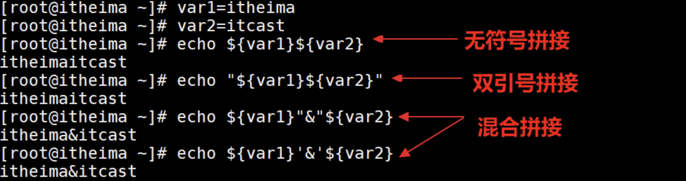

## 字符串截取语法

| 格式                       | 说明                                                         |
| -------------------------- | ------------------------------------------------------------ |
| `${变量名:start:length}`   | 从 string 字符串的左边第 start 个字符开始，<br>向右截取 length 个字符。 |
| `${变量名:start}`          | 从 string 字符串的左边第 start 个字符开始截取，直到最后。    |
| `${变量名:0-start:length}` | 从 string 字符串的右边第 start 个字符开始，<br>向右截取 length 个字符。 |
| `${变量名:0-start}`        | 从 string 字符串的右边第 start 个字符开始截取，直到最后。    |
| `${变量名#*chars}`         | 从 string 字符串第一次出现 *chars 的位置开始，<br>截取 *chars 右边的所有字符。 |
| `${变量名##*chars}`        | 从 string 字符串最后一次出现 *chars 的位置开始，<br>截取 *chars 右边的所有字符。 |
| `${变量名%chars*}`         | 从 string 字符串最后第一次出现 chars* 的位置开始，<br>截取 chars* 左边的所有字符。 |
| `${变量名%%chars*}`        | 从 string 字符串第一次出现 chars* 的位置开始，<br>截取 chars* 左边的所有字符 |

```shell
[root@486ac2144c14 ~]# s="I am from china"
[root@486ac2144c14 ~]# echo ${s:3:6}
m from
[root@486ac2144c14 ~]# echo ${s:10}
china
```

# shell索引数组变量

## 介绍

Shell 支持数组（Array）,   数组是若干数据的集合，其中的每一份数据都称为数组的元素。

> 注意Bash Shell 只支持一维数组，不支持多维数组。

## 数组的定义

语法:在 Shell 中，用括号`( )`来表示数组，数组元素之间用空格来分隔. 语法为：

```shell
array_name=(item1  item2 ...)  # 方式1
array_name=([索引下标1]=item1  [索引下标2]=item2  ...)  # 方式2
```

> 注意，赋值号 `=` 两边不能有空格

演示:

1. 定义数字存储100,3,22,58,77,17,20

   ```shell
   nums=(29 100 13 8 91 44)
   ```

2. Shell 是弱类型的，它并不要求所有数组元素的类型必须相同

   ```shell
   arr=(20 56 "xiao lu")
   ```

   Shell数组元素定义后不是固定的,  定义后还可以赋值

   ```shell
   arr[6]=100
   ```

3. 可以给指定元素赋值初始化

   ```shell
   arr2=([0]=1 [2]=100 [4]="aa")
   ```

   > 由于上面只赋值了3个元素, 所以数组的长度是3

## 数组的获取

语法:

1. 通过下标获取元素值,index从0开始

   ```shell
   ${arr[index]}
   ```

   > 注意要是用`{ }`

2. 获取值同时复制给其他变量

   ```shell
   item=${arr[index]}
   ```

3. 使用 `@` 或 `*` 可以获取数组中的所有元素

   ```shell
   ${arr[@]}
   ${arr[*]}
   ```

4. 获取数组的长度或个数

   ```shell
   ${#arr[@]}
   ${#arr[*]}
   ```

5. 获取数组指定元素的字符长度

   ```shell
   ${#arr[索引]}
   ```

## 数组的拼接

所谓 Shell 数组拼接（数组合并），就是将两个数组连接成一个数组

语法:

使用 `@` 和 `*` 获取数组所有元素之后进行拼接

```shell
array_new=(${array1[@]} ${array2[@]} ...)
array_new=(${array1[*]} ${array2[*]} ...)
```

## 数组的删除

删除数组指定元素数据和删除整个数组数据

语法:

1. 删除数组指定元素数据

   ```shell
   unset array_name[index]
   ```

2. 删除整个数组

   ```shell
   unset array_name
   ```

# shell内置命令

## 内置命令介绍

Shell 内置命令，就是由 Bash Shell 自身提供的命令，而不是文件系统中的可执行文件。

使用type 来确定一个命令是否是内置命令：

```
type 命令
```

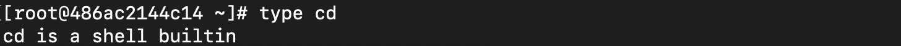

可以看到cd是shell的内置命令

通常来说，内置命令会比外部命令执行得更快，执行外部命令时不但会触发磁盘 I/O，还需要 fork 出一个单独的进程来执行，执行完成后再退出。而执行内置命令相当于调用当前 Shell 进程的一个函数, 还是一个进程, 减少了上下文切换。

## 内置命令列表

| 命令        | 说明                                                  |
| ----------- | ----------------------------------------------------- |
| :           | 扩展参数列表，执行重定向操作                          |
| .           | 读取并执行指定文件中的命令（在当前 shell 环境中）     |
| ==alias==   | 为指定命令定义一个别名                                |
| bg          | 将作业以后台模式运行                                  |
| bind        | 将键盘序列绑定到一个 readline 函数或宏                |
| break       | 退出 for、while、select 或 until 循环                 |
| builtin     | 执行指定的 shell 内建命令                             |
| caller      | 返回活动子函数调用的上下文                            |
| cd          | 将当前目录切换为指定的目录                            |
| command     | 执行指定的命令，无需进行通常的 shell 查找             |
| compgen     | 为指定单词生成可能的补全匹配                          |
| complete    | 显示指定的单词是如何补全的                            |
| compopt     | 修改指定单词的补全选项                                |
| continue    | 继续执行 for、while、select 或 until 循环的下一次迭代 |
| ==declare== | 声明一个变量或变量类型。                              |
| dirs        | 显示当前存储目录的列表                                |
| disown      | 从进程作业表中刪除指定的作业                          |
| ==echo==    | 将指定字符串输出到 STDOUT                             |
| enable      | 启用或禁用指定的内建shell命令                         |
| eval        | 将指定的参数拼接成一个命令，然后执行该命令            |
| exec        | 用指定命令替换 shell 进程                             |
| ==exit==    | 强制 shell 以指定的退出状态码退出                     |
| export      | 设置子 shell 进程可用的变量                           |
| fc          | 从历史记录中选择命令列表                              |
| fg          | 将作业以前台模式运行                                  |
| getopts     | 分析指定的位置参数                                    |
| hash        | 查找并记住指定命令的全路径名                          |
| help        | 显示帮助文件                                          |
| history     | 显示命令历史记录                                      |
| jobs        | 列出活动作业                                          |
| kill        | 向指定的进程 ID(PID) 发送一个系统信号                 |
| let         | 计算一个数学表达式中的每个参数                        |
| local       | 在函数中创建一个作用域受限的变量                      |
| logout      | 退出登录 shell                                        |
| mapfile     | 从 STDIN 读取数据行，并将其加入索引数组               |
| popd        | 从目录栈中删除记录                                    |
| printf      | 使用格式化字符串显示文本                              |
| pushd       | 向目录栈添加一个目录                                  |
| pwd         | 显示当前工作目录的路径名                              |
| ==read==    | 从 STDIN 读取一行数据并将其赋给一个变量               |
| readarray   | 从 STDIN 读取数据行并将其放入索引数组                 |
| readonly    | 从 STDIN 读取一行数据并将其赋给一个不可修改的变量     |
| return      | 强制函数以某个值退出，这个值可以被调用脚本提取        |
| set         | 设置并显示环境变量的值和 shell 属性                   |
| shift       | 将位置参数依次向下降一个位置                          |
| shopt       | 打开/关闭控制 shell 可选行为的变量值                  |
| source      | 读取并执行指定文件中的命令（在当前 shell 环境中）     |
| suspend     | 暂停 Shell 的执行，直到收到一个 SIGCONT 信号          |
| test        | 基于指定条件返回退出状态码 0 或 1                     |
| times       | 显示累计的用户和系统时间                              |
| trap        | 如果收到了指定的系统信号，执行指定的命令              |
| type        | 显示指定的单词如果作为命令将会如何被解释              |
| typeset     | 声明一个变量或变量类型。                              |
| ulimit      | 为系统用户设置指定的资源的上限                        |
| umask       | 为新建的文件和目录设置默认权限                        |
| unalias     | 刪除指定的别名                                        |
| unset       | 刪除指定的环境变量或 shell 属性                       |
| wait        | 等待指定的进程完成，并返回退出状态码                  |

## alias内置命令

alisa 用于给命令创建别名。若该命令且不带任何参数，则显示当前 Shell 进程中的所有别名列表。

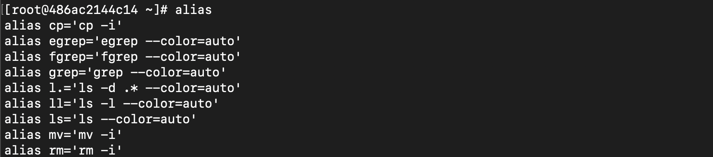

上面是系统为了方便命令操作默认将部分命令创建为别名  `ll` 的命令与`ls -l`的效果一样,   就是因为ll是别名

### alias别名定义语法

```
alias 别名='命令'
```

### unalias别名删除

删除指定别名

```
unalias 别名
```

删除当前shell环境中所有的别名

```
unalias -a
```

>注意:  以上2种方式删除都是临时s删除当前Shell的别名,  如果想永久删除必须去配置文件中手动删除

### alias演示

输出所有进程的信息，我们一般写法如下:

```
ps -aux
```

给上面的命令起别名psList, 并使用psList输出

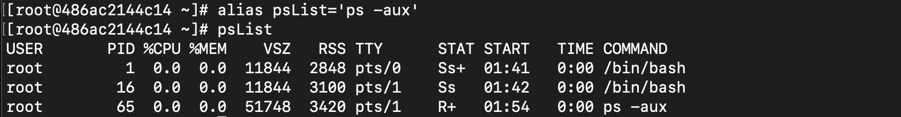

删除psList别名

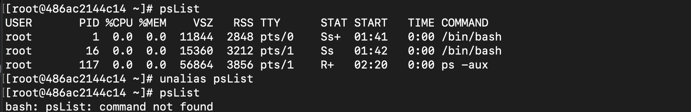

## echo内置命令

echo 是一个 Shell 内置命令，用于在终端输出字符串，并在最后默认加上换行符

### echo输出语法

默认输出换行语法

```
echo 字符串
```

若想输出不换行

```
echo -n 字符串
```

代码演示:

编写一个test.sh  内容如下:

```shell
#!/bin/bash

echo "hello"
echo "world"
echo -n "itheima"
echo -n "shell"
```

sh test.sh运行后的输出结果:

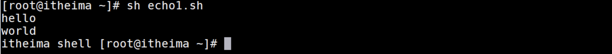

### echo输出转移字符

/n 转移字符

用于echo输出字符串非结尾处的换行,  但是默认echo无法解析`/n` 转义字符


-e参数

-e参数用来解析转移字符

```shell
echo -e "字符串中含有转移字符"
```


## read内置命令

read 是 Shell 内置命令，用于从标准输入中读取数据并赋值给变量。如果没有进行重定向，默认就是从终端控制台读取用户输入的数据；如果进行了重定向，那么可以从文件中读取数据。

语法:

```shell
read [-options] [var1 var2 ...]
```

> `options`表示选项，如下表所示；`var`表示用来存储数据的变量，可以有一个，也可以有多个。
>
> `options`和`var`都是可选的，如果没有提供变量名，那么读取的数据将存放到环境变量 REPLY 中。

options支持的参数

| 选项           | 说明                                                         |
| -------------- | ------------------------------------------------------------ |
| -a array       | 把读取的数据赋值给数组 array，从下标 0 开始。                |
| -d delimiter   | 用字符串 delimiter 指定读取结束的位置，而不是一个换行符（读取到的数据不包括 delimiter）。 |
| -e             | 在获取用户输入的时候，对功能键进行编码转换，不会直接显式功能键对应的字符。 |
| ==-n num==     | 读取 num 个字符，而不是整行字符。                            |
| ==-p  prompt== | 显示提示信息，提示内容为 prompt。                            |
| -r             | 原样读取（Raw mode），不把反斜杠字符解释为转义字符。         |
| ==-s==         | 静默模式（Silent mode），不会在屏幕上显示输入的字符。当输入密码和其它确认信息的时候，这是很有必要的。 |
| ==-t seconds== | 设置超时时间，单位为秒。如果用户没有在指定时间内输入完成，那么 read 将会返回一个非 0 的退出状态，表示读取失败。 |
| -u fd          | 使用文件描述符 fd 作为输入源，而不是标准输入，类似于重定向。 |

### 实例1: 多个变量赋值

需求:

使用read命令给多个变量赋值

步骤:

1. 创建文件read1.sh

2. 编辑文件, 编写read命令提示用户输入多个信息个多个变量赋值,  保存文件

3. 执行read1.sh文件

创建read1.sh  写入以下内容:

```shell
#!/bin/bash
read -p "请输入姓名,年龄,爱好:" name age hobby
echo "姓名: ${name}"
echo "年龄: ${age}"
echo "爱好: ${hobby}"
```

运行效果:

```shell
[root@486ac2144c14 ~]# sh read1.sh 
请输入姓名,年龄,爱好:lu 12 coding
姓名: lu
年龄: 12
爱好: coding
```


### 实例2: 读取一个字符

需求:

从终端控制台只读取一个字符

步骤:

1. 创建文件read2.sh文件
2. 编辑文件,编写read命令,使用-n 1 参数读取一个字符
3. 执行文件

创建read2.sh文件，写入一下内容:

```shell
#!/bin/bash

read -n 1 -p "请输入一个字符:" char
printf '\n'
echo "请输入的字符为:" $char
```

运行效果:

```shell
(base) macbook:~ shawroad$ sh read2.sh 
请输入一个字符:x
请输入的字符为: x
```

> 注意
>
> `-n 1`只读取一个字符。运行脚本后，只要输入的一个字符，立即读取结束，不用等待用户按下回车键。
>
> `printf '\n'`语句用于换行，否则 echo 的输出结果会和用户输入的内容位于同一行，不容易区分

### 实例3: 限制时间输入

需求:

在终端控制台输入时, 设置指定时间内输入密码

步骤:

1. 创建文件read3.sh
2. 编辑文件内容编写, 使用read命令`-t seconds  ` 限制输入时间,  使用`-s` 静默模式输入密码
3. 执行文件

创建read3.sh文件，写入一下内容:

```shell
#!/bin/bash
read -t 20 -sp "请输入密码(20秒内):" pwd1
printf "\n"
read -t 20 -sp "请再次输入密码(20秒内):" pwd2
printf "\n"
if 
   [ $pwd1 == $pwd2 ]
then
   echo "密码和确认密码一致，验证通过"
else
   echo "密码与确认密码不一致，验证失败"
fi
```

## exit内置命令

### exit命令介绍

`exit` 用于退出当前 Shell 进程结束运行，并返回一个退出状态；使用`$?`可以接收这个退出状态.

`exit` 命令可以接受一个整数值作为参数，代表退出状态。如果不指定，默认状态值是 0。

一般情况下，退出状态为 0 表示成功，退出状态为非 0 表示执行失败（出错）了。 

语法

正确退出的语法:

```shell
exit
```

错误退出的语法:

```shell
exit 非0数字   # 介于 0~255 之间的整数，其中只有 0 表示成功，其它值都表示失败
```

### exit应用场景

1. 结束当前Shell进程

2. 当Shell 进程执行出错退出时，可以返回不同的状态值代表不同的错误

   > 比如打开一个文件时，可以返回1 表示文件不存在，2 表示文件没有读取权限，3 表示文件类型不对。

### 实例练习

编写Shell脚本使用exit 退出,  退出时返回一个非0数字状态值,  执行脚本文件并打印返回状态值

创建一个exit.sh文件，写入以下内容:

```shell
#!/bin/bash
echo "one"
exit 6
echo "two"
```

运行后的效果:

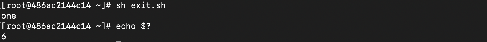

也就是说执行到exit就退出了。不再往下执行。

## declare内置命令

declare命令用于声明 shell 变量。可用来声明变量并设置变量的属性，也可用来显示shell函数。若不加上任何参数，则会显示全部的shell变量与函数(与执行set指令的效果相同)。

### declare命令作用

1. declare设置变量的属性 

2. 查看全部Shell变量与函数

3. 实现关联数组变量

   > 不同于普通数组,  关联数组的下标是字符串, 通过字符串下标操作数据

语法:

1. declare设置变量的属性语法

   ```
   declare [+/-][aArxif][变量名称=设置值]
   ```

   > +/- 　"-"可用来指定变量的属性，"+"则是取消变量所设的属性。
   >
   > a    设置为普通索引数组
   >
   > A    设置为key-value关联数组
   >
   > r 　将变量设置为只读,  也可以使用readonly
   >
   > x 　设置变量成为环境变量，也可以使用export
   >
   > i 　设置为整型变量。
   >
   > f     设置为一个函数变量

   

2. 查看全部shell变量与函数定义语法

   ```shell
   declare [-fF]
   ```

   >declare后无参数，查询全部shell变量与函数定义
   >
   >-f 仅查询显示函数定义
   >
   >-F 仅查询显示函数名字

   查看所有变量与所有函数 

   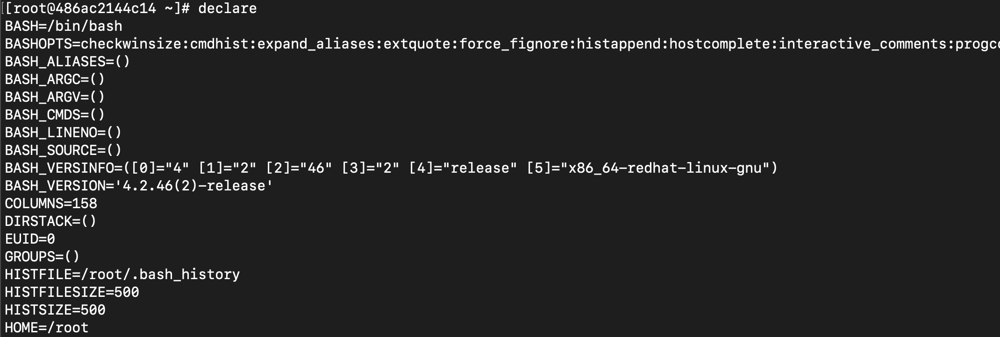

   查看所有函数与定义

   ```shell
   [root@486ac2144c14 ~]# declare -f
   __add_sys_prefix_to_path () 
   { 
       if [ -n "${_CE_CONDA}" ] && [ -n "${WINDIR+x}" ]; then
           SYSP=$(\dirname "${CONDA_EXE}");
       else
           SYSP=$(\dirname "${CONDA_EXE}");
           SYSP=$(\dirname "${SYSP}");
       fi;
       if [ -n "${WINDIR+x}" ]; then
           PATH="${SYSP}/bin:${PATH}";
           PATH="${SYSP}/Scripts:${PATH}";
           PATH="${SYSP}/Library/bin:${PATH}";
           PATH="${SYSP}/Library/usr/bin:${PATH}";
           PATH="${SYSP}/Library/mingw-w64/bin:${PATH}";
           PATH="${SYSP}:${PATH}";
       else
           PATH="${SYSP}/bin:${PATH}";
       fi;
       \export PATH
   }
   __conda_activate () 
   ....
   ```

   查询所有函数名列表

   ```shell
   [root@486ac2144c14 ~]#  declare -F
   declare -f __add_sys_prefix_to_path
   declare -f __conda_activate
   declare -f __conda_hashr
   declare -f __conda_reactivate
   declare -f conda
   declare -f shell_session_delete_expired
   declare -f shell_session_history_allowed
   declare -f shell_session_history_check
   declare -f shell_session_history_enable
   declare -f shell_session_save
   declare -f shell_session_save_history
   declare -f shell_session_update
   declare -f update_terminal_cwd
   ```

   

3. 实现key-value关联数组变量语法

   关联数组也称为“键值对（key-value）”数组，键（key）也即字符串形式的数组下标，值（value）也即元素值。

   ```shell
   declare -A 关联数组变量名=([字符串key1]=值1 [字符串key2]=值2 ...)
   ```

   >declare也可以用于定义普通数组,  `-a` 参数创建普通或索引数组   `-A` 创建关联数组
   >
   >`declare -a 关联数组变量名=(值1 值2 ...)`
   >
   >`declare -a 关联数组变量名=([0]=值1 [1]=值2 ...)`  

   获取指定key的值

   ```
   ${关联数组变量名[key]}
   ```

   获取所有值

   ```shell
   ${关联数组变量名[*]}   # 方式1
   ${关联数组变量名[@]}   # 方式1
   ```

   实例1:

   使用declare定义一普通数组,并获取打印元素数据的值

   创建declare1.sh文件，编写以下内容:

   ```shell
   #!/bin/bash
   declare -a arr1=(1 2 3 aa)
   echo ${arr1[1]}
   echo ${arr1[*]}
   
   declare -a arr2=([0]=1 [1]=2  [2]=3  [4]=aa)
   echo ${arr2[1]}
   echo ${arr2[*]}
   
   declare -a arr2[3]=4
   echo ${arr2[*]}
   ```

   运行后输出结果为;

   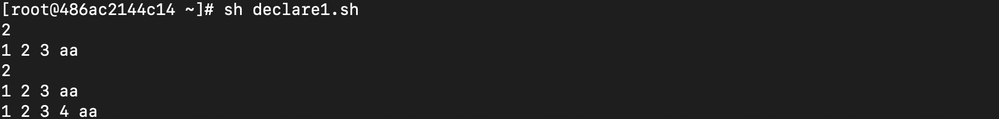

   实例2:

   使用declare定义关联数组并打印输出

   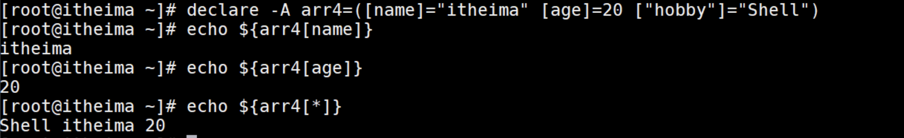

   > 注意: 使用参数`-A`  才是关联数组  , 关联数组无法使用索引获取

# shell运算符

## expr命令

expr 是 evaluate expressions 的缩写，译为“表达式求值”。Shell expr 是一个功能强大，并且比较复杂的命令，它除了可以实现整数计算，还可以结合一些选项对字符串进行处理，例如计算字符串长度、字符串比较、字符串匹配、字符串提取等, 后续讲解。

语法:

计算语法

```
expr 算术运算符表达式
```

>注意: 运算表达式

获取计算结果赋值给新变量语法

```
result = `expr 算术运算符表达式`
```

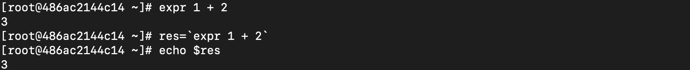

>注意:  运算符表达式中每个数字与符号之间要有空格

## 算术运算符

### 算术运算符介绍

下表列出了常用的算术运算符，假定变量 a 为 1，变量 b 为 2：

| 运算符 | 说明 | 举例                       |
| :----- | :--- | :------------------------- |
| +      | 加法 | `expr $a + $b` 结果为 3    |
| -      | 减法 | `expr $a - $b` 结果为 -1   |
| *      | 乘法 | `expr $a \* $b` 结果为  2  |
| /      | 除法 | `expr $b / $a` 结果为 2    |
| %      | 取余 | `expr $b % $a` 结果为 0    |
| =      | 赋值 | a=$b 将把变量 b 的值赋给 a |

> 四则运算中如果使用了(), 也需要转义 `\( 1 + 1 \)`

### 算术运算符演示

operation1.sh脚本代码:

```shell
#!/bin/bash
a=1 b=2          # 声明变量a=1和b=2
echo "a=${a} b=${b}"
echo "a + b = `expr $a + $b`"
echo "a * b = `expr $a \* $b`"
echo "a - b = `expr $a - $b`"
echo "a * b = `expr $a \* $b`"
echo "b / a = `expr $b / $a`"
echo "b % a = `expr $b % $a`"

echo -n "a == b 结果为 "
if [ $a == $b ]       # 注意变量与符号之间都要有空格
then
        echo true
else
        echo false
fi

echo -n "a != b 结果为 "
if [ $a != $b ]        # 注意变量与符号之间都要有空格
then
        echo true
else
        echo false
fi
```

执行输出结果:

```shell
[root@486ac2144c14 ~]# sh operation1.sh 
a=1 b=2
a + b = 3
a * b = 2
a - b = -1
a * b = 2
b / a = 2
b % a = 0
-n a == b 结果为 
false
-n a != b 结果为 
true
```

## 比较运算符

### 整数比较运算符

语法:

下表列出了常用的比较运算符，假定变量 a 为 1，变量 b 为 2：

| 运算符 | 说明                                                         | 举例                     |
| :----- | :----------------------------------------------------------- | :----------------------- |
| `-eq`  | equals 检测两个数是否相等，相等返回 0, 否则返回1。           | `[ $a -eq $b ]` 返回 1。 |
| `-ne`  | not equals检测两个数是否不相等，不相等返回 true。            | `[ $a -ne $b ]` 返回 0。 |
| `-gt`  | greater than检测左边的数是否大于右边的,<br>是返回0, 否则1    | `[ $a -gt $b ]` 返回 1。 |
| `-lt`  | lower than检测左边的数是否小于右边的,<br>是返回0, 否则1      | `[ $a -lt $b ]` 返回 0。 |
| `-ge`  | greater equals检测左边的数是否大于等于右边的,<br>是返回0, 否则1 | `[ $a -ge $b ] `返回 1。 |
| `-le`  | lower equals检测左边的数是否小于等于右边的,<br>是返回0, 否则1 | `[ $a -le $b ] `返回 0。 |
| `<`    | 检测左边的数是否小于右边的,<br/>是返回0, 否则1               | `(($a<$b))` 返回0        |
| `<=`   | 检测左边的数是否小于等于右边的,<br/>是返回0, 否则1           | `(($a<=$b))` 返回0       |
| `>`    | 检测左边的数是否大于右边的,<br/>是返回0, 否则1               | `(($a>$b))` 返回1        |
| `>=`   | 检测左边的数是否大于等于右边的,<br/>是返回0, 否则1           | `(($a>=$b))` 返回1       |

> 注意: 整数比较运算符只支持整数，不支持小数与字符串(字符串比较后续讲解)，除非字符串的值是整数数字。
>
> 每个命令都有返回值,  这个后面我们会讲解退出状态再具体说明,  返回0代表成功, 返回1代表失败

演示

operation2.sh脚本代码:

```shell
#!/bin/bash
a=1 b=2
echo "a=${a} b=${b}"
if [ $a -eq $b ]
then
   echo "$a -eq $b : a 等于 b"
else
   echo "$a -eq $b: a 不等于 b"
fi
if [ $a -ne $b ]
then
   echo "$a -ne $b: a 不等于 b"
else
   echo "$a -ne $b : a 等于 b"
fi
if [ $a -gt $b ]
then
   echo "$a -gt $b: a 大于 b"
else
   echo "$a -gt $b: a 不大于 b"
fi
if [ $a -lt $b ]
then
   echo "$a -lt $b: a 小于 b"
else
   echo "$a -lt $b: a 不小于 b"
fi
if [ $a -ge $b ]
then
   echo "$a -ge $b: a 大于或等于 b"
else
   echo "$a -ge $b: a 小于 b"
fi
if [ $a -le $b ]
then
   echo "$a -le $b: a 小于或等于 b"
else
   echo "$a -le $b: a 大于 b"
fi

if (($a > $b))
then
   echo "$a > $b: a 大于 b"
else
   echo "$a > $b: a 不大于 b"
fi
if (($a < $b))
then
   echo "$a < $b: a 小于 b"
else
   echo "$a < $b: a 不小于 b"
fi
if (($a >= $b))
then
   echo "$a >= $b: a 大于或等于 b"
else
   echo "$a >= $b: a 小于 b"
fi
if (($a <= $b))
then
   echo "$a <= $b: a 小于或等于 b"
else
   echo "$a <= $b: a 大于 b"
fi
```

执行输出结果:

```shell
[root@486ac2144c14 ~]# sh operation2.sh 
a=1 b=2
1 -eq 2: a 不等于 b
1 -ne 2: a 不等于 b
1 -gt 2: a 不大于 b
1 -lt 2: a 小于 b
1 -ge 2: a 小于 b
1 -le 2: a 小于或等于 b
1 > 2: a 不大于 b
1 < 2: a 小于 b
1 >= 2: a 小于 b
1 <= 2: a 小于或等于 b
```

### 字符串比较运算符

可以比较2个变量, 变量的类型可以为数字（整数，小数）与字符串

语法:

下表列出了常用的字符串运算符，假定变量 a 为 "abc"，变量 b 为 "efg"：

字符串比较可以使用 `[[]]` 和 `[]` 2种方式

| 运算符  | 说明                                                      | 举例                                                         |
| :------ | :-------------------------------------------------------- | :----------------------------------------------------------- |
| == 或 = | 相等。用于比较两个字符串或数字，相同则返回 0。可以使用`=` | `[ $a == $b ] `返回1 <br>`[  $a = $b ]` 返回 1<br>`[[ $a == $b ]]` 返回1<br>`[[ $a = $b ]]` 返回1 |
| !=      | 不相等。用于比较两个字符串或数字，不相同则返回 0。        | `[ $a != $b ]` 返回 0<br>`[[ $a != $b ]]` 返回 0             |
| <       | 小于, 用于比较两个字符串或数字， 小于返回0， 否则返回1    | `[ $a \< $b ]` 返回 0<br/>`[[ $a < $b ]]` 返回 0             |
| >       | 大于, 用于比较两个字符串或数字， 大于返回0， 否则返回1    | `[ $a \> $b ]` 返回 1<br/>`[[ $a > $b ]]` 返回 1             |
| -z      | 检测字符串长度是否为0，为0返回 true。                     | [ -z $a ] 返回 1。                                           |
| -n      | 检测字符串长度是否不为 0，不为 0 返回 true。              | [ -n "$a" ] 返回 0。                                         |
| $       | 检测字符串是否不为空，不为空返回 0 ,否则返回1。           | [ $a ] 返回 0。                                              |

>字符串比较没有 `<=`  可以通过 `[[ "a" < "b" && "a" = "b" ]]`

演示:

Operation3.sh代码如下:

```shell
#!/bin/bash

a="itheima" b="itcast" c=1 d=2
echo "a=${a},b=${b},c=${c},d=${d}"

if [ $a = $b ]
then
   echo "$a = $b : a 等于 b"
else
   echo "$a = $b: a 不等于 b"
fi

if [ $a != $b ]
then
   echo "$a != $b : a 不等于 b"
else
   echo "$a != $b: a 等于 b"
fi

if [[ $a > $b ]]
then
   echo "$a > $b : a 大于 b"
else
   echo "$a > $b: a 不大于 b"
fi

if [ $a \> $b ]
then
   echo "$a > $b : a 大于 b"
else
   echo "$a > $b: a 不大于 b"
fi

if [[ $c > $d ]]
then
   echo "$c > $d : c 大于 d"
else
   echo "$c > $d: c 不大于 d"
fi

if [ -z $a ]
then
   echo "-z $a : 字符串长度为 0"
else
   echo "-z $a : 字符串长度不为 0"
fi

if [ -n "$a" ]
then
   echo "-n $a : 字符串长度不为 0"
else
   echo "-n $a : 字符串长度为 0"
fi

if [ $a ]
then
   echo "$a : 字符串不为空"
else
   echo "$a : 字符串为空"
fi
```

运行效果;

```shell
[root@486ac2144c14 ~]# sh operation3.sh 
a=itheima,b=itcast,c=1,d=2
itheima = itcast: a 不等于 b
itheima != itcast : a 不等于 b
itheima > itcast : a 大于 b
itheima > itcast : a 大于 b
1 > 2: c 不大于 d
-z itheima : 字符串长度不为 0
-n itheima : 字符串长度不为 0
itheima : 字符串不为空
```

**`[[]]`  和 `[]` 的区别**

**区别一:word splitting的发生**

> `[[]]` 不会有word splitting发生
>
> `[]` 会有word splitting发生

word splitting介绍: 会将含有空格字符串进行分拆分割后比较

示例:

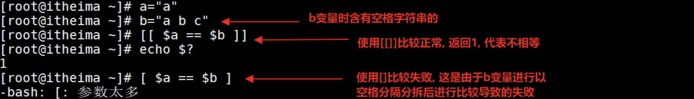

**区别二:转义字符**

> `[[]]`  对 `<` 不需要转义, 格式为 ` [[ 字符串1 < 字符串2 ]]` 
>
> `[]` 需要对 `<,>等` 转义 ,  格式为 ` [ 字符串1 \< 字符串2 ]` 

##### 示例

`[]` 执行效果

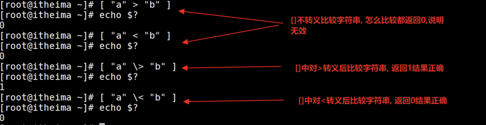

`[[]]` 执行效果, 不需要转义执行结果正确

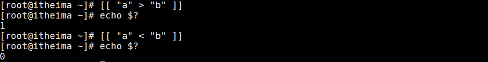

常用: `[[ 表达式 ]]`  即可以实现数字和字符串比较,  并且不需要转义, 不会分割

## 布尔运算符

### 介绍

| 运算符 | 说明                                                         | 举例                                  |
| :----- | :----------------------------------------------------------- | :------------------------------------ |
| !      | 非运算，取反, 表达式为 true 则返回 false，<br>否则返回 true。 | `[ ! false ]` 返回 true。             |
| -o     | or 或运算，有一个表达式为 true 则返回 true。                 | `[ 表达式1 -o 表达式2 ]` 返回 true。  |
| -a     | and 与运算，两个表达式都为 true 才返回 true。                | `[ 表达式1 -a 表达式2 ]` 返回 false。 |

> 注意布尔运算符只能放在`[]`  才有效  
>
> 以后常使用布尔运算符与test命令进行连接条件测试, 后续讲解

### 演示

operation4.sh

```shell
#!/bin/bash
a=1 b=2

if [ $a -lt 2 -a $b -gt 10 ]
then
   echo "$a 小于 2 且 $b 大于 10 : 返回 true"   
else
   echo "$a 小于 2 且 $b 大于 10 : 返回 false"  # $b -gt 10不成立, 输出这个表达式
fi

if [ $a -lt 10 -o $b -gt 10 ]
then
   echo "$a 小于 10 或 $b 大于 10 : 返回 true"  # $a -lt 10 成立, 输出这个表达式
else
   echo "$a 小于 10 或 $b 大于 10 : 返回 false"
fi

if [ ! $a -gt $b ]
then
   echo "$a 大于 $b 取反 : 返回 true"
else
   echo "$a 大于 $b 取反 : 返回 false"   # $a -gt $b 为true , 取反为false, 输出这个表达式
fi
```

输出结果:

```shell
[root@486ac2144c14 ~]# sh operation4.sh 
1 小于 2 且 2 大于 10 : 返回 false
1 小于 10 或 2 大于 10 : 返回 true
1 大于 2 取反 : 返回 true
```

## 逻辑运算符

### 介绍

| 运算符 | 说明       | 举例                                  |
| :----- | :--------- | :------------------------------------ |
| &&     | 逻辑的 AND | `[[ 表达式1 && 表达式2 ]]` 返回 false |
| \|\|   | 逻辑的 OR  | `[[ 表达式1 || 表达式2 ]]` 返回 true  |

> 注意:  使用`&&`  和  `||`  的运算符必须放在 `[[]]`  或 `(())`中才有效, 否则报错
>
> `-a` 和 `-o` 的运算符必须放在 `[]` 在才有效 或 test命令中
>
> !可以用在`[]`,`[[]]`中, 不可以在(())

### 演示

operation5.sh

```shell
#!/bin/bash

a=1 b=2

if [[ $a -lt 10 && $b -gt 10 ]]
then
   echo "返回 true" 
else
   echo "返回 false"  # $b -gt 10 不成立, 输出false
fi

if [[ $a -lt 10 || $b -gt 10 ]]
then
   echo "返回 true"   # $a -lt 10 成立,  输出true
else
   echo "返回 false"  
fi
```

执行输出结果为:

```shell
[root@486ac2144c14 ~]# sh operation5.sh 
返回 false
返回 true
```

## 文件测试运算符

文件测试运算符用于检测文件的各种属性。

属性检测描述如下：

| 操作符          | 说明                                                         | 举例                      |
| :-------------- | :----------------------------------------------------------- | :------------------------ |
| -b file         | 检测文件是否是块设备文件，如果是，则返回 true。              | [ -b $file ] 返回 false。 |
| -c file         | 检测文件是否是字符设备文件，如果是，则返回 true。            | [ -c $file ] 返回 false。 |
| ==-d file==     | directory, 检测文件是否是目录，如果是，则返回 true。         | [ -d $file ] 返回 false。 |
| ==-f file==     | file, 检测文件是否是普通文件（既不是目录，也不是设备文件）<br>，如果是，则返回 true。 | [ -f $file ] 返回 true。  |
| -g file         | 检测文件是否设置了 SGID 位，如果是，则返回 true。            | [ -g $file ] 返回 false。 |
| -k file         | 检测文件是否设置了粘着位(Sticky Bit)，如果是，<br>则返回 true。 | [ -k $file ] 返回 false。 |
| -p file         | 检测文件是否是有名管道，如果是，则返回 true。                | [ -p $file ] 返回 false。 |
| -u file         | 检测文件是否设置了 SUID 位，如果是，则返回 true。            | [ -u $file ] 返回 false。 |
| ==-r file==     | read,检测文件是否可读，如果是，则返回 true。                 | [ -r $file ] 返回 true。  |
| ==-w file==     | write,检测文件是否可写，如果是，则返回 true。                | [ -w $file ] 返回 true。  |
| ==-x file==     | execute, 检测文件是否可执行，如果是，则返回 true。           | [ -x $file ] 返回 true。  |
| ==-s file==     | size, 检测文件是否为空（文件大小是否大于0）<br>，不为空返回 true。 | [ -s $file ] 返回 true。  |
| ==-e file==     | exists, 检测文件（包括目录）是否存在，如果是，<br>则返回 true。 | [ -e $file ] 返回 true。  |
| file1 -nt file2 | new than(nt),  file1是否比file2新                            | [ file1 -nt file2 ]       |
| file1 -ot file2 | old than(ot), file1是否比file2旧                             | [ file1 -ot file2 ]       |

其他检查符：

- -S: 判断某文件是否 socket。
- -L: link, 检测文件是否存在并且是一个符号链接。

语法:

```shell
[ options 文件路径字符串]
或
[[ options 文件路径字符串 ]]
```

### 演示

operation6.sh

```shell
#!/bin/bash

file="/root/operation1.sh"
if [ -w $file ]
then
   echo "文件可写"
else
   echo "文件不可写"
fi
if [ -r $file ]
then
   echo "文件可读"
else
   echo "文件不可读"
fi
if [ -x $file ]
then
   echo "文件可执行"
else
   echo "文件不可执行"
fi
if [ -f $file ]
then
   echo "文件是普通文件"
else
   echo "文件是特殊文件"
fi
if [ -s $file ]
then
   echo "文件不是空"
else
   echo "文件是空"
fi
if [ -e $file ]
then
   echo "文件存在"
else
   echo "文件不存在"
fi
if [ -d $file ]
then
   echo "文件是目录"
else
   echo "文件不是目录"
fi

file2="/root/operation2.sh"
if [ file -nt file2 ]
then
   echo "operation1.sh文件比operation2.sh文件新"
else
   echo "operation1.sh文件不比operation2.sh文件新"
fi
```

# shell整数计算命令

## expr命令详解

expr (evaluate expressions 的缩写)，译为“表达式求值”。Shell expr 是一个功能强大，并且比较复杂的命令，它除了可以实现整数计算，还可以结合一些选项对字符串进行处理，例如计算字符串长度、字符串比较、字符串匹配、字符串提取等.

### 求值表达式

计算语法;

```shell
expr 算术运算符表达式
# 例如: expr 1 + 1   返回:2
# 例如: expr \( 10 + 10 \) \* 2 + 100   返回: 140
```

获取计算结果赋值给新变量语法

```shell
result=`expr 算术运算符表达式`
# 例如: result=`expr 1 + 1`  输出result得到结果: 2
```

### 字符串语法

计算字符串长度语法

```shell
expr length  字符串
# 例如: expr length "xiaolu"   # 返回:6
```

截取字符串语法

```shell
expr substr 字符串 start end
# start 截取字符串的起始位置，从1开始
# end 截取字符串的结束位置，包含这个位置截取
# 例如: expr substr "itheima" 1 2    # 返回it
```

获取一个字符在字符串中出现的位置

```shell
expr index 被查找字符串 需要查找的字符
# 例如: expr index "itheima" t   # 返回2
```

正则表达式匹配1语法

```shell
expr match 字符串 正则表达式
# 正则表达式默认带有^ ,  代表以什么开头
# 返回值为符合匹配字符的长度, 否则返回为0
# 例如: expr match "itheima" ".*m"  会返回: 6
# 正则表达式通配符"."代表任意一个字符
# 正则表达式通配符"*"代表签名的字符可以出现0到多次
# ".*m" 含义为匹配字符串中m前面的字符串长度 
```

正则表表达式匹配2语法,  功能与语法1一样

```shell
expr 字符串 : 正则表达式
# 正则表达式默认带有^ ,  代表以什么开头
# 返回值为符合匹配字符的长度, 否则返回为0
# 例如: expr "itheima" : ".*m"  会返回: 6
```

练习demo:

```shell
#!/bin/bash
# 四则运算
result=`expr \( 10 + 10 \) \* 2 + 100`
echo "(10+10)*2+100=${result}"

# 计算字符串的长度
echo "itheima字符串长度=`expr length "itheima"`"

# 获取第一个字符在字符串中出现的位置
echo "itheima字符串中第一个t的位置=`expr index "itheima" t`"

# 正则表达式匹配1
echo "正则表达式match匹配查找itheima字符串中m前面任意字符的总长度=`expr match "itheima" ".*m"`"

# 正则表达式匹配2
echo "正则表达式匹配查找itheima字符串中m前面任意字符的总长度=`expr "itheima" : ".*m"`"
```

执行结果:

 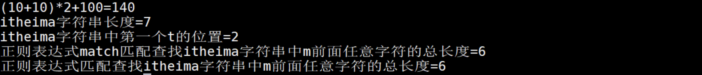

## (())命令详解

### 介绍

双小括号 (( )) , 用于进行数学运算表达式的执行 , 将数学运算表达式放在`((`和`))`之间。

可以使用`$`获取 (( )) 表达式命令的结果，这和使用`$`获得变量值是一样的。

### 用法

| 运算操作符/运算命令                          | 说明                                                         |
| -------------------------------------------- | ------------------------------------------------------------ |
| ((a=1+6))<br>((b=a-1)) <br>((c=a+b))         | 这种写法可以在计算完成后给变量赋值。以 ((b=a-1)) 为例，<br>即将 a-1 的运算结果赋值给变量 c。  注意，使用变量时不用加`$`前缀，<br>(( )) 会自动解析变量名。 |
| `a=$((1+6)`<br>`b=$((a-1))`<br> `c=$((a+b))` | 可以在 (( )) 前面加上`$`符号获取 (( )) 命令的执行结果，<br>也即获取整个表达式的值。以 `c=$((a+b))` 为例，即将 a+b 这个<br>表达式的运算结果赋值给变量 c。  注意，如果 c=((a+b)) 这样的写<br>法是错误的，不加`$`就不能取得表达式的结果。 |
| ((a>7 && b==c))                              | (( )) 也可以进行逻辑运算，在 if 语句中常会使用逻辑运算。     |
| echo $((a+10))                               | 需要立即输出表达式的运算结果时，可以在 (( )) 前面加`$`符号。 |
| ((a=3+5, b=a+10))                            | 对多个表达式同时进行计算, 多表表达式使用","号隔开            |

> 注意:  符号之间有无空格都可以 , (( a = 1 + 6 )) 等价于 ((a=1+6))

实例;

```shell
#!/bin/bash
# 计算1+6赋值给变量a
((a=1+6))

# 计算变量a-1赋值给变量b
((b=a-1))

# 计算变量a+变量b赋值给变量c
((c=a+b))

# 打印变量a,变量b, 变量c的值
echo "a=${a},b=${b},c=${c}"

# $赋值写法
a=$((1+6)) b=$((a-1)) c=$((a+b))
echo "a=${a},b=${b},c=${c}"

# (())多个表达式计算赋值
((a=1+6,b=a-1,c=a+b))
echo "a=${a},b=${b},c=${c}"

# echo输出直接使用(())
echo "1+6=$((1+6))"

# (()) 用于逻辑表达式 在if中使用
if ((a>7 && b==c))
then
        echo "a>7 && b==c 成立"
else
        echo "a>7 && b==c 不成立"
fi
```

执行结果:

```shell
[root@486ac2144c14 ~]# sh operation5.sh 
a=7,b=6,c=13
a=7,b=6,c=13
a=7,b=6,c=13
1+6=7
a>7 && b==c 不成立
```

## let命令详解

let 命令和双小括号 (( )) 在数字计算方面功能一样.  但是没有(())功能强大,  let只能用于赋值计算, 不能直接输出, 不可以条件判断一起使用

### 语法

```shell
let 赋值表达式
```

> 注意
>
> 1. 语法功能等价于`((表达式))`
>
> 2. 多个表达式之间使用空格,  不是","号
>
> 3. 对于类似`let a+b`这样的写法，Shell 虽然计算了 a+b 的值，但却将结果丢弃, 如果 `echo let a+b` 会直接输出字符串 `a+b` ；若不想这样，可以使用`let sum=a+b`将 a+b 的结果保存在变量 sum 中。
>
>    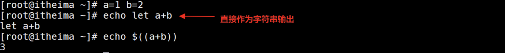
>
>    输出建议使用(())

### 实例

```shell
#!/bin/bash
# 计算1+6赋值给变量a
let a=1+6

# 计算变量a-1赋值给变量b
let b=a-1

# 计算变量a+变量b赋值给变量c
let c=a+b

# 打印变量a,变量b, 变量c的值
echo "a=${a},b=${b},c=${c}"

# let多个表达式计算赋值
let a=1+6 b=a-1 c=a+b
echo "a=${a},b=${b},c=${c}"
```

执行输出结果:

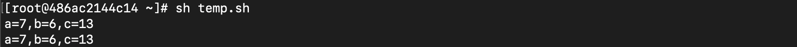

## $[]命令详解

和 (())、let 命令类似，$[] 也只能进行整数运算。但是只能对单个表达式的计算求值与输出

### 语法

```shell
$[表达式]
```

> 1. $[] 会对`表达式`进行计算，并取得计算结果
> 2. 表达式内部不可以赋值给变量

### 实例

```shell
#!/bin/bash
# 计算1+6赋值给变量a
a=$[1+6]

# 计算变量a-1赋值给变量b
b=$[a-1]

# 计算变量a+变量b赋值给变量c
c=$[a+b]

# 打印变量a,变量b, 变量c的值
echo "a=${a},b=${b},c=${c}"

# 直接输出
echo "$[1+6],$[7-1],$[7+6]"
```

执行输出结果:

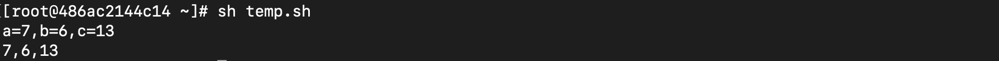

## bc命令

Bash shell内置了对整数运算的支持，但是并不支持浮点运算，而 linux bc (basic calculator)命令可以很方便的进行浮点运算. bc命令是Linux简单的计算器,能进行进制转换与计算。能转换的进制包括十六进制、十进制、八进制、二进制等。可以使用的运算符号包括(+)加法、(-)减法、(*)乘法、(/)除法、(^)指数、(%)余数等

### 语法

```shell
bc [options] [参数]
```

options

| 选项   | 说明                                                        |
| ------ | ----------------------------------------------------------- |
| -h     | help，帮助信息                                              |
| -v     | version，显示命令版本信息                                   |
| ==-l== | mathlib, 使用标准数学库, 例如使用内置函数就需要使用这个参数 |
| -i     | interactive, 强制交互                                       |
| -w     | warn, 显示 POSIX 的警告信息                                 |
| -s     | standard, 使用 POSIX 标准来处理                             |
| ==-q== | quiet, 不显示欢迎信息                                       |

> 默认使用bc命令后回车会有很多欢迎信息，  可以使用  `bc -q`  回车后不会有欢迎信息 

参数

文件： 指定包含计算任务的文件。

### 实例

创建一个文件task.txt， 编辑内容如下（一行一个表达式）:

```shell
108*67+12345
58+2007*11
```

执行命令:

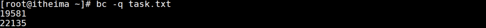

> 可以使用 `quit` 命令退出bc

### bc中的内置变量和数学函数

内置变量

| 变量名      | 作 用                                                        |
| ----------- | ------------------------------------------------------------ |
| scale       | 指定精度，也即小数点后的位数, 对计算结果指定保留小数；默认为 0，也即不使用小数部分。 |
| ibase       | 指定输入的数字的进制，默认为十进制。                         |
| obase       | 指定输出的数字的进制，默认为十进制。                         |
| last 或者 . | 获取最近计算打印结果的数字                                   |

内置数学函数

| 函数名  | 作用                               |
| ------- | ---------------------------------- |
| s(x)    | 计算 x 的正弦值，x 是弧度值。      |
| c(x)    | 计算 x 的余弦值，x 是弧度值。      |
| a(x)    | 计算 x 的反正切值，返回弧度值。    |
| l(x)    | 计算 x 的自然对数。                |
| e(x)    | 求 e 的 x 次方。                   |
| j(n, x) | 贝塞尔函数，计算从 n 到 x 的阶数。 |

### bc的使用

通常在linux下bc当计算器用, 具体有3个用法

1. bc中互动式的数学运算
2. shell中非互动式的管道运算
3. shell中非互动式的输入重定向运算

#### 实例1: bc中互动式的数学运算

使用`bc -q` 回车即可，直接进行计算

演示:

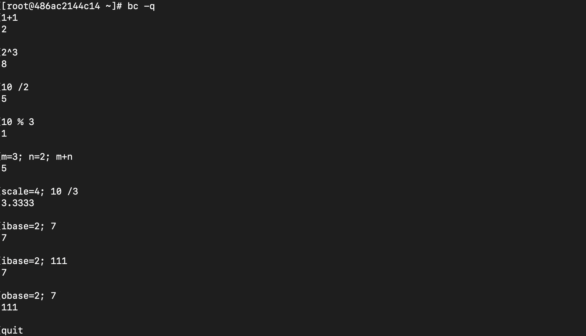

如果想使用数学函数  启动的时候命令为: `bc -q -l`

#### 实例2: shell中非互动式的管道运算

在 Shell 脚本中，我们可以借助管道使用 bc 计算器。

借用管道使用bc计算器语法

直接进行bc的表达式计算输出

```shell
echo "expression" | bc [options]
```

>"expression" 表达式必须符合bc命令要求的公式
>
>"expression"  表达式里面可以引用shell变量
>
>例如:  Shell变量 `a=2`   在表达式里面引用的语法:  `$a`

将bc计算结果赋值给shell变量

```shell
# 第一种方式
var_name=`echo "expression" | bc [options]`

# 第二种方式
var_name=$(echo "expression" | bc [options])
```

> $() 与 `` 功能一样, 都是执行里面的命令
>
> 区别
>
> ​     `` 是所有linux系统支持的方式,  兼容性较好, 但是容易与引号产生混淆
>
> ​      $() 不是所有linux系统都支持的方式,  兼容性较差, 但是不容易产生混淆

演示:

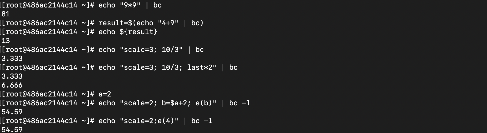

> 注意 b是bc中定义的新变量, 与shell变量没有任何关系,  所以不可以在shell中获取b变量

进制转换

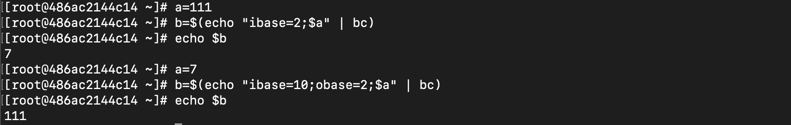

#### 实例3: shell中非互动式的输入重定向运算

将计算表达式输出给bc去执行, 特点类似于文件中输入,可以输入多行表达式, 更加清晰

语法:

```shell
# 第一种方式
var_name=`bc [options] << EOF
第一行表达式1
第二行表达式2
...
EOF
`

# 第二种方式
var_name=$(bc [options] << EOF
第一行表达式1
第二行表达式2
...
EOF
)
```

> `var_name` 这是Shell变量的名字
>
> `bc` 执行bc的命令
>
> `EOF..EOF`  输入流的多行表达式
>
> 含义:  将EOF中间多行表达式输入给到bc去执行, j将bc执行的结果给到Shell变量var_name

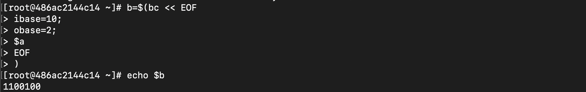

> 如果有大量的数学计算，那么使用输入重定向就比较方便，因为数学表达式可以换行，写起来更加清晰。

# 流程控制语句

## 循环控制语句: if else语句

### if语法

多行写法语法

```shell
if 条件
then
   命令
fi
```

> 可以将if语句放入一行语法
>
> ```shell
> if 条件; then 命令; fi
> ```

### if else语法

```shell
if 条件
then
   命令
else
   命令
fi
```

### if elif else语法

```shell
if  条件1
then
   命令1
elif 条件2
then
    命令2
elif 条件3
then
    命令3
……
else
   命令N
fi

```

实例:

```shell
# 提示"请输入你的考试成绩:" 接收用户输入一个成绩, 之后使用if else条件句判断
# 要求1: 小于 60 输出"不及格"
# 要求2: 大于等于70 并且 小于80 输出"中等"
# 要求3: 大于等于80 并且 小于90 输出"良好"
# 要求4: 大于等于90 并且 小于等于100 输出"优秀"
# 要求5: 以上不符合输出"成绩不合法"

#!/bin/bash
read -p "请输入你的考试成绩:" score
if (( $score < 60 )); then
    echo "不及格"
elif (( $score >= 60 && $score < 70 )); then
    echo "及格"
elif (( $score >= 70 && $score < 80 )); then
    echo "中等"
elif (( $score >= 80 && $score < 90 )); then
    echo "良好"
elif (( $score >= 90 && $score <= 100 )); then
    echo "优秀"
else
    echo "成绩不合法"
fi
```

> `(())`是一种数学计算命令，它除了可以进行最基本的加减乘除运算，还可以进行大于、小于、等于等关系运算，以及与、或、非逻辑运算。当 a 和 b 相等时，`(( $a == $b ))`判断条件成立，进入 if，执行 then 后边的 echo 语句

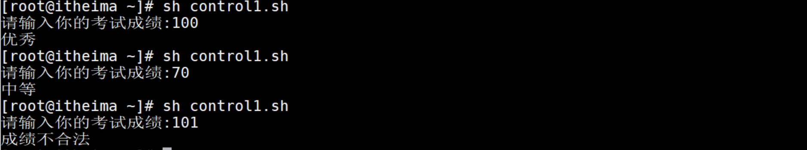

### if条件判断句的退出状态

#### 介绍

linux任何命令的的执行都会有一个退出状态,  无论是内置命令还是外部文件命令. 还是自定义的 Shell 函数，当它退出（运行结束）时，都会返回一个比较小的整数值给调用（使用）它的程序，这就是命令的**退出状态**

大多数命令状态0代表成功, 非0代表失败. 也有特殊的命令,比如 diff 命令用来比较两个文件的不同，对于“没有差别”的文件返回 0，对于“找到差别”的文件返回 1，对无效文件名返回 2

Shell 中，有多种方式取得命令的退出状态，其中 `$?` 是最常见的一种.

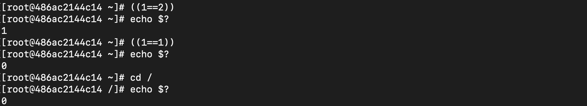

#### 退出状态和逻辑运算符的组合

shell if语句使用逻辑运算符将多个退出状态组合起来，这样就可以一次判断多个条件了。

| 运算符     | 使用格式         | 说明                                                         |
| ---------- | ---------------- | ------------------------------------------------------------ |
| && 或 -a   | 条件1 && 条件2   | 逻辑与运算符，当 条件1 和 条件2 同时成立时，<br>整个表达式才成立。  如果检测到 条件1 的退出状态为 0，<br>就不会再检测 条件2 了，因为不管 条件2 的退出状态是什么，<br>整个表达式必然都是不成立的，检测了也是多此一举。 |
| \|\| 或 -o | 条件1 \|\| 条件2 | 逻辑或运算符，条件1 和 条件2 两个表<br>达式中只要有一个成立，整个表达式就成立。  如果检<br>测到 条件1 的退出状态为 1，就不会再检测 条件2 了，因为<br>不管 条件2 的退出状态是什么，整个表达式必然都是成立的，<br>检测了也是多此一举。 |
| !          | !条件            | 逻辑非运算符，相当于“取反”的效果。如果 条件 成立，那么整<br>个表达式就不成立；如果 条件 不成立，那么整个表达式就成立。 |

#### 实例

需求

提示输入"请输入文件全名: "和"请输入数据:" 并接收文件名与数据

使用逻辑运算符判断满足2 条件 :  文件需要具有可写权限  和   输入的数据长度不为0

满足以上2个条件 将用户输入的 数据 写入到指定的文件中去

第一步创建文件: `touch itheima.txt`

第二步写代码:

```shell
#!/bin/bash
read -p "请输入文件全名: " filename
read -p "请输入数据:" data
if [ -w $filename -a -n $data ]
then
   echo $data
   echo $data > $filename
   echo "成功"
else
   echo "失败"
fi
```

> test命令用于对文件或字符串进行检测,  `-w` 判断文件是否存在并且可写,  `-n` 用于检测字符串是否非空, 后续讲解.
>
> `$data > $filename`   其中 `>`  用于将内容输出到指定文件中去

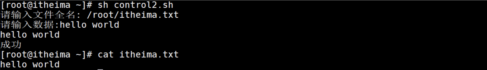

### [额外加]shell内置命令: test

Shell中的 test 命令用于检查某个条件是否成立，它可以进行数值、字符和文件三个方面的测试。

功能与[]一样

#### 整数比较测试

语法:

```shell
if test 数字1 options 数字2
then
...
fi
```

options具体如下

| 参数 | 说明           |
| :--- | :------------- |
| -eq  | 等于则为真     |
| -ne  | 不等于则为真   |
| -gt  | 大于则为真     |
| -ge  | 大于等于则为真 |
| -lt  | 小于则为真     |
| -le  | 小于等于则为真 |

实例

```shell
#!/bin/bash
num1=1 num2=1 num3=2
echo "num1=${num1},num2=${num2},num3=${num3}"

if test $num1 -eq $num2
then
    echo 'num1和num2两个数相等！'
else
    echo 'num1和num2两个数不相等！'
fi

if test $num2 -eq $num3
then
    echo 'num2和num3两个数相等！'
else
    echo 'num2和num3两个数不相等！'
fi
```

执行后的结果为:

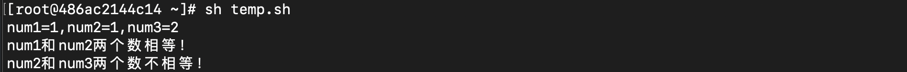

#### 字符串测试

语法

| 参数      | 说明                                      |
| :-------- | :---------------------------------------- |
| = 或  ==  | 等于, 等于返回0代表成功,否则返回1代表失败 |
| !=        | 不等于                                    |
| `\<`      | 小于                                      |
| `\>`      | 大于                                      |
| -z 字符串 | 字符串的长度为零则为真                    |
| -n 字符串 | 字符串的长度不为零则为真                  |

实例

```shell
#!/bin/bash

str1="itheima" str2="itcast" str3=""
echo "str1=${str1},str2=${str2},str3=${str3}"

if test $str1 = $str2
then
    echo 'str1和str2两个字符串相等'
else
    echo 'str1和str2两个字符串不相等'
fi

if test $str1 \> $str2
then
    echo 'str1大于str2'
else
    echo 'str1小于str2'
fi

if test -z $str2
then
   echo "str2字符串长度为0"
else
   echo "str2字符串长度不为0"
fi

if test -z $str3
then
   echo "str3字符串长度为0"
else
   echo "str3字符串长度不为0"
fi
```

执行后的结果为:


#### 文件测试

#### 语法

| 参数          | 说明                                           |
| :------------ | :--------------------------------------------- |
| ==-e 文件名== | exists, 如果文件存在则为真                     |
| ==-r 文件名== | read,如果文件存在且可读则为真                  |
| ==-w 文件名== | write,如果文件存在且可写则为真                 |
| ==-x 文件名== | execute,如果文件存在且可执行则为真             |
| ==-s 文件名== | string,如果文件存在且至少有一个字符则为真      |
| ==-d 文件名== | directory,如果文件存在且为目录则为真           |
| -f 文件名     | file,如果文件存在且为普通文件则为真            |
| -c 文件名     | character,如果文件存在且为字符型特殊文件则为真 |
| -b 文件名     | 如果文件存在且为块特殊文件则为真               |

演示

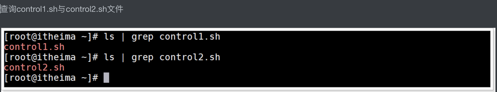

```shell
#!/bin/bash

if test -w ./control1.sh
then
    echo '文件已存在并且可写!'
else
    echo '文件不存在或不可写!'
fi

if test -e ./control1.sh -a -e ./control2.sh
then
    echo '两个文件都存在!'
else
    echo '可能有一个或两个文件不存在'
fi
```

> Shell提供了与( -a )、或( -o )、非( ! )三个逻辑操作符用于将测试条件连接起来，其优先级为："!"最高，"-a"次之，"-o"最低,  语法
>
> ```shell
> test 条件1 -o 条件2 -a 条件3 ...
> ```

## 流程控制语句: case

Shell case语句为多选择语句。可以用case语句匹配一个值与一个模式，如果匹配成功，执行相匹配的命令;

当分支较多，并且判断条件比较简单时，使用 case in 语句就比较方便了。

语法:

```shell
case 值 in
匹配模式1)
    命令1
    命令2
    ...
    ;;
匹配模式2）
    命令1
    命令2
    ...
    ;;
*)
    命令1
    命令2
    ...
    ;;
esac
```

每一匹配模式必须以右括号结束。取值可以为变量或常数。匹配发现取值符合某一模式后，其间所有命令开始执行直至 ;;(类似break, 不可以替代否则语法报错)。取值将检测匹配的每一个模式。一旦模式匹配，则执行完匹配模式相应命令后不再继续其他模式。如果无一匹配模式，使用星号 * 捕获该值，再执行后面的命令。

case、in 和 esac 都是 Shell 关键字,   esac就是case的反写在这里代表结束case

匹配模式:  可以是一个数字、一个字符串，甚至是一个简单正则表达式。

简单正则表达式支持如下通配符

| 格式  | 说明                                                         |
| ----- | ------------------------------------------------------------ |
| *     | 表示任意字符串。                                             |
| [abc] | 表示 a、b、c 三个字符中的任意一个。比如，[15ZH] 表示 1、5、Z、H 四个字符中的任意一个。 |
| [m-n] | 表示从 m 到 n 的任意一个字符。比如，[0-9] 表示任意一个数字，[0-9a-zA-Z] 表示字母或数字。 |
| \|    | 表示多重选择，类似逻辑运算中的或运算。比如，abc \| xyz 表示匹配字符串 "abc" 或者 "xyz"。 |

实例

```shell
#!/bin/bash
read -p "请输入一个0~7的数字:" number
case $number in
1)
    echo "星期一"
   ;;
2)
    echo "星期二"
    ;;
3)
    echo "星期三"
    ;;
4)
    echo "星期四"
    ;;
5)
    echo "星期五"
    ;;
6)
    echo "星期六"
    ;;
0|7)
    echo "星期日"
    ;;
*)
    echo "您输入的数字无效"
    ;; 
esac
```

执行后的结果为:

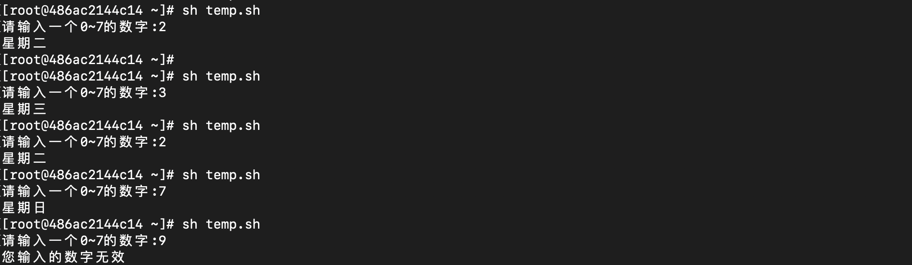

## 流程控制语句: while

while用于循环执行一系列命令

语法:

多行写法

```shell
while 条件
do
   命令1
   命令2
   ...
   continue; # 结束当前这一次循环, 进入下一次循环
   break; # 结束当前循环
done
```

一行写法

```shell
while 条件; do 命令; done;
```

实例:

输出指定多少次的hello world

```shell
#!/bin/bash
read -p "请输入一个数字:" number
i=0
while [[ $i < $number ]]
do
   echo "hello world"
   ((i++))
done
```

执行后的结果为:

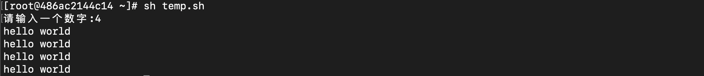

无线循环

```shell
while :
do 
   command
done
```

或

```shell
while true
do 
   command
done
```

## 流程控制语句: until

until 也是循环结构语句,  until 循环与 while 循环在处理方式上刚好相反,  循环条件为false会一致循环, 条件为true停止循环.

语法:

```shell
until 条件
do
    命令
done
```

条件如果返回值为1(代表false)，则继续执行循环体内的语句，否则跳出循环。


实例:

```shell
#!/bin/bash
read -p "请输入一个数字:" number
i=0
until [[ ! $i < $number ]]
do
  echo "hello world"
  ((i++))
done
```

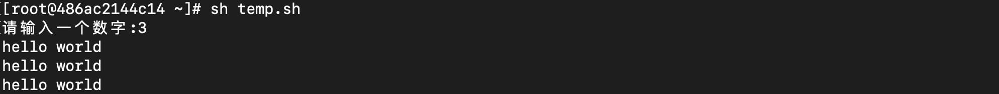

## 流程控制语句: for

Shell支持for循环,  与其他编程语言类似.

### 循环方式1

语法

多行写法

```shell
for var in item1 item2 ... itemN
do
    命令1
    命令2
    ...
done
```

一行写法

```shell
for var in item1 item2 ... itemN; do 命令1; 命令2…; done;
```

> var是循环变量
>
> item1 item2 ... itemN 是循环的范围

实例:

```shell
#!/bin/bash
for i in 1 2 3 4 5 
do 
   echo "Hello World"
done
```

### 循环方式2

语法

多行写法

```shell
for var in {start..end}
do
   命令
done
```

> start:  循环范围的起始值,必须为整数
>
> end: 循环范围的结束值, 必须为整数

一行写法

```shell
for var in {start..end}; do 命令; done
```

实例:

```shell
# 循环打印1到5
for i in {1..5}; do echo $i; done
```

### 循环方式3

语法

多行写法

```shell
for((i=start;i<=end;i++))
do 
   命令
done
```

一行写法

```shell
for((i=start;i<=end;i++)); do 命令; done
```


实现无限循环

```shell
for((;;)); do 命令; done
```

## 流程控制语句: select

select in 循环用来增强交互性，它可以显示出带编号的菜单，用户输入不同的编号就可以选择不同的菜单，并执行不同的功能.   select in 是 Shell 独有的一种循环，非常适合终端（Terminal）这样的交互场景, 其他语言没有;

语法

```shell
select var in menu1 menu2 ...
do
    命令
done
```

> 注意: select 是无限循环（死循环），输入空值，或者输入的值无效，都不会结束循环，只有遇到 break 语句，或者按下 Ctrl+D 组合键才能结束循环。
>
> 执行命令过程中: 终端会输出 `#?`  代表可以输入选择的菜单编号

### 实例1

```shell
#!/bin/bash
echo "你的爱好是什么?"
select hobby in "编程" "游戏" "篮球" "游泳"
do
   echo $hobby
    break
done
echo "你的爱好是:${hobby}"
```

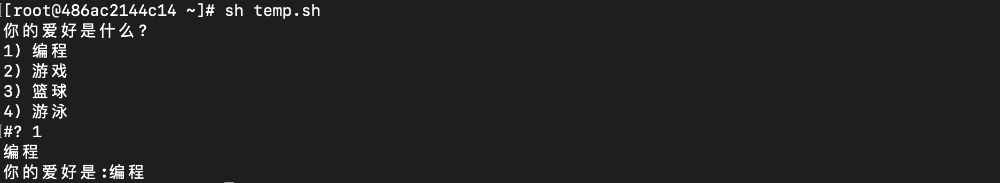

### 实例2

```shell
#!/bin/bash
echo "你的爱好是什么"
select hobby in "编程" "游戏" "篮球" "游泳"
do
    case $hobby in
        "编程")
            echo "编程,多敲代码"
            break
            ;;
        "游戏")
            echo "少玩游戏"
            break
            ;;
        "篮球"|"游泳")
            echo "运动有利健康"
            break
            ;;
        *)
            echo "输入错误，请重新输入"
    esac
done
```

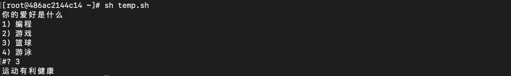

# 函数

Shell编程和其他编程语言一样, 有函数,  函数是由若干条shell命令组成的语句块，实现Shell脚本代码重用和模块化编程。

## 函数分类

1. 系统函数
2. 自定义函数

## 系统函数

系统自带提供的函数, 可以直接使用.

### basename系统函数

basename函数用于获取文件名的函数,  根据给出的文件路径截取出文件名

语法:

```shell
basename [string / pathname] [suffix]
```

> 根据指定字符串或路径名进行截取文件名,  比如:  根据路径"/one/two/aa.txt",  可以截取出aa.txt
>
> suffix: 用于截取的时候去掉指定的后缀名.

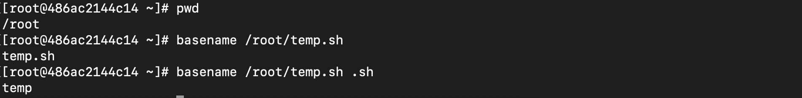

### dirname系统函数

从指定的文件绝对路径,  去除文件名，返回剩下的前缀目录路径

语法:

```shell
dirname 文件绝对路径
```

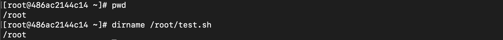

## 自定义函数

开发人员可以通过自定义开发函数,实现代码重用.

语法:

```shell
# 函数定义
[ function ] func1name ()
{
   命令
   [return 返回值]
}

# 调用
func1name 传递参数1 传递参数2 ...
```

> 可以带function fun() 定义，也可以直接fun() 定义,不带任何参数。
>
> 参数返回，可以显示加：return 返回，如果不加，将以最后一条命令运行结果，作为返回值。 return后跟数值n(0~255)

**注意**

必须在调用函数地方之前，先声明函数，shell脚本是逐行运行,  只要先运行了函数, 后面才可以时使用函数

### 实例1: 无参无返回值函数

```shell
#!/bin/bash
demo ()
{
   echo "执行了函数"
}

# 调用函数
demo
```


### 实例2: 无参有返回值函数

```shell
#!/bin/bash
sum ()
{
   echo "求两个数之和..."
   read -p "输入第一个数字:" n1
   read -p "输入第二个数字:" n2
   echo "两个数分别为: ${n1} 和 ${n2}"
   return $(($n1+$n2))
}

# 调用函数
sum
echo "两个数字的和为: $?"   # 获得返回值

```


### 实例3: 有参函数

在Shell中，调用函数时可以向其传递参数。在函数体内部，通过 `$n` 的形式来获取参数的值，例如，`$1` 表示第一个参数，`$2` 表示第二个参数...

其他参数介绍

| 参数处理 | 说明                                                         |
| :------- | :----------------------------------------------------------- |
| $#       | 传递到脚本或函数的参数个数                                   |
| $*       | 以一个单字符串显示所有向脚本传递的参数                       |
| $$       | 脚本运行的当前进程ID号                                       |
| $!       | 后台运行的最后一个进程的ID号                                 |
| $@       | 与$*相同，但是使用时加引号，并在引号中返回每个参数。         |
| $?       | 显示最后命令的退出状态。0表示没有错误，其他任何值表明有错误。 |

demo演示

```shell
#!/bin/bash
funParam(){
   echo "第一个参数为: $1"
   echo "第二个参数为: $2"
   echo "第十个参数为: ${10}"
   echo "参数总共有 $# 个"
   echo "作为一个字符串输出所有参数: $*"
}

# 调用函数
funParam 1 2 3 4 5 6 7 8 9 10 22
```


## shell程序与函数的区别

函数和shell程序比较相似，区别在于：

1. Shell 程序(内置命令和外部脚本文件),  外部脚本文件是在子Shell中运行,  会开启独立的进程运行
2. Shell函数在当前Shell的进程中运行

实例:

```shell
#!/bin/bash
demo(){
        echo "函数中打印当前进程ID:$$"
}

echo "当前脚本文件(Shell程序)打印当前进程ID:$$"
# 调用函数
demo
```

运行效果:


# shell重定向输入暑促

## 重定向介绍

### 标注输入介绍

从键盘读取用户输入的数据，然后再把数据拿到Shell程序中使用；

### 标注输出介绍

Shell程序产生的数据，这些数据一般都是呈现到显示器上供用户浏览查看;

### 默认输入输出文件

每个 Unix/Linux 命令运行时都会打开三个文件,  文件如下

| 文件名 | 类型                                  | 文件描述符(file description, fd) | 功能                     |
| ------ | ------------------------------------- | -------------------------------- | ------------------------ |
| stdin  | (standard input)<br>标准输入文件      | 0                                | 获取键盘的输入数据       |
| stdout | (standard output)<br/>标准输出文件    | 1                                | 将正确数据输出到显示器上 |
| stderr | (standard error)<br/>标准错误输出文件 | 2                                | 将错误信息输出到显示器上 |

> 每个文件都有一个唯一的 **文件描述符fd**,  后面会通过唯一 **文件描述符fd** 操作对应的信息

Shell程序操作输入输出时用到这3个文件

1. Shell程序默认会从stdin文件中读取输入数据
2. Shell程序默认会向stdout文件输出正确数据
3. Shell程序默认会项stderr文件中输出错误信息

这3个文件用于临时传输数据使用

### 重定向输入输出介绍

1. 标准输入是数据默认从键盘流向程序，如果改变了它的方向，数据就从其它地方流入，这就是输入重定向。

2. 标准输出是数据默认从程序流向显示器，如果改变了它的方向，数据就流向其它地方，这就是输出重定向。

   > Linux Shell 重定向分为两种，一种输入重定向，一种是输出重定向；

重定向作用:输出重定向是指命令的结果不再输出到显示器上，而是输出到其它地方，一般是文件中。这样做的最大好处就是把命令的结果保存起来，当我们需要的时候可以随时查询。

## 重定向语法

| 命令                  | 说明                                                         |
| :-------------------- | :----------------------------------------------------------- |
| 命令 > file           | 将正确数据重定向输出到 file 文件中, 覆盖方式                 |
| 命令 < file           | 将输入重定向从 file 文件中读取数据                           |
| 命令 >> file          | 将正确数据重定向输出到 file 文件中, 追加方式                 |
| 命令 < file1 > file2  | 从file文件读取数据, 输出数据到file2文件中                    |
| 命令 fd> file         | 根据指定的文件描述符fd 将数据重定向输出到 file 文件中, 覆盖方式 |
| 命令 fd>> file        | 根据指定的文件描述符fd 将数据重定向输出到 file 文件中, 追加方式 |
| 命令 > file fd1>& fd2 | 将 fd1 和 fd2 文件描述符合并 输出到文件。                    |
| fd1<& fd2             | 将 fd1 和 fd2 文件描述符合并 从文件读取输入.                 |
| << tag                | 读取终端输入数据,  将开始标记 tag 和结束标记 tag 之间的内容作为输入。<br>标记名tag可以任意 |

> 在输出重定向中，`>`代表的是覆盖输出，`>>`代表的是追加输出。
>
> fd是文件描述符 
>
> ​      0 通常是标准输入（STDIN），
>
> ​      1 是标准输出（STDOUT），
>
> ​      2 是标准错误输出（STDERR）。
>
> fd>  或  fd>>  中间不可以有空格

## 重定向输出

### 正确信息重定向输出

```shell
echo "hello world" >> log.txt   # 追加方式
```

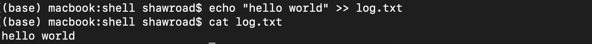

### 错误信息重定向

假设有个错误信息如下:


想看xx文件夹下的文件目录，结果没有文件。如果按上面那种方式，是不会将错误信息输入到log.txt中的，因此我们要做如下处理:

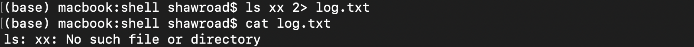

> 2 是标准错误输出（STDERR）, 注意
>
> `>` 覆盖方式输出
>
> `2>` 注意fd与>符号之间不能有空格 

### 正确和错误信息同时输出

```shell
echo "hello world" > log.txt 2>&1
```

> 数字 1 代表正确输出的结果输出到文件中
> 数字 2 代表错误结果输出到文件中
>
> `2>& 1` 将正确和错误都输出到文件中.  `2>&` 中间不能有空格,  写法有2种
>
> ​      合并第一种写法:  `2>& 1`
>
> ​        合并第二种写法:  `2>&1`

## 重定向输入

在将重定向输入之前，先学习一个wc命令。Linux wc 命令可以用来对文本进行统计，包括单词个数、行数、字节数

### wc命令语法

```shell
wc  [options]  [文件名]
```

 options有如下:

| 选项 | 含义                  |
| ---- | --------------------- |
| `-c` | character, 统计字节数 |
| `-w` | word, 统计单词数      |
| `-l` | line, 统计行数        |

接下来我们用重定向输入的方式统计一个文件有多少行

```shell
wc -l < log.txt
```

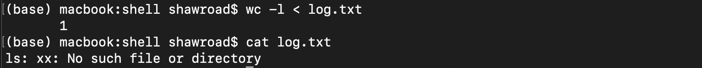

### 逐行读取文件数据

循环读取文件每一行数据

```shell
while read str; do echo $str; done < log.txt
```


### 读取终端输入数据的行数


# 好工具: cut

使用cut可以切割提取指定列\字符\字节的数据，`cut`  译为“剪切, 切割”  ,  是一个强大文本处理工具，它可以将文本按列进行划分的文本处理。cut命令逐行读入文本，然后按列划分字段并进行提取、输出等操作。

## 语法

```shell
cut [options] filename
```

options参数说明

| 选项参数        | 功能                                                         |
| --------------- | ------------------------------------------------------------ |
| -f 提取范围     | 列号，获取第几列                                             |
| -d 自定义分隔符 | 自定义分隔符，默认为制表符。                                 |
| -c 提取范围     | 以字符为单位进行分割                                         |
| -b 提取范围     | 以字节为单位进行分割。这些字节位置将忽略多字节字符边界，除非也指定了 -n 标志。 |
| -n              | 与“-b”选项连用，不分割多字节字符；                           |

提取范围说明

| 提取范围  | 说明                                                       |
| --------- | ---------------------------------------------------------- |
| n-        | 提取指定第n列或字符或字节后面所有数据                      |
| n-m       | 提取指定第n列或字符或字节到第m列或字符或字节中间的所有数据 |
| -m        | 提取指定第m列或字符或字节前面所有数据                      |
| n1,n2,... | 提前指定枚举列的所有数据                                   |

## 切割提取指定列数据

有一个文件cut1.txt

```shell
AA  itheima 11 XX
BB  itcast 22 XXX
CC  Shell 33 XXXX
DD  it 44 XXXXXXX
```

提取文件中第一列数据

```shell
cut cut1.txt -d " " -f 1   # 按空格切分 取出第一列
```


提取文件中第一列和第三列，枚举查找

```shell
cut cut1.txt -d " " -f 1,3
```


提取文件中第二列,第三列,第四列, 范围查找


提取文件中第一列后面所有列的数据

```shell
cut cut1.txt -d " "  -f 2- 
```


提起文件中结束列前面所有列的数据

```shell
cut -d " " -f -2 cut1.txt
# -2 提取指定列前面所有列数据
```


## 切割提取指定字符数据

提取每行前3个字符

```shell
cut cut1.txt -c 1-3
```


提取每行第4个字符以后的数据

```shell
cut cut1.txt -c 4-
```


提取每行第3个字符前面所有字符

```shell
cut cut1.txt -c -3
```


## 切割提取指定字节数据

提取字符串"abc传智播客" 前3个字节

```shell
echo "abc传智播客" | cut -b -3
```


提取字符串"abc传智播客" 前4个字节

```shell
echo "abc传智播客" | cut -b -4
```


提取字符串"abc传智播客" 前6个字节

```shell
echo "abc传智播客" | cut -b -6
# 由于linux系统默认utf-8码表, 所以一个汉字占3个字节
```


提取字符串"abc传智播客" 前4个字节, 就可以将汉字 "传"输出,

```shell
echo "abc传智播客" | cut -nb -4
#  -n 取消多字节字符分割直接输出
```


## 切割提取指定单词数据

在cut1.txt文件中切割出"itheima"

```shell
cat cut1.txt | grep itheima | cut -d " " -f 2
```


## 切割提取bash进程的PID号

```shell
ps -aux | grep 'bash' | head -n 1 | cut -d " " -f 8
```


## 切割提取IP地址

```shell
ifconfig | grep broadcast | cut -d " " -f 10
```


# 好工具: sed

sed （stream editor, 流编辑器） 是Linux下一款功能强大的非交互流式文本编辑器(vim是交互式文本编辑器)，可以对文本文件的每一行数据匹配查询之后进行增、删、改、查等操作，支持按行、按字段、按正则匹配文本内容，灵活方便，特别适合于大文件的编辑.

sed是一种流编辑器，它一次处理一行内容,  将这行放入缓存(存区空间称为：模式空间)，然后才对这行进行处理，处理完后，将缓存区的内容发送到终端。

## sed处理数据原理


## 语法

```shell
sed [选项参数] [模式匹配/sed程序命令] [文件名]

# 模式匹配,sed会读取每一行数据到模式空间中, 之后判断当前行是否符合模式匹配要求,符合要求就会
# 执行sed程序命令, 否则不会执行sed程序命令;如果不写匹配模式,那么每一行都会执行sex程序命令
```

选项参数说明:

| 选项参数                   | 功能                                                         |
| -------------------------- | ------------------------------------------------------------ |
| `-e`                       | 直接在指令列模式上进行sed的动作编辑。它告诉sed将下一个参数解释为一个sed指令，只有当命令行上给出多个sed指令时才需要使用-e选项;一行命令语句可以执行多条sed命令 |
| `-i`                       | 直接对内容进行修改，不加-i时默认只是预览，不会对文件做实际修改 |
| `-f`                       | 后跟保存了sed指令的文件                                      |
| `-n`                       | 取消默认输出，sed默认会输出所有文本内容，使用-n参数后只显示处理过的行 |
| `-r ruguler              ` | 使用扩展正则表达式，默认情况sed只识别基本正则表达式 *        |

sed程序命令

| 命令 | 功能描述                                      |
| ---- | --------------------------------------------- |
| `a`  | add新增，a的后面可以接字串，在下一行出现      |
| `c`  | change更改, 更改匹配行的内容                  |
| `d`  | delete删除, 删除匹配的内容                    |
| `i`  | insert插入, 向匹配行前插入内容                |
| `p`  | print打印, 打印出匹配的内容，通常与-n选项和用 |
| `s`  | substitute替换, 替换掉匹配的内容              |
| `=`  | 用来打印被匹配的行的行号                      |
| `n`  | 读取下一行，遇到n时会自动跳入下一行           |

特殊符号

| 命令                | 功能描述                                                     |
| ------------------- | ------------------------------------------------------------ |
| `!`                 | 就像一个sed命令，放在限制条件后面, 对指定行以外的所有行应用命令(取反) |
| {sed命令1;sed命令2} | 多个命令操作同一个的行                                       |

## 数据准备

sed.txt文件内容:

```
ABC
itheima itheima
itcast
123
itheima
```

## 向文件中添加数据

### 1. 指定行号的前或后面添加数据

向第三行后面添加hello

```shell
sed '3ahello' sed.txt
```

> 3代表第三行
>
> a代表在后面添加，出现在下一行
>
> 注意这里不改变原文件 想改变原文件 加 -i

执行后的结果


向第三行前面添加hello

```shell
sed '3ihello' sed.txt
```

> 3 , 代表第三行
>
> i,  代表在前面添加, 出现在上一行
>
> 注意这里没有修改源文件

执行后的结果


### 2. 指定内容前或后面添加数据

向内容 `itheima` 后面添加 `hello` ，如果文件中有多行包括 ``itheima``，则每一行后面都会添加

```shell
sed "/itheima/ahello" sed.txt
```

执行后的结果为:


向内容 `itheima` 前面添加 `hello` ，如果文件中有多行包括 ``itheima``，则每一行前面都会添加

```shell
sed "/itheima/ihello" sed.txt
```

执行后的结果:


### 3. 在最后一行前或后添加hello

在最后一行后面添加hello

```shell
sed "$ahello" sed.txt
```

> $a 最后一行后面添加。 $代表最后一行

执行后的结果:


在最后一行前面添加hello

```shell
sed "$ihello" sed.txt
```

> $i 最后一行前面添加

执行后的结果:


## 删除文件中的数据

### 1. 删除指定行

删除第二行

```shell
sed "2d" sed.txt
# d 用于删除
# 2d 删除第二行
```

执行后的结果:


删除第一行、第四行的数据

```shell
sed "1d;4d" sed.txt
```


### 2. 删除奇数行

从第一行开始删除。每隔两行就删掉一行

```shell
sed '1~2d' sed.txt
# 1~2  从第一行开始，每隔2行
```

执行后的结果;


### 3. 删除指定范围的多行数据

删除从第1行到第3行的数据

```shell
sed '1,3d' sed.txt
# 1,3  从指定第1行开始到第3行结束
```

执行后的结果:


### 4. 删除指定范围取反的多行数据

删除从第1行到第3行取反的数据

```shell
sed '1,3!d' sed.txt
# 1,3! 从指定第1行开始到第3行结束取反, 就是不在这个范围的行
```

执行后的结果:


### 5. 删除最后一行

```shell
sed "$d" sed.txt
```

执行后的结果:


### 6. 删除匹配itheima的行

```shell
sed '/itheima/d' sed.txt
# /itheima/ 匹配itheima
```

执行后的结果:


### 7. 删除匹配行到最后一行

删除匹配itheima行到最后一行 , 命令

```shell
sed '/itheima/,$d' sed.txt
# , 代表范围匹配
```

执行后的结果:


### 8. 删除匹配行及其后面一行

删除匹配itheima行及其后面一行

```shell
sed '/itheima/,+1d' sed.txt
```

执行后的结果:


### 9. 删除不匹配的行

删除不匹配 `itheima` 或 `itcast` 的行

```shell
sed '/itheima\|itcast/!d' sed.txt
# \| 是正则表达式的或者 这里|需要转义, 所以为\|
# ! 取反
```

执行后的结果:


## 更改文件中的数据

### 1. 将文件的第一行修改为hello

```shell
sed "1chello" sed.txt
```

执行后的结果:


### 2. 将包含itheima的行修改为hello

```shell
sed '/itheima/chello' sed.txt
```

执行后的结果为:


### 3. 将最后一行修改为hello

```shell
sed "$chello" sed.txt
```

执行后的结果为:


### 4. 将文件中的itheima替换为hello

将文件中的itheima替换为hello,默认只替换每行第一个itheima

```shell
sed "s/itheima/hello/" sed.txt
```

执行后的结果为:


> 注意 `'s/itheima/hello/'`  最后一个`/` 不可少

将文本中所有的itheima都替换为hello, 全局替换

```shell
sed 's/itheima/hello/g'  sed.txt
# g 代表匹配全局所有符合的字符
```


### 5. 将每行中第二个匹配替换

将每行中第二个匹配的itheima替换为hello 命令

```shell
sed "s/itheima/hello/2" sed.txt
```

执行后的结果为:


### 6. 替换后的内容写入文件

将每行中第二个匹配的itheima替换为hello ,  将替换后的内容写入到sed2.txt文件中

```shell
# 第一种方式
sed -n 's/itheima/hello/2pw sed2.txt' sed.txt
# w写入
# p打印, -n只是获取

# 第二种方式
sed -n 's/itheima/hello/2p ' sed.txt > sed2.txt
```

执行后的结果为:


### 7. 正则表达式匹配替换

匹配有 `i` 的行，替换匹配行中 `t` 后的所有内容为空 

```shell
sed '/i/s/t.*//g' sed.txt
# /t.*/ 表示逗号后的所又内容
```

执行后的结果为:


### 8. 每行末尾拼接test

```shell
sed 's/$/& test' sed.txt
# & 用于拼接
```

执行后的结果为:


### 9. 每行行首添加注释

```shell
sed 's/^/#/' sed.txt
```

执行后的结果为:


## 查询文件或管道中的数据

### 1. 查询含有itcast的行数据

```shell
sed -n "/itcast/p" sed.txt
```

执行后的结果为:


### 2. 管道过滤查询

管道查询所有进程中含有sshd的进程信息命令

```shell
ps -aux | sed -n '/sshd/p'
```

执行后的结果为:


## 多个sed程序命令执行

将sed.txt文件中的第1行删除并将 `itheima` 替换为 `itcast`

```shell
# 第一种方式, 多个sed程序命令 在每个命令之前使用 -e 参数
sed -e '1d' -e 's/itheima/itcast/g' sed.txt 

# 第二种方式
sed  '1d;s/itheima/itcast/g' sed.txt
```

执行后的结果为:


## sed高级用法: 缓存区数据交换

### 模式空间与暂存空间介绍

1. 首先需要明白, sed处理文件是逐行处理的, 即**读取一行处理一行,输出一行**;

2. sed把文件读出来每一行存放的空间叫模式空间, 会在该空间中对读到的内容做相应处理;

3. 此外sed还有一个额外的空间即暂存空间, 暂存空间刚开始里边只有个空行, 记住这一点;

4. sed可使用相应的命令从模式空间往暂存空间放入内容或从暂存空间取内容放入模式空间;

   > 2个缓存空间传输数据的目的是为了更好的处理数据, 一会参考案例学习  

### 关于缓存区sed程度命令

| 命令 | 含义                                                       |
| ---- | ---------------------------------------------------------- |
| h    | 将**模式空间**里面的内容复制到**暂存空间**缓存区(覆盖方式) |
| H    | 将**模式空间**里面的内容复制到**暂存空间**缓存区(追加方式) |
| g    | 将**暂存空间**里面的内容复制到**模式空间**缓存区(覆盖方式) |
| G    | 将**暂存空间**里面的内容复制到**模式空间**缓存区(追加方式) |
| x    | 交换2个空间的内容                                          |

### 缓存空间数据交换

#### 实例1: 第一行粘贴到最后1行

将模式空间第一行复制到暂存空间(覆盖方式),并将暂存空间的内容复制到模式空间中的最后一行(追加方式)

```shell
sed '1h;$G' sed.txt
# 1h 从模式空间中将第一行数据复制到暂存空间(覆盖方式)
# $G 将暂存空间中的内容复制到模式空间中最后一行(追加方式)
```

执行后的结果为:


#### 实例2: 第一行删除后粘贴到最后一行

将模式空间第一行复制到暂存空间(覆盖方式)并删除, 最后将暂存空间的内容复制到模式空间中的最后一行(追加方式)

```shell
sed '1{h;d};$G' sed.txt
# 1{h;d}对模式空间中的第一行数据同时进行复制到暂存空间(覆盖方式)和删除模式空间中的第一行数据
```

执行后的结果为:


#### 实例3: 第一行数据复制粘贴替换其他行数据

将模式空间第一行复制到暂存空间(覆盖方式), 最后将暂存空间的内容复制到模式空间中替换从第2行开始到最后一行的每一行数据(覆盖方式)

```shell
sed "1h;2,$g" sed.txt
```

执行后的结果为:


#### 实例4: 将前3行数据数据复制粘贴到最后一行

将前3行数据复制到暂存空间(追加方式), 之后将暂存空间的所有内容复制粘贴到模式空间最后一行(追加方式)

```shell
sed "1,3H;$G" sed.txt
```

执行后的结果为:


## 再加两个例子

### 给每一行添加空行

插入空行

```shell
sed G -i sed.txt
# G 每行后面添加一个空行
# -i 修改源文件
```

执行后的结果为:


### 删除所有的空行

```shell
sed -i '/^$/d' sed.txt
```

执行后的结果为:


# 好工具: awk

awk是一个强大的文本分析工具，相对于grep的查找，sed的编辑，awk在其对数据分析并生成报告时,显得尤为强大，简单来说awk就是把文件逐行的读入，以空··s格为默认分隔符将每行切片，切开的部分再进行各种分析处理, 因为切开的部分使用awk可以定义变量,运算符, 使用流程控制语句进行深度加工与分析。

> 创始人 Alfred V. **A**ho、Peter J. **W**einberger和Brian W. **K**ernighan  awk由来是姓氏的首字母

## 语法

```shell
awk [options] 'pattern{action}' {filenames}
```

> pattern：表示AWK在数据中查找的内容，就是匹配模式
>
> action：在找到匹配内容时所执行的一系列命令

选项参数说明

| 选项参数 | 功能                   |
| -------- | ---------------------- |
| -F       | 指定输入文件拆分分隔符 |
| -v       | 赋值一个用户定义变量   |

## awk内置变量

| 内置变量 | 含义                                                         |
| -------- | ------------------------------------------------------------ |
| ARGC     | 命令行参数个数                                               |
| ARGV     | 命令行参数排列                                               |
| ENVIRON  | 支持队列中系统环境变量的使用                                 |
| FILENAME | awk浏览的文件名                                              |
| FNR      | 浏览文件的记录数                                             |
| FS       | 设置输入域分隔符，等价于命令行 -F选项                        |
| NF       | 浏览记录的域的个数, 根据分隔符分割后的列数                   |
| NR       | 已读的记录数, 也是行号                                       |
| OFS      | 输出域分隔符                                                 |
| ORS      | 输出记录分隔符                                               |
| RS       | 控制记录分隔符                                               |
| `$n`     | `$0`变量是指整条记录。`$1`表示当前行的第一个域,`$2`表示当前行的第二个域,......以此类推。 |
| $NF      | $NF是number finally,表示最后一列的信息，跟变量NF是有区别的，变量NF统计的是每行列的总数 |

## 数据准备

```shell
cp /etc/passwd ./    # 将passwd文件移到当前目录
```

## 默认每行空格切割数据

```shell
echo "abc 123 456" | awk '{print $1"&"$2"&"$3}'
```

执行后效果:


## 打印含有匹配信息的行

搜索passwd文件有root关键字的所有行

```shell
awk "/root/" passwd
# '/root/' 是查找匹配模式, 没有action命令, 默认输出所有符合的行数据
```

执行后效果:


## 打印匹配行中第7列数据

搜索passwd文件有root关键字的所有行, 然后以":"拆分并打印输出第7列

```shell
awk -F ":" '/root/{print $7}'  passwd
# -F: 以':'分隔符拆分每一个列(域)数据
```

执行后效果:


## 打印文件每行属性

统计passwd:  文件名，每行的行号，每行的列数，对应的完整行内容:

```shell
awk -F ":" '{print "文件名:" FILENAME ",行号" NR ",列数:" NR ",内容:" $0}' passwd

```


使用printf替代print，可以让代码可读性更好

```shell
awk -F ':' '{printf("文件名:%5s,行号:%2s, 列数:%1s, 内容:%2s\n",FILENAME,NR,NF,$O)}' passwd
# printf(格式字符串,变量1,变量2,...)
# 格式字符串: %ns 输出字符串,n 是数字，指代输出几个字符, n不指定自动占长度
# 格式字符串: %ni 输出整数,n 是数字，指代输出几个数字
# 格式字符串: %m.nf 输出浮点数,m 和 n 是数字，指代输出的整数位数和小数位数。如 %8.2f 代表共输出 8 位数，其中 2 位是小数，6 位是整数；
```


## 打印第二行信息

打印/etc/passwd/ 的第二行信息

```shell
awk -F ":" 'NR==2{printf("filename: %s, %s \n", FILENAME, $0)}' passwd
```

执行后的结果为:


## 查找以c开头的资源

awk过滤的使用,  查找当前目录下文件名以c开头的文件列表

```shell
ls -a | awk "/^c/"
```

执行后结果为:


## 打印第一列信息

按照":" 分割查询第一列打印输出

```shell
awk -F ":" '{print $1}' passwd
```


## 打印最后一列信息

按照":" 分割查询最后一列打印输出

```shell
awk -F: '{print $NF}' passwd
```


## 打印倒数第二列信息

按照":" 分割查询倒数第二列打印输出

```shell
awk -F: '{print $(NF-1)}' passwd
# $(NF-N) N是几, 就是倒数第几列
```

执行后结果为:


## 打印10-20行的第一列

获取第10到20行的第一列的信息

```shell
awk -F: '{if(NR>=10 && NR<=20) print $1}' passwd
```

执行后的结果为:


## 多分隔符使用

"one:two/three"字符串按照多个分隔符":"或者"/" 分割, 并打印分割后每个列数据

```shell
echo "one:two/three" | awk -F '[:/]' '{printf("%s\n%s\n%s\n%s\n",$0,$1,$2,$3)}'
```

执行后的结果为:


## 添加开始与结束内容

给数据添加开始与结束

```shell
echo -e  "abc\nabc" | awk 'BEGIN{print "开始..."} {print $0} END{print "结束..."}'

# BEGIN 在所有数据读取行之前执行；END 在所有数据执行之后执行。
```

执行后的结果为:


## 使用循环拼接分割后的字符串

"abc itheima     itcast   21" 使用空格分割后, 通过循环拼接在一起

```shell
echo "abc itheima     itcast   21" | awk -v str="" -F '[ ]+' '{for(n=1;n<=NF;n++){ str=str$n} print str }'
# -v 定义变量
```


## 操作指定数字运算

将passwd文件中的用户id增加数值1并输出

```shell
echo "2.1" | awk -v i=1 '{print $0+i}'
```


## 切割ip

```shell
ifconfig | awk '/broadcast/{print}' | awk -F " " '{print $2}'
```

执行后的结果为:


## 显示空行行号

查询sed.txt中空行所在的行号

```shell
sed 'G' sed.txt | awk '/^$/{print NR}'
```

执行后的结果为:


## 小结

grep , sed ,awk , cut 文本字符串操作四剑客的区别

> grep：用于查找匹配的行
>
> cut：  截取数据. 截取某个文件中的列, 重点是按照列分割,  这个命令不适合截取文件中有多个空白字符的字段
>
> sed： 增删改查数据. sed用于在文件中以行来截取数据进行增\删\改\查
>
> awk：截取分析数据.  可以在某个文件中是以竖列来截取分析数据,  如果字段之间含有很多空白字符也可以获取需要的数据, awk是一种语言,可以深入分析文件数据

# 好工具: sort

sort命令是在Linux里非常有用，它将文件进行排序，并将排序结果标准输出或重定向输出到指定文件。

## 语法

```shell
sort (options) 参数
```

| 选项            | 说明                                                     |
| --------------- | -------------------------------------------------------- |
| ==-n==          | number,依照数值的大小排序                                |
| ==-r==          | reverse, 以相反的顺序来排序                              |
| ==-t 分隔字符== | 设置排序时所用的分隔字符, 默认空格是分隔符               |
| ==-k==          | 指定需要排序的列                                         |
| -d              | 排序时，处理英文字母、数字及空格字符外，忽略其他的字符。 |
| -f              | 排序时，将小写字母视为大写字母                           |
| -b              | 忽略每行前面开始出的空格字符                             |
| ==-o 输出文件== | 将排序后的结果存入指定的文件                             |
| -u              | 意味着是唯一的(unique)，输出的结果是去完重了的           |
| -m              | 将几个排序好的文件进行合并                               |

参数: 指定待排序的文件列表

## 数据准备

sort.txt文本文件内容

```
张三 30  
李四 95  
播仔 85 
播仔 85
播仔 86
AA 85
播妞 100
```

## 数字升序

按照“ ”空格分割后的第2列数字升序排序。

```shell
sort -t " " -k2n,2 sort.txt
# -t " " 代表使用空格分隔符拆分列
# -k 2n,2 代表根据从第2列开始到第2列结束进行数字升序, 仅对第2列排序
# 2n后面的n是代表对数字排序
```

执行后结果:


## 数字升序去重

先按照“ ”空格分割后的,  然后,按照第2列数字升序排序,  最后对所有列去重

```shell
 sort -t " " -k2n,2 -uk1,2 sort.txt
 # 这里的-uk1,2是按照第1、2列进行去重
```

执行后的结果为:


> 注意: 先排序再去重

## 数字升序去重结果保存到文件

```shell
sort -t " " -k2n,2 -uk1,2 -o sort2.txt sort.txt
# -o sort2.txt  结果输出保存到sort2.txt
```


## 数字降序去重

先按照“ ”空格分割后的,  然后,按照第2列数字降序排序,  最后对所有列去重

```shell
sort -t " " -k2nr,2 -uk1,2 sort.txt
```


## 多列排序

准备文件sort3.txt，内容如下:

```shell
公司A,部门A,3
公司A,部门B,0
公司A,部门C,10
公司A,部门D,9
公司B,部门A,30
公司B,部门B,40
公司B,部门C,43
公司B,部门D,1
公司C,部门A,30
公司C,部门B,9
公司C,部门C,100
公司C,部门D,80
公司C,部门E,60
```

要求:  以","分割先对第一列字符串升序,  再对第3列数字降序

```shell
sort -t "," -k1,1 -k3nr,3 sort3.txt
```

执行后的结果为:


## 小结

能够使用sort对字符串升序或降序排序

> 字符串升序: `sort -kstart,end 文件`
>
> 字符串降序: `sort -kstartr,end 文件`

能够使用sort 对数字升序或降序

> 数字升序: `sort -kstartn,end 文件`
>
> 数字降序: `sort -kstartnr,end 文件`

能够使用sort 对多列进行排序

> `sort -kstart[nr],end  -kstart[nr],end ... 文件`