- [第一章: Spark基础入门](#第一章-spark基础入门)
  - [Spark概念介绍](#spark概念介绍)
    - [Spark是什么？](#spark是什么)
    - [Spark VS Hadoop](#spark-vs-hadoop)
    - [Spark框架模块](#spark框架模块)
    - [Spark的运行模式](#spark的运行模式)
    - [Spark架构中的角色](#spark架构中的角色)
  - [Spark安装](#spark安装)
    - [local模式安装](#local模式安装)
    - [local模式下的角色分布](#local模式下的角色分布)
    - [Standalone模式安装](#standalone模式安装)
    - [Standalone架构](#standalone架构)
    - [Spark程序运行层次结构](#spark程序运行层次结构)
    - [问题](#问题)
  - [Pyspark](#pyspark)
    - [使用](#使用)
    - [Python on Spark执行原理](#python-on-spark执行原理)
- [第二章: SparkCore](#第二章-sparkcore)
  - [RDD详解](#rdd详解)
    - [RDD是什么?](#rdd是什么)
    - [RDD的五大特性](#rdd的五大特性)
    - [WordCount案例分析](#wordcount案例分析)
  - [RDD编程入门](#rdd编程入门)
    - [SparkContext对象](#sparkcontext对象)
    - [RDD的创建](#rdd的创建)
      - [并行化创建](#并行化创建)
      - [读取文件创建](#读取文件创建)
    - [RDD算子](#rdd算子)
      - [算子分类](#算子分类)
      - [常用Transformation算子](#常用transformation算子)
        - [map算子](#map算子)
        - [flatmap算子](#flatmap算子)
        - [reduceByKey算子](#reducebykey算子)
        - [groupBy算子](#groupby算子)
        - [filter算子](#filter算子)
# 第一章: Spark基础入门

## Spark概念介绍

### Spark是什么？

Spark是一款分布式**内存计算**的统一分析引擎。其特点就是对任意类型的数据进行自定义计算。

Spark可以计算：结构化、半结构化、非结构化等各种类型的数据结构，同时也支持使用Python、Java、Scala、R以及SQL语言去开发应用程序计算数据。

Spark的适用面非常广泛，所以，被称之为 统一的（适用面广）的分析引擎（数据处理）

### Spark VS Hadoop

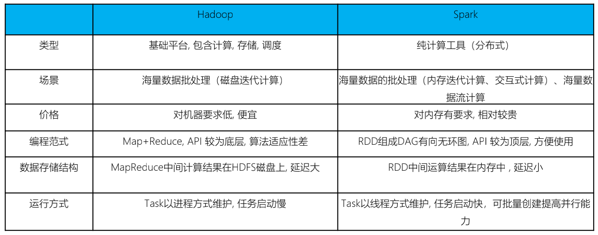

尽管Spark相对于Hadoop而言具有较大优势，但Spark并不能完全替代Hadoop

- 在计算层面，Spark相比较MR（MapReduce）有巨大的性能优势，但至今仍有许多计算工具基于MR构架，比如非常成熟的Hive 
- Spark仅做计算，而Hadoop生态圈不仅有计算（MR）也有存储（HDFS）和资源管理调度（YARN），HDFS和YARN仍是许多大数据体系的核心架构。

问题: Hadoop的基于进程的计算和Spark基于线程方式优缺点？

**答案：**Hadoop中的MR中每个map/reduce task都是一个java进程方式运行，好处在于进程之间是互相独立的，每个task独享进程资源，没有互相干扰，监控方便，但是问题在于task之间不方便共享数据，执行效率比较低。比如多个map task读取不同数据源文件需要将数据源加载到每个map task中，造成重复加载和浪费内存。而基于线程的方式计算是为了数据共享和提高执行效率，Spark采用了线程的最小的执行单位，但缺点是线程之间会有资源竞争。

### Spark框架模块

整个Spark 框架模块包含：Spark Core、 Spark SQL、 Spark Streaming、 Spark GraphX、 Spark MLlib，而后四项的能力都是建立在核心引擎之上。

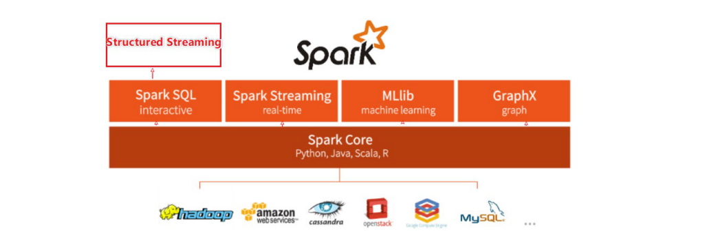

- Spark Core：Spark的核心，Spark核心功能均由Spark Core模块提供，是Spark运行的基础。Spark Core以RDD为数据抽象，提供Python、Java、Scala、R语言的API，可以编程进行海量离线数据批处理计算。

- SparkSQL：基于SparkCore之上，提供结构化数据的处理模块。SparkSQL支持以SQL语言对数据进行处理，SparkSQL本身针对离线计算场景。同时基于SparkSQL，Spark提供了**StructuredStreaming**模块，可以以SparkSQL为基础，进行数据的流式计算。

- SparkStreaming：以SparkCore为基础，提供数据的流式计算功能。

- MLlib：以SparkCore为基础，进行机器学习计算，内置了大量的机器学习库和API算法等。方便用户以分布式计算的模式进行机器学习计算。

- GraphX：以SparkCore为基础，进行图计算，提供了大量的图计算API，方便用于以分布式计算模式进行图计算。

### Spark的运行模式

Spark提供多种运行模式，包括:

- 本地模式(单机)

  本地模式就是以一个**独立的进程**，通过其内部的**多个线程来模拟**整个Spark运行时环境。这种模式一般都是用来调试代码。

- Standlone模式(集群)

  Spark中的各个角色以独立进程的形式存在，并组成spark集群环境。

- Hadoop yarn模式(集群)

  Spark中各个角色运行在YARN的容器内部，并组成Spark集群环境。

- Kubernetes(容器集群)

  Spark中的各个角色运行在Kubernetes的容器内部，并组成Spark集群环境。

### Spark架构中的角色

首先来回顾一下YARN中的角色

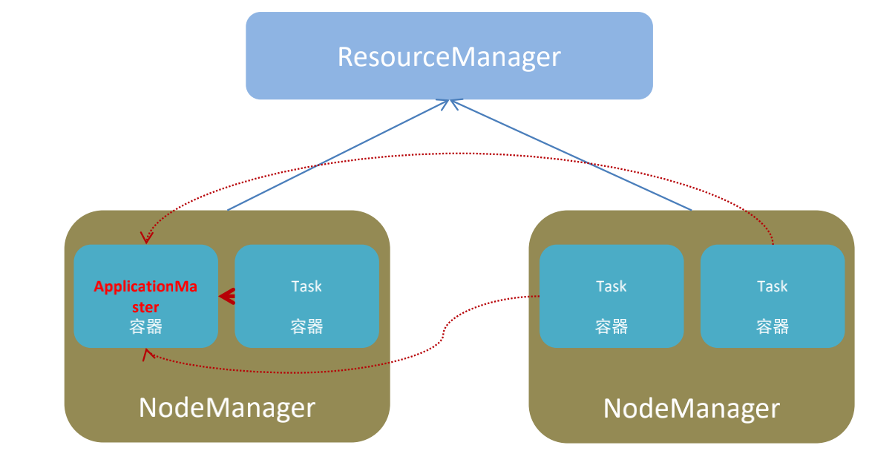

YARN主要有4类角色，从2个层面去看：

资源管理层面

- 集群资源管理者（Master）：ResourceManager
- 单机资源管理者（Worker）：NodeManager

任务计算层面

- 单任务管理者（Master）：ApplicationMaster

- 单任务执行者（Worker）：Task（容器内计算框架的工作角色）

对比spark中的角色

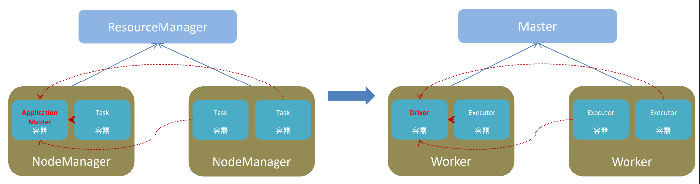

可以发现角色基本一一对应，只是名字叫法不一样。

spark中由四类角色组成整个spark的运行环境。

- master角色，管理整个集群的资源。    类比于YARN的ResouceManager
- worker角色，管理单个服务器的资源。    类比于YARN的NodeManager
- driver角色，管理单个Spark任务在运行的时候的任务。  类比于YARN的ApplicationMaster
- executor角色，单个任务运行的时候的一堆工作者，干活的。  类比于YARN的容器内运行的TASK

从两个层面划分

资源管理层面:

- 管理者: Spark是Master角色，YARN是ResourceManager
- 工作中: Spark是Worker角色，YARN是NodeManager

任务执行层面:

- 某任务管理者: Spark是Driver角色，YARN是ApplicationMaster
- 某任务执行者: Spark是Executor角色，YARN是容器中运行的具体工作进程。

## Spark安装

### local模式安装

本质: **启动一个JVM Process进程(一个进程里面有多个线程)，执行任务Task**

- Local模式可以限制模拟Spark集群环境的线程数量, 即Local[N] 或 Local[*]。
- 其中**N代表可以使用N个线程**，每个线程拥有一个cpu core。如果不指定N，则默认是1个线程（该线程有1个core）。 通常Cpu有几个Core，就指定几个线程，最大化利用计算能力。
- 如果是**local[\*]**，则代表 Run Spark locally with as many worker threads as logical cores on your machine.按照Cpu最多的Cores设置线程数。

### local模式下的角色分布

对于资源管理: `Master： Local进程本身`,  `Worker： Local进程本身`

对于任务执行:  `Driver: Local进程本身`，`Executor:不存在，没有独立的Executor角色。由Local进程(也就是Driver)内的线程提供计算能力`

测试安装是否成功:


每一个Spark程序运行的时候，会绑定到Driver所在机器的4040端口上。如果4040端口被占用, 会顺延到4041 ... 4042...

打开监控页面: http://127.0.0.1:4040/

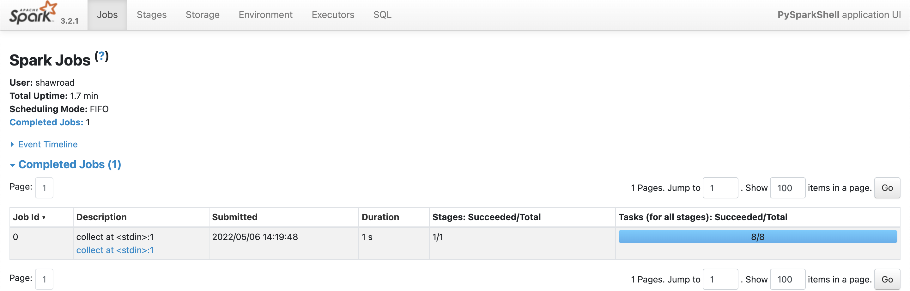

### Standalone模式安装

Standalone模式是Spark自带的一种集群模式，不同于前面本地模式启动多个进程来模拟集群的环境，Standalone模式是真实地在多个机器之间搭建Spark集群的环境，完全可以利用该模式搭建多机器集群，用于实际的大数据处理。

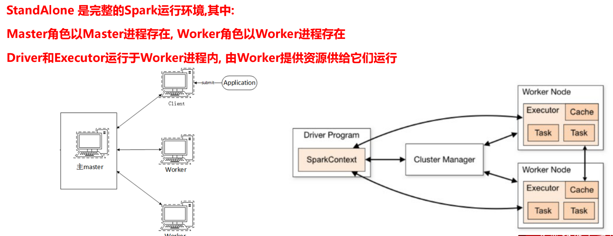

### Standalone架构

StandAlone集群在进程上主要有3类进程: 

- 主节点Master进程: Master角色, 管理整个集群资源，并托管运行各个任务的Driver
- 从节点Workers: Worker角色, 管理每个机器的资源，分配对应的资源来运行Executor(Task)； 每个从节点分配资源信息给Worker管理，资源信息包含内存Memory和CPU Cores核数
- 历史服务器HistoryServer(可选): Spark Application运行完成以后，保存事件日志数据至HDFS，启动HistoryServer可以查看应用运行相关信息。

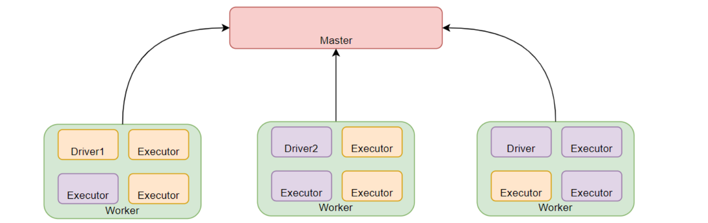

### Spark程序运行层次结构

在前面我们接触到了不少的监控页面,有4040,有8080,有18080,它们有何区别吗?

- 4040: 是一个运行的Application在运行的过程中临时绑定的端口,用以查看当前任务的状态.4040被占用会顺延到4041.4042等。4040是一个临时端口,当前程序运行完成后, 4040就会被注销哦
- 8080: 默认是StandAlone下, Master角色(进程)的WEB端口,用以查看当前Master(集群)的状态
- 18080: 默认是历史服务器的端口, 由于每个程序运行完成后,4040端口就被注销了. 在以后想回看某个程序的运行状态就可以通过历史服务器查看,历史服务器长期稳定运行,可供随时查看被记录的程序的运行过程.

Spark Application程序运行时三个核心概念：Job、Stage、Task，说明如下：

- Job：由多个 Task 的并行计算部分，一般 Spark 中的action 操作（如 save、collect，后面进一步说明），会生成一个 Job。 
- Stage：Job 的组成单位，一个 Job 会切分成多个 Stage，Stage 彼此之间相互依赖顺序执行，而每个 Stage 是多个 Task 的集合，类似 map 和 reduce stage。 
- Task：被分配到各个 Executor 的单位工作内容，它是Spark 中的最小执行单位，一般来说有多少个 Paritition（物理层面的概念，即分支可以理解为将数据划分成不同部分并行处理），就会有多少个 Task，每个 Task 只会处理单一分支上的数据。

### 问题

1. StandAlone的原理?

   答: Master和Worker角色以独立进程的形式存在,并组成Spark运行时环境(集群)

2. Spark角色在StandAlone中的分布？

   答: Master角色:Master进程, Worker角色:Worker进程, Driver角色和Executor角色:以线程运行在Worker中

3. Standalone如何提交Spark应用？

   答: bin/spark-submit --master spark://server:7077

## Pyspark

安装

```shell
conda install pyspark
或者
pip install pyspark -i https://pypi.douban.com/simple/
```

PySpark是什么?和bin/pyspark 程序有何区别?

答: PySpark是一个Python的类库, 提供Spark的操作API。 bin/pyspark 是一个交互式的程序,可以提供交互式编程并执行Spark计算

### 使用

Spark Application程序入口为：SparkContext，任何一个应用首先需要构建SparkContext对象，如下两步构建：

- 第一步、创建SparkConf对象

  > 设置Spark Application基本信息，比如应用的名称AppName和应用运行Master 

- 第二步、基于SparkConf对象，创建SparkContext对象

```python
conf = SparkConf().setAppName(appName).setMaster(master)
sc = SparkContext(conf=conf)
```

实例程序: 统计wordcount

```python
import findspark
findspark.init('/usr/local/spark')
from pyspark import SparkConf, SparkContext


if __name__ == '__main__':
    conf = SparkConf().setMaster("local[*]").setAppName('WordCountHelloWorld')

    # 通过SparkConf对象构建SparkContext对象
    sc = SparkContext(conf=conf)

    # 需求: wordcount   尝试度hdfs或者本地的文件
    # 读取文件
    file_rdd = sc.textFile('./words.txt')   # 读本地文件
    # file_rdd = sc.textFile('hdfs://node1.8020/input/words.txt')  # 读hdfs上的数据

    # 将单词进行切割，得到一个存储全部单词的集合对象
    words_rdd = file_rdd.flatMap(lambda line: line.split(' '))

    # 将单词转为元组对象，key是单词 value是1
    words_with_one_rdd = words_rdd.map(lambda x: (x, 1))

    # 将元组的value 按照key来分组 对所有的value执行聚合操作(相加)
    result_rdd = words_with_one_rdd.reduceByKey(lambda a, b: a+b)

    # 通过collect方法手机RDD的数据打印输出结果
    print(result_rdd.collect())
    '''
    结果输出:
    [('hadoop', 3), ('hive', 2), ('flink', 2), ('spark', 2), ('mapreduce', 1)]
    '''
```

wordcount原理分析

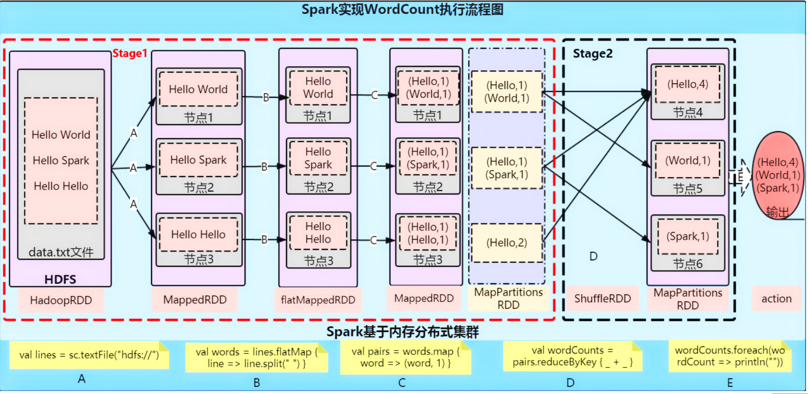

### Python on Spark执行原理

PySpark宗旨是在不破坏Spark已有的运行时架构，在Spark架构外层包装一层Python API，借助Py4j实现Python和Java的交互，进而实现通过Python编写Spark应用程序，其运行时架构如下图所示。

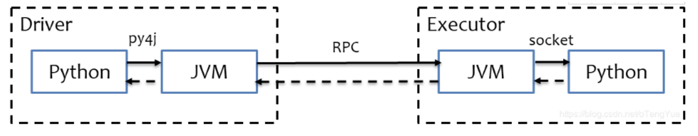

# 第二章: SparkCore

## RDD详解

### RDD是什么?

RDD（Resilient Distributed Dataset）叫做弹性分布式数据集，是Spark中最基本的数据抽象，代表一个不可变、可分区、里面的元素可并行计算的集合。

- Dataset(数据集): 一个数据集合，用于存放数据的。如: python中的list, tuple等都是数据，但是它们是本地集合，即: 数据都是在一个进程中的，不能跨进程。
- Distributed(分布式)：RDD中的数据是分布式存储的，可用于分布式计算。
- Resilient(弹性)：RDD中的数据可以存储在内存中或者磁盘中。

RDD定义

- RDD（Resilient Distributed Dataset）弹性分布式数据集，是Spark中最基本的数据抽象，代表一个不可变、可分区、里面的元素可并行计算的集合。
- 所有的运算以及操作都建立在 RDD 数据结构的基础之上。
- 可以认为RDD是分布式的列表List或数组Array，抽象的数据结构，RDD是一个抽象类Abstract Class和泛型Generic Type

### RDD的五大特性

**特性1: RDD是有分区的**

RDD的分区是RDD数据存储的最小单位。一个RDD的数据，本质上是分隔成了多个分区

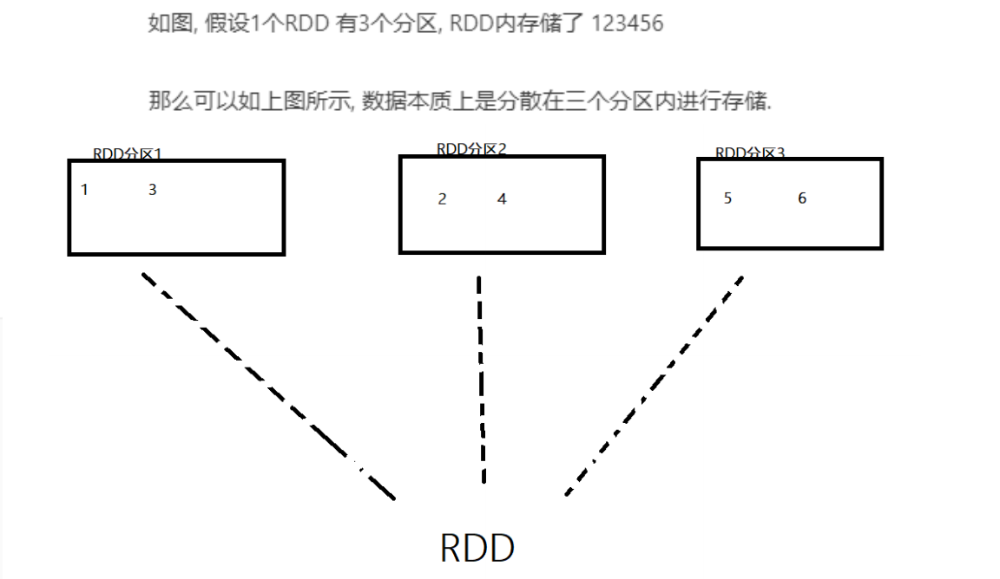

```python
sc.parallelize([1,2,3,4,5,6,7,8,9], 3).glom().collect()   # 分三区
# 输出: [[1,2,3], [4,5,6], [7,8,9]]

sc.parallelize([1,2,3,4,5,6,7,8,9], 6).glom().collect()   # 分六区
# 输出: [[1], [2,3], [4], [5,6], [7], [8,9]]

# 从上面可以看出，设置三个分区，数据就分成3部分 设置六个分区，数据就被分成了6部分
```

**特性2: RDD的方法会作用在其所有的分区上**

```python
sc.parallelize([1,2,3,4,5,6,7,8,9],3).glom().collect()
# [[1,2,3],[4,5,6],[7,8,9]]
sc.parallelize([1,2,3,4,5,6,7,8,9],3).map(lambda x: x*10)glom().collect()
# [[10,20,30],[40,50,60],[70,80,90]]
# 也就是说上面的map操作会作用到三个分区上
```

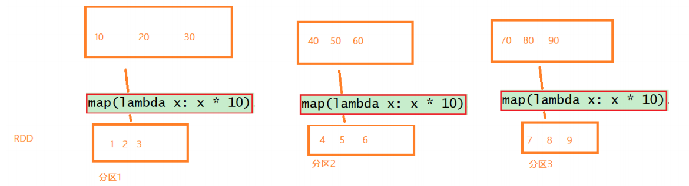

**特性3: RDD之间是有依赖关系的**

```python
sc = SparkContext(conf=conf)
rdd1 = sc.textFile('../1.txt')
rdd2 = rdd1.flatMap(lambda x: x.split(' '))
rdd3 = rdd2.map(lambda x: (x, 1))
rdd4 = rdd3.reduceByKey(lambda a, b: a + b)
print(rdd4.collect())
```

如上代码，各个rdd之间是有依赖的。比如rdd2会产生rdd3, rdd2又由rdd1产生，形成一个依赖链条。

**特性4: Key-Value型的RDD可以有分区器**

Key-Value行的数据 就是二元组的数据 如: ('spark', 1), ('hadoop', 1)等。

默认分区器: Hash分区规则，但是也可以手动设置一个分区器(rdd.partitionBy的方法设置)

**特性5: RDD的分区规划，会尽量靠近数据所在的服务器**

在初始RDD(读取数据的时候)规划的时候，分区会尽量规划到存储数据所在的服务器上。因为这样可以走本地读取，避免网络读取。

> spark会在确保并行计算能力的前提下，尽量确保本地读取
>
> 这里是尽量确保，并不是100%

### WordCount案例分析

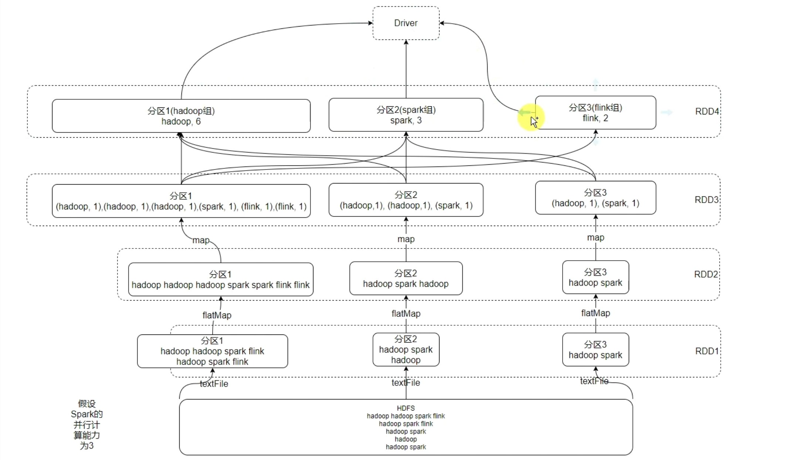

## RDD编程入门

### SparkContext对象

Spark RDD 编程的程序入口对象是SparkContext对象(不论何种编程语言)。只有构建出SparkContext, 基于它才能执行后续的API调用和计算。本质上, SparkContext对编程来说, 主要功能就是创建第一个RDD出来

```python
import findspark
findspark.init('/usr/local/spark')
from pyspark import SparkConf, SparkContext

if __name__ == '__main__':
    conf = SparkConf().setMaster("local[*]").setAppName('preactice')
    # 通过SparkConf对象构建SparkContext对象
    sc = SparkContext(conf=conf)
```

### RDD的创建

RDD的创建主要有两种方式:

- 通过并行化集合创建(本地对象 转 分布式RDD)
- 读取外部数据源(读取文件)

#### 并行化创建

概念: 并行化创建是指将本地集合-> 转向分布式RDD

语法:

```python
rdd = sparkcontext.parallelize(参数1,参数2)
# 参数1: 集合对象即可，比如list
# 参数2: 分区数
```

例子:

```python
import findspark
findspark.init('/usr/local/spark')
from pyspark import SparkConf, SparkContext


if __name__ == '__main__':
    conf = SparkConf().setMaster("local[*]").setAppName('create partition')

    # 通过SparkConf对象构建SparkContext对象
    sc = SparkContext(conf=conf)

    # 默认分区
    rdd = sc.parallelize([1, 2, 3, 4, 5, 6, 7, 8, 9])
    print('默认分区数:', rdd.getNumPartitions())  # 默认分区数: 8  local模式跟本地的cpu合数有关

    # 指定分区
    rdd = sc.parallelize([1, 2, 3, 4, 5, 6, 7, 8, 9], numSlices=3)
    print("指定分区数:", rdd.getNumPartitions())   # 指定分区数: 3

    print(rdd.collect())   # [1, 2, 3, 4, 5, 6, 7, 8, 9]
```

#### 读取文件创建

这个api可以读取本地数据，也可以读取hdfs数据

语法:

```python
sparkcontext.textFile(参数1，参数2)
# 参数1: 必填，文件路径  或者hdfs路径
# 参数2: 可选，表示最小分区数量
# 注意: 参数2 话语权不足，spark有自己的判断，在它允许的范围内，参数2有效果，超出spark允许的范围，则该参数失效
```

例子:

```python
import findspark
findspark.init('/usr/local/spark')
from pyspark import SparkConf, SparkContext


if __name__ == '__main__':
    conf = SparkConf().setMaster("local[*]").setAppName('create rdd')

    # 通过SparkConf对象构建SparkContext对象
    sc = SparkContext(conf=conf)

    # textFile API读取本地文件
    rdd = sc.textFile('./words.txt', 3)
    print('分区数:', rdd.getNumPartitions())   # 分区数: 3
    print('读取的数据:', rdd.collect())
    # 读取的数据: ['hadoop hadoop flink', 'spark hive hive spark', 'flink hadoop', 'mapreduce']
    
    # 读取hdfs
    rdd2 = sc.textFile('hfds://node1:8020/input/words.txt', 3)
    print('分区数:', rdd.getNumPartitions())   # 分区数: 3
    print('读取的数据:', rdd.collect())
    # 读取的数据: ['hadoop hadoop flink', 'spark hive hive spark', 'flink hadoop', 'mapreduce']
```

读取文件还有一个api  叫做wholeTextFile  主要针对读取一堆小文件

语法:

```python
sparkcontext.wholeTextFiles(参数1，参数2)
# 参数1: 必填，文件路径 支持本地和hdfs
# 参数2: 分区数
```

例子:

```python
import findspark
findspark.init('/usr/local/spark')
from pyspark import SparkConf, SparkContext


if __name__ == '__main__':
    conf = SparkConf().setMaster("local[*]").setAppName('create rdd')

    # 通过SparkConf对象构建SparkContext对象
    sc = SparkContext(conf=conf)

    rdd = sc.wholeTextFiles('../data/tiny_files/', 10)   # 注意力路径 这个路径下有很多小文件
    print(rdd.getNumPartitions())
    print(rdd.collect())
    # [(文件名，数据), (文件名，数据), (文件名，数据)...]
```

### RDD算子

算子: 分布式集合对象上的API称之为算子。

方法\函数: 本地对象的API称之为方法\函数。

#### 算子分类

算子主要分为两类:

- Transformation: 转换算子
- Action: 动作(行动)算子

**Transformation: 转换算子**

定义: RDD的算子，返回值仍旧是一个RDD，称之为转换算子。

特性: 这类算子是`laze懒加载`的，如果没有action孙子，Transformation算子是不工作的。可以类比TensorFlow的静态图。

**Action算子**

定义: 返回值不是rdd的 就是action算子。

#### 常用Transformation算子

##### map算子

功能: map算子是将rdd的数据一条条处理(处理的逻辑 基于map算子中接受的处理函数)，返回新的rdd

例子:

```python
import findspark
findspark.init('/usr/local/spark')
from pyspark import SparkConf, SparkContext


def map_func(data):
    return data * 10

  
if __name__ == '__main__':
    conf = SparkConf().setMaster("local[*]").setAppName('transformation-map')

    # 通过SparkConf对象构建SparkContext对象
    sc = SparkContext(conf=conf)

    rdd = sc.parallelize([1, 2, 3, 4, 5])
    
    # 通过普通函数
    print(rdd.map(map_func).collect()) 
    # [10, 20, 30, 40, 50]

    # 通过匿名函数
    print(rdd.map(lambda data: data * 10).collect())
    # [10, 20, 30, 40, 50]
```

##### flatmap算子

功能: 对rdd执行map操作，然后进行解除嵌套操作。

> 解除嵌套
>
> 嵌套的list: [[1, 2, 3], [4, 5, 6], [7, 8, 9]]
>
> 解除嵌套的list: [1, 2, 3, 4, 5, 6, 7, 8, 9]

```python
import findspark
findspark.init('/usr/local/spark')
from pyspark import SparkConf, SparkContext


if __name__ == '__main__':
    conf = SparkConf().setMaster("local[*]").setAppName('transformation-flatmap')

    # 通过SparkConf对象构建SparkContext对象
    sc = SparkContext(conf=conf)

    rdd = sc.parallelize(['a b c', 'a c e', 'e c a'])
    
    # 按空格切分 解除嵌套
    print(rdd.flatMap(lambda x: x.split(' ')).collect())
    # ['a', 'b', 'c', 'a', 'c', 'e', 'e', 'c', 'a']
```

##### reduceByKey算子

功能: 针对KV型RDD, 自动按照key分组，然后根据你提供的聚合逻辑，完成`组内数据(value)`的聚合操作。

例子:

```python
import findspark
findspark.init('/usr/local/spark')
from pyspark import SparkConf, SparkContext


if __name__ == '__main__':
    conf = SparkConf().setMaster("local[*]").setAppName('transformation-reduceByKey')

    # 通过SparkConf对象构建SparkContext对象
    sc = SparkContext(conf=conf)

    rdd = sc.parallelize([('a', 1), ('a', 1), ('b', 1), ('b', 1), ('a', 1)])
    result = rdd.reduceByKey(lambda a, b: a + b)
    # 上面语句相当于是先根据key聚合  然后再将后面的数据累加
    print(result.collect())
    # [('a', 3), ('b', 2)]
```

接下来看看reduceByKey中的聚合逻辑

比如: 有a对应的value有[1,2,3,4,5]，然后聚合的函数是: `lambda a, b: a+b`,则聚合逻辑为:

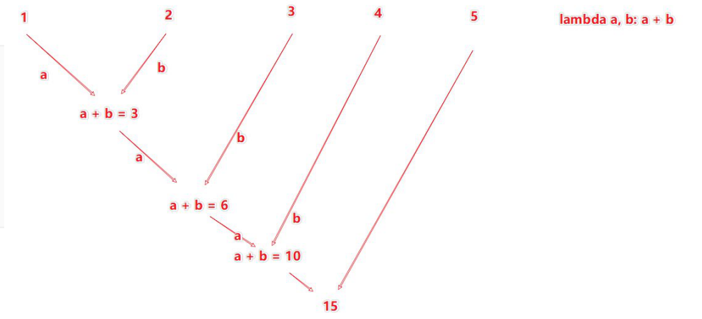

##### groupBy算子

功能: 将rdd的数据进行分组

例子:

```python
import findspark
findspark.init('/usr/local/spark')
from pyspark import SparkConf, SparkContext


if __name__ == '__main__':
    conf = SparkConf().setMaster("local[*]").setAppName('transformation-groupBy')

    # 通过SparkConf对象构建SparkContext对象
    sc = SparkContext(conf=conf)

    rdd = sc.parallelize([1, 2, 3, 4, 5])

    # 分组 将数字分层 偶数和奇数两组
    rdd2 = rdd.groupBy(lambda num: 'even' if (num % 2) == 0 else "odd")

    # 将rdd2的元素的value转换成list,这样print可以输出内容
    print(rdd2.map(lambda x: (x[0], list(x[1]))).collect())
    # [('even', [2, 4]), ('odd', [1, 3, 5])]
```

##### filter算子

功能: 过滤想要的数据进行保留

