- [第一章: Spark基础入门](#第一章-spark基础入门)
  - [Spark概念介绍](#spark概念介绍)
    - [Spark是什么？](#spark是什么)
    - [Spark VS Hadoop](#spark-vs-hadoop)
    - [Spark框架模块](#spark框架模块)
    - [Spark的运行模式](#spark的运行模式)
    - [Spark架构中的角色](#spark架构中的角色)
  - [Spark安装](#spark安装)
    - [local模式安装](#local模式安装)
    - [local模式下的角色分布](#local模式下的角色分布)
    - [Standalone模式安装](#standalone模式安装)
    - [Standalone架构](#standalone架构)
    - [Spark程序运行层次结构](#spark程序运行层次结构)
    - [问题](#问题)
  - [Pyspark](#pyspark)
    - [使用](#使用)
    - [Python on Spark执行原理](#python-on-spark执行原理)
- [第二章: SparkCore](#第二章-sparkcore)
  - [RDD详解](#rdd详解)
    - [RDD是什么?](#rdd是什么)
    - [RDD的五大特性](#rdd的五大特性)
    - [WordCount案例分析](#wordcount案例分析)
  - [RDD编程入门](#rdd编程入门)
    - [SparkContext对象](#sparkcontext对象)
    - [RDD的创建](#rdd的创建)
      - [并行化创建](#并行化创建)
      - [读取文件创建](#读取文件创建)
    - [RDD算子](#rdd算子)
      - [算子分类](#算子分类)
      - [常用Transformation算子](#常用transformation算子)
        - [map算子](#map算子)
        - [flatmap算子](#flatmap算子)
        - [reduceByKey算子](#reducebykey算子)
        - [groupBy算子](#groupby算子)
        - [filter算子](#filter算子)
        - [distinct算子](#distinct算子)
        - [union算子](#union算子)
        - [join算子](#join算子)
        - [intersection算子](#intersection算子)
        - [glom算子](#glom算子)
        - [groupByKey算子](#groupbykey算子)
        - [sortBy算子](#sortby算子)
        - [sortByKey算子](#sortbykey算子)
        - [综合案例](#综合案例)
      - [常用Action算子](#常用action算子)
        - [countByKey算子](#countbykey算子)
        - [collect算子](#collect算子)
        - [reduce算子](#reduce算子)
        - [fold算子](#fold算子)
        - [first算子](#first算子)
        - [take算子](#take算子)
        - [top算子](#top算子)
        - [count算子](#count算子)
        - [takeSample算子](#takesample算子)
        - [takeOrdered算子](#takeordered算子)
        - [foreach算子](#foreach算子)
        - [saveAsTextFile算子](#saveastextfile算子)
      - [分区操作算子](#分区操作算子)
        - [mapPartitions算子-Transformation](#mappartitions算子-transformation)
        - [foreachePartition算子-Action](#foreachepartition算子-action)
        - [partitionBy算子-Transformation](#partitionby算子-transformation)
        - [repartition算子-Transformation](#repartition算子-transformation)
        - [coalesce算子-Transformation](#coalesce算子-transformation)
        - [maoValues算子-Transformation](#maovalues算子-transformation)
      - [面试题](#面试题)
  - [RDD的持久化](#rdd的持久化)
    - [RDD的数据是过程数据](#rdd的数据是过程数据)
    - [RDD缓存](#rdd缓存)
    - [RDD的CheckPoint](#rdd的checkpoint)
    - [缓存和CheckPoint对比](#缓存和checkpoint对比)
  - [案例学习](#案例学习)
    - [提交到集群执行](#提交到集群执行)
  - [共享变量](#共享变量)
    - [广播变量](#广播变量)
    - [累加器](#累加器)
    - [综合案例](#综合案例-1)
  - [Spark内核调度](#spark内核调度)
    - [DAG概念](#dag概念)
    - [DAG的宽窄依赖和阶段划分](#dag的宽窄依赖和阶段划分)
    - [内存迭代计算](#内存迭代计算)
    - [面试题](#面试题-1)
    - [Spark并行度](#spark并行度)
    - [Spark的任务调度](#spark的任务调度)
    - [层级关系梳理](#层级关系梳理)
- [第三章: SparkSQL](#第三章-sparksql)
  - [概念](#概念)
    - [SparkSQL和Hive的异同](#sparksql和hive的异同)
    - [SparkSQL的数据抽象](#sparksql的数据抽象)
    - [SparkSession对象](#sparksession对象)
    - [实例](#实例)
  - [DataFrame入门和操作](#dataframe入门和操作)
    - [DataFrame的组成](#dataframe的组成)
    - [DataFrame的构建](#dataframe的构建)
      - [DataFrame的构建-基于RDD方式1](#dataframe的构建-基于rdd方式1)
      - [DataFrame的构建-基于RDD方式2](#dataframe的构建-基于rdd方式2)
      - [DataFrame的构建-基于RDD方式3](#dataframe的构建-基于rdd方式3)
      - [DataFrame的构建-基于Pandas的DataFrame](#dataframe的构建-基于pandas的dataframe)
      - [DataFrame的代码构建-读取外部数据](#dataframe的代码构建-读取外部数据)
        - [读取text文件](#读取text文件)
        - [读取json文件](#读取json文件)
        - [读取csv文件](#读取csv文件)
        - [读取parquet数据](#读取parquet数据)
    - [DataFrame的入门操作](#dataframe的入门操作)
      - [DSL语法学习](#dsl语法学习)
        - [show方法](#show方法)
        - [printSchema方法](#printschema方法)
        - [select方法](#select方法)
        - [filter和where方法](#filter和where方法)
        - [groupBy分组](#groupby分组)
      - [SQL语法学习](#sql语法学习)
        - [查询](#查询)
        - [函数](#函数)
      - [案例学习](#案例学习-1)
        - [词频统计案例学习](#词频统计案例学习)
        - [电影评分数据分析案例](#电影评分数据分析案例)
      - [SparkSQL Shuffle分区数目](#sparksql-shuffle分区数目)
      - [SparkSQL清洗数据API](#sparksql清洗数据api)
        - [dropDuplicates去重方法](#dropduplicates去重方法)
        - [dropna删除缺失值](#dropna删除缺失值)
        - [fillna填充缺失值](#fillna填充缺失值)
      - [DataFrame的数据写出](#dataframe的数据写出)
  - [SparkSQL函数定义](#sparksql函数定义)
    - [SparkSQL定义UDF函数](#sparksql定义udf函数)
      - [sparksql定义udf函数](#sparksql定义udf函数-1)
      - [注册一个Float返回值类型](#注册一个float返回值类型)
      - [注册一个ArrayType类型的返回值udf](#注册一个arraytype类型的返回值udf)
      - [注册一个字典类型的返回值的udf](#注册一个字典类型的返回值的udf)
    - [SparkSQL使用窗口函数](#sparksql使用窗口函数)
  - [SparkSQL的运行流程](#sparksql的运行流程)
    - [SparkSQL的自动优化](#sparksql的自动优化)
    - [Catalyst优化器](#catalyst优化器)
  - [SparkSQL整合Hive](#sparksql整合hive)
# 第一章: Spark基础入门

## Spark概念介绍

### Spark是什么？

Spark是一款分布式**内存计算**的统一分析引擎。其特点就是对任意类型的数据进行自定义计算。

Spark可以计算：结构化、半结构化、非结构化等各种类型的数据结构，同时也支持使用Python、Java、Scala、R以及SQL语言去开发应用程序计算数据。

Spark的适用面非常广泛，所以，被称之为 统一的（适用面广）的分析引擎（数据处理）

### Spark VS Hadoop


尽管Spark相对于Hadoop而言具有较大优势，但Spark并不能完全替代Hadoop

- 在计算层面，Spark相比较MR（MapReduce）有巨大的性能优势，但至今仍有许多计算工具基于MR构架，比如非常成熟的Hive 
- Spark仅做计算，而Hadoop生态圈不仅有计算（MR）也有存储（HDFS）和资源管理调度（YARN），HDFS和YARN仍是许多大数据体系的核心架构。

问题: Hadoop的基于进程的计算和Spark基于线程方式优缺点？

**答案：**Hadoop中的MR中每个map/reduce task都是一个java进程方式运行，好处在于进程之间是互相独立的，每个task独享进程资源，没有互相干扰，监控方便，但是问题在于task之间不方便共享数据，执行效率比较低。比如多个map task读取不同数据源文件需要将数据源加载到每个map task中，造成重复加载和浪费内存。而基于线程的方式计算是为了数据共享和提高执行效率，Spark采用了线程的最小的执行单位，但缺点是线程之间会有资源竞争。

### Spark框架模块

整个Spark 框架模块包含：Spark Core、 Spark SQL、 Spark Streaming、 Spark GraphX、 Spark MLlib，而后四项的能力都是建立在核心引擎之上。

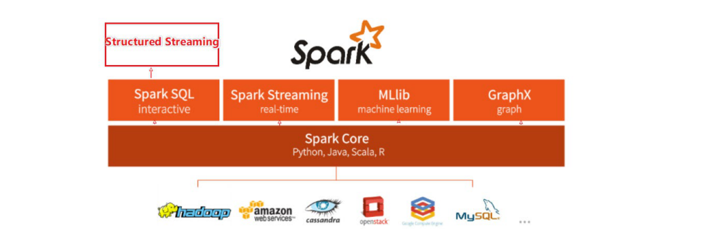

- Spark Core：Spark的核心，Spark核心功能均由Spark Core模块提供，是Spark运行的基础。Spark Core以RDD为数据抽象，提供Python、Java、Scala、R语言的API，可以编程进行海量离线数据批处理计算。

- SparkSQL：基于SparkCore之上，提供结构化数据的处理模块。SparkSQL支持以SQL语言对数据进行处理，SparkSQL本身针对离线计算场景。同时基于SparkSQL，Spark提供了**StructuredStreaming**模块，可以以SparkSQL为基础，进行数据的流式计算。

- SparkStreaming：以SparkCore为基础，提供数据的流式计算功能。

- MLlib：以SparkCore为基础，进行机器学习计算，内置了大量的机器学习库和API算法等。方便用户以分布式计算的模式进行机器学习计算。

- GraphX：以SparkCore为基础，进行图计算，提供了大量的图计算API，方便用于以分布式计算模式进行图计算。

### Spark的运行模式

Spark提供多种运行模式，包括:

- 本地模式(单机)

  本地模式就是以一个**独立的进程**，通过其内部的**多个线程来模拟**整个Spark运行时环境。这种模式一般都是用来调试代码。

- Standlone模式(集群)

  Spark中的各个角色以独立进程的形式存在，并组成spark集群环境。

- Hadoop yarn模式(集群)

  Spark中各个角色运行在YARN的容器内部，并组成Spark集群环境。

- Kubernetes(容器集群)

  Spark中的各个角色运行在Kubernetes的容器内部，并组成Spark集群环境。

### Spark架构中的角色

首先来回顾一下YARN中的角色


YARN主要有4类角色，从2个层面去看：

资源管理层面

- 集群资源管理者（Master）：ResourceManager
- 单机资源管理者（Worker）：NodeManager

任务计算层面

- 单任务管理者（Master）：ApplicationMaster

- 单任务执行者（Worker）：Task（容器内计算框架的工作角色）

对比spark中的角色

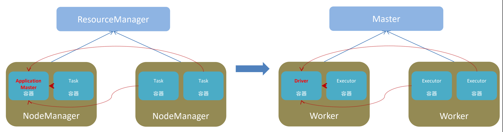

可以发现角色基本一一对应，只是名字叫法不一样。

spark中由四类角色组成整个spark的运行环境。

- master角色，管理整个集群的资源。    类比于YARN的ResouceManager
- worker角色，管理单个服务器的资源。    类比于YARN的NodeManager
- driver角色，管理单个Spark任务在运行的时候的任务。  类比于YARN的ApplicationMaster
- executor角色，单个任务运行的时候的一堆工作者，干活的。  类比于YARN的容器内运行的TASK

从两个层面划分

资源管理层面:

- 管理者: Spark是Master角色，YARN是ResourceManager
- 工作中: Spark是Worker角色，YARN是NodeManager

任务执行层面:

- 某任务管理者: Spark是Driver角色，YARN是ApplicationMaster
- 某任务执行者: Spark是Executor角色，YARN是容器中运行的具体工作进程。

## Spark安装

### local模式安装

本质: **启动一个JVM Process进程(一个进程里面有多个线程)，执行任务Task**

- Local模式可以限制模拟Spark集群环境的线程数量, 即Local[N] 或 Local[*]。
- 其中**N代表可以使用N个线程**，每个线程拥有一个cpu core。如果不指定N，则默认是1个线程（该线程有1个core）。 通常Cpu有几个Core，就指定几个线程，最大化利用计算能力。
- 如果是**local[\*]**，则代表 Run Spark locally with as many worker threads as logical cores on your machine.按照Cpu最多的Cores设置线程数。

### local模式下的角色分布

对于资源管理: `Master： Local进程本身`,  `Worker： Local进程本身`

对于任务执行:  `Driver: Local进程本身`，`Executor:不存在，没有独立的Executor角色。由Local进程(也就是Driver)内的线程提供计算能力`

测试安装是否成功:

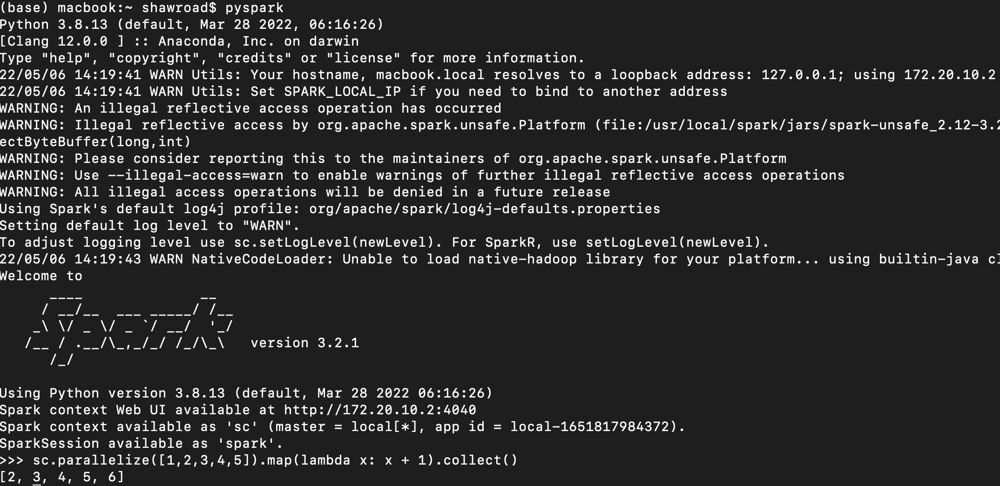

每一个Spark程序运行的时候，会绑定到Driver所在机器的4040端口上。如果4040端口被占用, 会顺延到4041 ... 4042...

打开监控页面: http://127.0.0.1:4040/


### Standalone模式安装

Standalone模式是Spark自带的一种集群模式，不同于前面本地模式启动多个进程来模拟集群的环境，Standalone模式是真实地在多个机器之间搭建Spark集群的环境，完全可以利用该模式搭建多机器集群，用于实际的大数据处理。


### Standalone架构

StandAlone集群在进程上主要有3类进程: 

- 主节点Master进程: Master角色, 管理整个集群资源，并托管运行各个任务的Driver
- 从节点Workers: Worker角色, 管理每个机器的资源，分配对应的资源来运行Executor(Task)； 每个从节点分配资源信息给Worker管理，资源信息包含内存Memory和CPU Cores核数
- 历史服务器HistoryServer(可选): Spark Application运行完成以后，保存事件日志数据至HDFS，启动HistoryServer可以查看应用运行相关信息。


### Spark程序运行层次结构

在前面我们接触到了不少的监控页面,有4040,有8080,有18080,它们有何区别吗?

- 4040: 是一个运行的Application在运行的过程中临时绑定的端口,用以查看当前任务的状态.4040被占用会顺延到4041.4042等。4040是一个临时端口,当前程序运行完成后, 4040就会被注销哦
- 8080: 默认是StandAlone下, Master角色(进程)的WEB端口,用以查看当前Master(集群)的状态
- 18080: 默认是历史服务器的端口, 由于每个程序运行完成后,4040端口就被注销了. 在以后想回看某个程序的运行状态就可以通过历史服务器查看,历史服务器长期稳定运行,可供随时查看被记录的程序的运行过程.

Spark Application程序运行时三个核心概念：Job、Stage、Task，说明如下：

- Job：由多个 Task 的并行计算部分，一般 Spark 中的action 操作（如 save、collect，后面进一步说明），会生成一个 Job。 
- Stage：Job 的组成单位，一个 Job 会切分成多个 Stage，Stage 彼此之间相互依赖顺序执行，而每个 Stage 是多个 Task 的集合，类似 map 和 reduce stage。 
- Task：被分配到各个 Executor 的单位工作内容，它是Spark 中的最小执行单位，一般来说有多少个 Paritition（物理层面的概念，即分支可以理解为将数据划分成不同部分并行处理），就会有多少个 Task，每个 Task 只会处理单一分支上的数据。

### 问题

1. StandAlone的原理?

   答: Master和Worker角色以独立进程的形式存在,并组成Spark运行时环境(集群)

2. Spark角色在StandAlone中的分布？

   答: Master角色:Master进程, Worker角色:Worker进程, Driver角色和Executor角色:以线程运行在Worker中

3. Standalone如何提交Spark应用？

   答: bin/spark-submit --master spark://server:7077

## Pyspark

安装

```shell
conda install pyspark
或者
pip install pyspark -i https://pypi.douban.com/simple/
```

PySpark是什么?和bin/pyspark 程序有何区别?

答: PySpark是一个Python的类库, 提供Spark的操作API。 bin/pyspark 是一个交互式的程序,可以提供交互式编程并执行Spark计算

### 使用

Spark Application程序入口为：SparkContext，任何一个应用首先需要构建SparkContext对象，如下两步构建：

- 第一步、创建SparkConf对象

  > 设置Spark Application基本信息，比如应用的名称AppName和应用运行Master 

- 第二步、基于SparkConf对象，创建SparkContext对象

```python
conf = SparkConf().setAppName(appName).setMaster(master)
sc = SparkContext(conf=conf)
```

实例程序: 统计wordcount

```python
import findspark
findspark.init('/usr/local/spark')
from pyspark import SparkConf, SparkContext


if __name__ == '__main__':
    conf = SparkConf().setMaster("local[*]").setAppName('WordCountHelloWorld')

    # 通过SparkConf对象构建SparkContext对象
    sc = SparkContext(conf=conf)

    # 需求: wordcount   尝试度hdfs或者本地的文件
    # 读取文件
    file_rdd = sc.textFile('./words.txt')   # 读本地文件
    # file_rdd = sc.textFile('hdfs://node1.8020/input/words.txt')  # 读hdfs上的数据

    # 将单词进行切割，得到一个存储全部单词的集合对象
    words_rdd = file_rdd.flatMap(lambda line: line.split(' '))

    # 将单词转为元组对象，key是单词 value是1
    words_with_one_rdd = words_rdd.map(lambda x: (x, 1))

    # 将元组的value 按照key来分组 对所有的value执行聚合操作(相加)
    result_rdd = words_with_one_rdd.reduceByKey(lambda a, b: a+b)

    # 通过collect方法手机RDD的数据打印输出结果
    print(result_rdd.collect())
    '''
    结果输出:
    [('hadoop', 3), ('hive', 2), ('flink', 2), ('spark', 2), ('mapreduce', 1)]
    '''
```

wordcount原理分析


### Python on Spark执行原理

PySpark宗旨是在不破坏Spark已有的运行时架构，在Spark架构外层包装一层Python API，借助Py4j实现Python和Java的交互，进而实现通过Python编写Spark应用程序，其运行时架构如下图所示。


# 第二章: SparkCore

## RDD详解

### RDD是什么?

RDD（Resilient Distributed Dataset）叫做弹性分布式数据集，是Spark中最基本的数据抽象，代表一个不可变、可分区、里面的元素可并行计算的集合。

- Dataset(数据集): 一个数据集合，用于存放数据的。如: python中的list, tuple等都是数据，但是它们是本地集合，即: 数据都是在一个进程中的，不能跨进程。
- Distributed(分布式)：RDD中的数据是分布式存储的，可用于分布式计算。
- Resilient(弹性)：RDD中的数据可以存储在内存中或者磁盘中。

RDD定义

- RDD（Resilient Distributed Dataset）弹性分布式数据集，是Spark中最基本的数据抽象，代表一个不可变、可分区、里面的元素可并行计算的集合。
- 所有的运算以及操作都建立在 RDD 数据结构的基础之上。
- 可以认为RDD是分布式的列表List或数组Array，抽象的数据结构，RDD是一个抽象类Abstract Class和泛型Generic Type

### RDD的五大特性

**特性1: RDD是有分区的**

RDD的分区是RDD数据存储的最小单位。一个RDD的数据，本质上是分隔成了多个分区

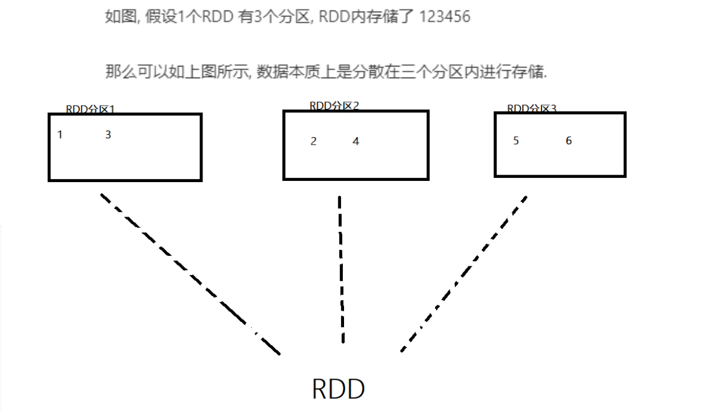

```python
sc.parallelize([1,2,3,4,5,6,7,8,9], 3).glom().collect()   # 分三区
# 输出: [[1,2,3], [4,5,6], [7,8,9]]

sc.parallelize([1,2,3,4,5,6,7,8,9], 6).glom().collect()   # 分六区
# 输出: [[1], [2,3], [4], [5,6], [7], [8,9]]

# 从上面可以看出，设置三个分区，数据就分成3部分 设置六个分区，数据就被分成了6部分
```

**特性2: RDD的方法会作用在其所有的分区上**

```python
sc.parallelize([1,2,3,4,5,6,7,8,9],3).glom().collect()
# [[1,2,3],[4,5,6],[7,8,9]]
sc.parallelize([1,2,3,4,5,6,7,8,9],3).map(lambda x: x*10)glom().collect()
# [[10,20,30],[40,50,60],[70,80,90]]
# 也就是说上面的map操作会作用到三个分区上
```


**特性3: RDD之间是有依赖关系的**

```python
sc = SparkContext(conf=conf)
rdd1 = sc.textFile('../1.txt')
rdd2 = rdd1.flatMap(lambda x: x.split(' '))
rdd3 = rdd2.map(lambda x: (x, 1))
rdd4 = rdd3.reduceByKey(lambda a, b: a + b)
print(rdd4.collect())
```

如上代码，各个rdd之间是有依赖的。比如rdd2会产生rdd3, rdd2又由rdd1产生，形成一个依赖链条。

**特性4: Key-Value型的RDD可以有分区器**

Key-Value行的数据 就是二元组的数据 如: ('spark', 1), ('hadoop', 1)等。

默认分区器: Hash分区规则，但是也可以手动设置一个分区器(rdd.partitionBy的方法设置)

**特性5: RDD的分区规划，会尽量靠近数据所在的服务器**

在初始RDD(读取数据的时候)规划的时候，分区会尽量规划到存储数据所在的服务器上。因为这样可以走本地读取，避免网络读取。

> spark会在确保并行计算能力的前提下，尽量确保本地读取
>
> 这里是尽量确保，并不是100%

### WordCount案例分析


## RDD编程入门

### SparkContext对象

Spark RDD 编程的程序入口对象是SparkContext对象(不论何种编程语言)。只有构建出SparkContext, 基于它才能执行后续的API调用和计算。本质上, SparkContext对编程来说, 主要功能就是创建第一个RDD出来

```python
import findspark
findspark.init('/usr/local/spark')
from pyspark import SparkConf, SparkContext

if __name__ == '__main__':
    conf = SparkConf().setMaster("local[*]").setAppName('preactice')
    # 通过SparkConf对象构建SparkContext对象
    sc = SparkContext(conf=conf)
```

### RDD的创建

RDD的创建主要有两种方式:

- 通过并行化集合创建(本地对象 转 分布式RDD)
- 读取外部数据源(读取文件)

#### 并行化创建

概念: 并行化创建是指将本地集合-> 转向分布式RDD

语法:

```python
rdd = sparkcontext.parallelize(参数1,参数2)
# 参数1: 集合对象即可，比如list
# 参数2: 分区数
```

例子:

```python
import findspark
findspark.init('/usr/local/spark')
from pyspark import SparkConf, SparkContext


if __name__ == '__main__':
    conf = SparkConf().setMaster("local[*]").setAppName('create partition')

    # 通过SparkConf对象构建SparkContext对象
    sc = SparkContext(conf=conf)

    # 默认分区
    rdd = sc.parallelize([1, 2, 3, 4, 5, 6, 7, 8, 9])
    print('默认分区数:', rdd.getNumPartitions())  # 默认分区数: 8  local模式跟本地的cpu合数有关

    # 指定分区
    rdd = sc.parallelize([1, 2, 3, 4, 5, 6, 7, 8, 9], numSlices=3)
    print("指定分区数:", rdd.getNumPartitions())   # 指定分区数: 3

    print(rdd.collect())   # [1, 2, 3, 4, 5, 6, 7, 8, 9]
```

#### 读取文件创建

这个api可以读取本地数据，也可以读取hdfs数据

语法:

```python
sparkcontext.textFile(参数1，参数2)
# 参数1: 必填，文件路径  或者hdfs路径
# 参数2: 可选，表示最小分区数量
# 注意: 参数2 话语权不足，spark有自己的判断，在它允许的范围内，参数2有效果，超出spark允许的范围，则该参数失效
```

例子:

```python
import findspark
findspark.init('/usr/local/spark')
from pyspark import SparkConf, SparkContext


if __name__ == '__main__':
    conf = SparkConf().setMaster("local[*]").setAppName('create rdd')

    # 通过SparkConf对象构建SparkContext对象
    sc = SparkContext(conf=conf)

    # textFile API读取本地文件
    rdd = sc.textFile('./words.txt', 3)
    print('分区数:', rdd.getNumPartitions())   # 分区数: 3
    print('读取的数据:', rdd.collect())
    # 读取的数据: ['hadoop hadoop flink', 'spark hive hive spark', 'flink hadoop', 'mapreduce']
    
    # 读取hdfs
    rdd2 = sc.textFile('hfds://node1:8020/input/words.txt', 3)
    print('分区数:', rdd.getNumPartitions())   # 分区数: 3
    print('读取的数据:', rdd.collect())
    # 读取的数据: ['hadoop hadoop flink', 'spark hive hive spark', 'flink hadoop', 'mapreduce']
```

读取文件还有一个api  叫做wholeTextFile  主要针对读取一堆小文件

语法:

```python
sparkcontext.wholeTextFiles(参数1，参数2)
# 参数1: 必填，文件路径 支持本地和hdfs
# 参数2: 分区数
```

例子:

```python
import findspark
findspark.init('/usr/local/spark')
from pyspark import SparkConf, SparkContext


if __name__ == '__main__':
    conf = SparkConf().setMaster("local[*]").setAppName('create rdd')

    # 通过SparkConf对象构建SparkContext对象
    sc = SparkContext(conf=conf)

    rdd = sc.wholeTextFiles('../data/tiny_files/', 10)   # 注意力路径 这个路径下有很多小文件
    print(rdd.getNumPartitions())
    print(rdd.collect())
    # [(文件名，数据), (文件名，数据), (文件名，数据)...]
```

### RDD算子

算子: 分布式集合对象上的API称之为算子。

方法\函数: 本地对象的API称之为方法\函数。

#### 算子分类

算子主要分为两类:

- Transformation: 转换算子
- Action: 动作(行动)算子

**Transformation: 转换算子**

定义: RDD的算子，返回值仍旧是一个RDD，称之为转换算子。

特性: 这类算子是`laze懒加载`的，如果没有action孙子，Transformation算子是不工作的。可以类比TensorFlow的静态图。

**Action算子**

定义: 返回值不是rdd的 就是action算子。

#### 常用Transformation算子

##### map算子

功能: map算子是将rdd的数据一条条处理(处理的逻辑 基于map算子中接受的处理函数)，返回新的rdd

例子:

```python
import findspark
findspark.init('/usr/local/spark')
from pyspark import SparkConf, SparkContext


def map_func(data):
    return data * 10

  
if __name__ == '__main__':
    conf = SparkConf().setMaster("local[*]").setAppName('transformation-map')

    # 通过SparkConf对象构建SparkContext对象
    sc = SparkContext(conf=conf)

    rdd = sc.parallelize([1, 2, 3, 4, 5])
    
    # 通过普通函数
    print(rdd.map(map_func).collect()) 
    # [10, 20, 30, 40, 50]

    # 通过匿名函数
    print(rdd.map(lambda data: data * 10).collect())
    # [10, 20, 30, 40, 50]
```

##### flatmap算子

功能: 对rdd执行map操作，然后进行解除嵌套操作。

> 解除嵌套
>
> 嵌套的list: [[1, 2, 3], [4, 5, 6], [7, 8, 9]]
>
> 解除嵌套的list: [1, 2, 3, 4, 5, 6, 7, 8, 9]

```python
import findspark
findspark.init('/usr/local/spark')
from pyspark import SparkConf, SparkContext


if __name__ == '__main__':
    conf = SparkConf().setMaster("local[*]").setAppName('transformation-flatmap')

    # 通过SparkConf对象构建SparkContext对象
    sc = SparkContext(conf=conf)

    rdd = sc.parallelize(['a b c', 'a c e', 'e c a'])
    
    # 按空格切分 解除嵌套
    print(rdd.flatMap(lambda x: x.split(' ')).collect())
    # ['a', 'b', 'c', 'a', 'c', 'e', 'e', 'c', 'a']
```

##### reduceByKey算子

功能: 针对KV型RDD, 自动按照key分组，然后根据你提供的聚合逻辑，完成`组内数据(value)`的聚合操作。

例子:

```python
import findspark
findspark.init('/usr/local/spark')
from pyspark import SparkConf, SparkContext


if __name__ == '__main__':
    conf = SparkConf().setMaster("local[*]").setAppName('transformation-reduceByKey')

    # 通过SparkConf对象构建SparkContext对象
    sc = SparkContext(conf=conf)

    rdd = sc.parallelize([('a', 1), ('a', 1), ('b', 1), ('b', 1), ('a', 1)])
    result = rdd.reduceByKey(lambda a, b: a + b)
    # 上面语句相当于是先根据key聚合  然后再将后面的数据累加
    print(result.collect())
    # [('a', 3), ('b', 2)]
```

接下来看看reduceByKey中的聚合逻辑

比如: 有a对应的value有[1,2,3,4,5]，然后聚合的函数是: `lambda a, b: a+b`,则聚合逻辑为:


##### groupBy算子

功能: 将rdd的数据进行分组

例子:

```python
import findspark
findspark.init('/usr/local/spark')
from pyspark import SparkConf, SparkContext


if __name__ == '__main__':
    conf = SparkConf().setMaster("local[*]").setAppName('transformation-groupBy')

    # 通过SparkConf对象构建SparkContext对象
    sc = SparkContext(conf=conf)

    rdd = sc.parallelize([1, 2, 3, 4, 5])

    # 分组 将数字分层 偶数和奇数两组
    rdd2 = rdd.groupBy(lambda num: 'even' if (num % 2) == 0 else "odd")

    # 将rdd2的元素的value转换成list,这样print可以输出内容
    print(rdd2.map(lambda x: (x[0], list(x[1]))).collect())
    # [('even', [2, 4]), ('odd', [1, 3, 5])]
    
    
    rdd_1 = sc.parallelize([('a', 1), ('a', 1), ('b', 1), ('b', 1), ('a', 1)])
    rdd_2= rdd_1.groupBy(lambda x: x[0])
    
```

##### filter算子

功能: 过滤想要的数据进行保留

语法: 

```python
rdd.filter(func)
# 传入一个参数 返回值必须是True或False
```

例子:

```python
import findspark
findspark.init('/usr/local/spark')
from pyspark import SparkConf, SparkContext


if __name__ == '__main__':
    conf = SparkConf().setMaster("local[*]").setAppName('transformation-filter')

    # 通过SparkConf对象构建SparkContext对象
    sc = SparkContext(conf=conf)

    rdd = sc.parallelize([1, 2, 3, 4, 5])

    # 保留奇数
    print(rdd.filter(lambda x: x % 2 == 1).collect())
    # 输出: [1, 3, 5]
```

##### distinct算子

功能: 对RDD数据进行去重，返回新RDD

例子:

```python
import findspark

findspark.init('/usr/local/spark')
from pyspark import SparkConf, SparkContext

if __name__ == '__main__':
    conf = SparkConf().setMaster("local[*]").setAppName('transformation-distinct')

    # 通过SparkConf对象构建SparkContext对象
    sc = SparkContext(conf=conf)

    rdd = sc.parallelize([1, 2, 2, 3, 3, 2, 1, 3, 4, 5])
    print(rdd.distinct().collect())
    # [1, 2, 3, 4, 5]

    rdd2 = sc.parallelize([('a', 1), ('a', 1), ('a', 2)])
    print(rdd2.distinct().collect())
    # [('a', 2), ('a', 1)]   可以看出是对value去重的
```

##### union算子

功能: 2个rdd合并成1个rdd返回，注意: 只是合并不去重

例子:

```python
import findspark

findspark.init('/usr/local/spark')
from pyspark import SparkConf, SparkContext

if __name__ == '__main__':
    conf = SparkConf().setMaster("local[*]").setAppName('transformation-union')

    # 通过SparkConf对象构建SparkContext对象
    sc = SparkContext(conf=conf)

    rdd1 = sc.parallelize([1, 1, 2, 2, 3])
    rdd2 = sc.parallelize([3, 3, 4, 4])

    union_rdd = rdd1.union(rdd2)
    print(union_rdd.collect())
    # [1, 1, 2, 2, 3, 3, 3, 4, 4]
```

##### join算子

功能: 对两个rdd执行join操作(可实现sql的内\外连接)。注意: join算子只能用于二元元组

语法:

```python
rdd.join(other_rdd)   # 内连接
rdd.leftOuterJoin(other_rdd)  # 左外
rdd.rightOuterJoin(other_rdd)   # 右外
```

例子:

```python
import findspark

findspark.init('/usr/local/spark')
from pyspark import SparkConf, SparkContext

if __name__ == '__main__':
    conf = SparkConf().setMaster("local[*]").setAppName('transformation-join')

    # 通过SparkConf对象构建SparkContext对象
    sc = SparkContext(conf=conf)

    # 部门id和员工姓名
    x = sc.parallelize([(1001, 'zhangsan'), (1002, 'lisi'), (1003, 'wangwu'), (1004, 'zhangliu')])
    # 部门id和部门名称
    y = sc.parallelize([(1001, 'sales'), (1002, 'tech')])

    # join是内连接
    print(x.join(y).collect())
    # [(1001, ('zhangsan', 'sales')), (1002, ('lisi', 'tech'))]

    # leftOuterJoin左外连接
    print(x.leftOuterJoin(y).collect())
    # [(1001, ('zhangsan', 'sales')), (1002, ('lisi', 'tech')), (1003, ('wangwu', None)), (1004, ('zhangliu', None))]

    # rightOuterJoin右外连接
    print(x.rightOuterJoin(y).collect())
    # [(1001, ('zhangsan', 'sales')), (1002, ('lisi', 'tech'))]
```

##### intersection算子

功能: 求2个rdd的交集，返回一个新rdd

例子:

```python
import findspark
findspark.init('/usr/local/spark')
from pyspark import SparkConf, SparkContext

if __name__ == '__main__':
    conf = SparkConf().setMaster("local[*]").setAppName('transformation-intersection')

    # 通过SparkConf对象构建SparkContext对象
    sc = SparkContext(conf=conf)

    rdd1 = sc.parallelize([("a", 1), ("b", 1)])
    rdd2 = sc.parallelize([("a", 1), ("c", 1)])
    rdd3 = rdd1.intersection(rdd2)
    print(rdd3.collect())
    # [('a', 1)]
    
    rdd1_1 = sc.parallelize([1, 2, 3, 4])
    rdd2_2 = sc.parallelize([1, 3, 5, 7])
    rdd3_3 = rdd1_1.intersection(rdd2_2)
    print(rdd3_3.collect())
    # [1, 3]
```

##### glom算子

功能: 将rdd的数据，加上嵌套，这个嵌套按照分区来进行

比如rdd的数据[1,2,3,4,5]有两个分区

那么被glom后，数据变成: [[1,2,3], [4,5]]

例子:

```python
import findspark
findspark.init('/usr/local/spark')
from pyspark import SparkConf, SparkContext

if __name__ == '__main__':
    conf = SparkConf().setMaster("local[*]").setAppName('transformation-glom')

    # 通过SparkConf对象构建SparkContext对象
    sc = SparkContext(conf=conf)

    rdd = sc.parallelize([1, 2, 3, 4, 5], numSlices=2)
    print(rdd.glom().collect())
    # [[1, 2], [3, 4, 5]]  可以看出显示两个分区的数据
```

##### groupByKey算子

功能: 针对KV型RDD，自动按照key分组

例子:

```python
import findspark
findspark.init('/usr/local/spark')
from pyspark import SparkConf, SparkContext

if __name__ == '__main__':
    conf = SparkConf().setMaster("local[*]").setAppName('transformation-groupByKey')

    # 通过SparkConf对象构建SparkContext对象
    sc = SparkContext(conf=conf)

    rdd = sc.parallelize([('a', 1), ('a', 1), ('b', 1), ('b', 1), ('a', 1)])
    group_rdd = rdd.groupByKey()
    print(group_rdd.map(lambda x: (x[0], list(x[1]))).collect())
    # [('a', [1, 1, 1]), ('b', [1, 1])]
```

##### sortBy算子

功能: 对RDD数据进行排序，基于你指定的排序依据

语法:

```python
rdd.sortBy(func, ascending=False, numPartitions=1)
# func 可以告知rdd按那个数据排序  不如lambda x: x[1] 按第二列数据排序
```

##### sortByKey算子

功能: 针对KV型RDD，按照key进行排序

语法:

```python
sortByKey()
```

例子:

```python
import findspark
findspark.init('/usr/local/spark')
from pyspark import SparkConf, SparkContext

if __name__ == '__main__':
    conf = SparkConf().setMaster("local[*]").setAppName('transformation-sortByKey')

    # 通过SparkConf对象构建SparkContext对象
    sc = SparkContext(conf=conf)

    rdd = sc.parallelize([('a', 1), ('E', 1), ('z', 1), ('d', 1), ('b', 1)])
    print(rdd.sortByKey().collect())   # 默认按key升序
    # [('E', 1), ('a', 1), ('b', 1), ('d', 1), ('z', 1)] 比ascii

    # 如果要确保全局有序，排序分区要给1，不是1的话，只能保证各个区内有序，整体不保证
    print(rdd.sortByKey(ascending=False, numPartitions=5).collect())
    # [('z', 1), ('d', 1), ('b', 1), ('a', 1), ('E', 1)]

    # 排序前，对排序的key进行处理，让key以你处理的样子排
    print(rdd.sortByKey(ascending=True, numPartitions=1, keyfunc=lambda key: key.lower()).collect())
    # [('a', 1), ('b', 1), ('d', 1), ('E', 1), ('z', 1)]
```

##### 综合案例

数据

```
{"id":1,"timestamp":"2019-05-08T01:03.00Z","category":"平板电脑","areaName":"京","money":"1450"}|{"id":2,"timestamp":"2019-05-08T01:01.00Z","category":"手机","areaName":"北京","money":"1450"}|{"id":3,"timestamp":"2019-05-08T01:03.00Z","category":"手机","areaName":"北京","money":"8412"}
{"id":4,"timestamp":"2019-05-08T05:01.00Z","category":"电脑","areaName":"上海","money":"1513"}|{"id":5,"timestamp":"2019-05-08T01:03.00Z","category":"家电","areaName":"北京","money":"1550"}|{"id":6,"timestamp":"2019-05-08T01:01.00Z","category":"电脑","areaName":"杭州","money":"1550"}
{"id":7,"timestamp":"2019-05-08T01:03.00Z","category":"电脑","areaName":"北京","money":"5611"}|{"id":8,"timestamp":"2019-05-08T03:01.00Z","category":"家电","areaName":"北京","money":"4410"}|{"id":9,"timestamp":"2019-05-08T01:03.00Z","category":"家具","areaName":"郑州","money":"1120"}
{"id":10,"timestamp":"2019-05-08T01:01.00Z","category":"家具","areaName":"北京","money":"6661"}|{"id":11,"timestamp":"2019-05-08T05:03.00Z","category":"家具","areaName":"杭州","money":"1230"}|{"id":12,"timestamp":"2019-05-08T01:01.00Z","category":"书籍","areaName":"北京","money":"5550"}
{"id":13,"timestamp":"2019-05-08T01:03.00Z","category":"书籍","areaName":"北京","money":"5550"}|{"id":14,"timestamp":"2019-05-08T01:01.00Z","category":"电脑","areaName":"北京","money":"1261"}|{"id":15,"timestamp":"2019-05-08T03:03.00Z","category":"电脑","areaName":"杭州","money":"6660"}
{"id":16,"timestamp":"2019-05-08T01:01.00Z","category":"电脑","areaName":"天津","money":"6660"}|{"id":17,"timestamp":"2019-05-08T01:03.00Z","category":"书籍","areaName":"北京","money":"9000"}|{"id":18,"timestamp":"2019-05-08T05:01.00Z","category":"书籍","areaName":"北京","money":"1230"}
{"id":19,"timestamp":"2019-05-08T01:03.00Z","category":"电脑","areaName":"杭州","money":"5551"}|{"id":20,"timestamp":"2019-05-08T01:01.00Z","category":"电脑","areaName":"北京","money":"2450"}
{"id":21,"timestamp":"2019-05-08T01:03.00Z","category":"食品","areaName":"北京","money":"5520"}|{"id":22,"timestamp":"2019-05-08T01:01.00Z","category":"食品","areaName":"北京","money":"6650"}
{"id":23,"timestamp":"2019-05-08T01:03.00Z","category":"服饰","areaName":"杭州","money":"1240"}|{"id":24,"timestamp":"2019-05-08T01:01.00Z","category":"食品","areaName":"天津","money":"5600"}
{"id":25,"timestamp":"2019-05-08T01:03.00Z","category":"食品","areaName":"北京","money":"7801"}|{"id":26,"timestamp":"2019-05-08T01:01.00Z","category":"服饰","areaName":"北京","money":"9000"}
{"id":27,"timestamp":"2019-05-08T01:03.00Z","category":"服饰","areaName":"杭州","money":"5600"}|{"id":28,"timestamp":"2019-05-08T01:01.00Z","category":"食品","areaName":"北京","money":"8000"}|{"id":29,"timestamp":"2019-05-08T02:03.00Z","category":"服饰","areaName":"杭州","money":"7000"}
```

需求:

读取数据order.txt文件，提取北京的数据，组合北京和商品类别进行输出

代码实现:

```python
import json
import findspark
findspark.init('/usr/local/spark')
from pyspark import SparkConf, SparkContext

if __name__ == '__main__':
    conf = SparkConf().setMaster("local[*]").setAppName('transformation-map')

    # 通过SparkConf对象构建SparkContext对象
    sc = SparkContext(conf=conf)

    # 需求: 读取数据，提取北京的数据，组合北京和商品类别进行输出

    # 1. 读取数据
    rdd = sc.textFile('./order.txt')

    # 2. 将每条json数据取出来
    json_str_rdd = rdd.flatMap(lambda x: x.split('|'))

    # 3. 将每个json字符串 变成字典对象
    json_dict_rdd = json_str_rdd.map(lambda x: json.loads(x.strip()))

    # 4. 过滤数据，只留北京
    beijing_rdd = json_dict_rdd.filter(lambda x: x['areaName'] == '北京')

    # 5. 组合北京和商品类型
    result_rdd = beijing_rdd.map(lambda x: x['areaName'] + '_' + x['category'])
    print(result_rdd.collect())
    '''
    结果输出:
    ['北京_手机', '北京_手机', '北京_家电', '北京_电脑', '北京_家电', '北京_家具', '北京_书籍', '北京_书籍', '北京_电脑', '北京_书籍', '北京_书籍', '北京_电脑', '北京_食品', '北京_食品', '北京_食品', '北京_服饰', '北京_食品']

    '''

```

#### 常用Action算子

##### countByKey算子

功能: 统计key出现的次数(一般适用于kv行kdd)

例子:

```python
import findspark
findspark.init('/usr/local/spark')
from pyspark import SparkConf, SparkContext

if __name__ == '__main__':
    conf = SparkConf().setMaster("local[*]").setAppName('action-countByKey')

    # 通过SparkConf对象构建SparkContext对象
    sc = SparkContext(conf=conf)

    rdd1 = sc.textFile('./words.txt')
    rdd2 = rdd1.flatMap(lambda x: x.split(' '))
    rdd3 = rdd2.map(lambda x: (x, 1))
    result = rdd3.countByKey()
    print(result)   # 返回是字典
    '''
    输出:
    defaultdict(<class 'int'>, {'hadoop': 3, 'flink': 2, 'spark': 2, 'hive': 2, 'mapreduce': 1})
    '''
```

##### collect算子

功能: 将rdd各个分区内的数据，统一收集到Driver中，形成一个list对象

> 这个算子是将rdd各个分区数据 都拉取到driver上
>
> 注意: rdd是分布式对象，其数据量可以非常大，所以用这个算子之前要心知肚明的了解，结果数据集不会太大。不然driver内存撑爆。

##### reduce算子

功能: 对RDD数据集按照你传入的逻辑进行聚合。

例子:

```python
import findspark
findspark.init('/usr/local/spark')
from pyspark import SparkConf, SparkContext

if __name__ == '__main__':
    conf = SparkConf().setMaster("local[*]").setAppName('action-reduce')

    # 通过SparkConf对象构建SparkContext对象
    sc = SparkContext(conf=conf)

    rdd = sc.parallelize([1, 2, 3, 4, 5])
    print(rdd.reduce(lambda a, b: a + b))
    # 结果:
    # 15
```

##### fold算子

功能: 和reduce一样，接受传入逻辑进行聚合，聚合是带有初始值的。

这个初始值集合，会同时作用在: 分区内聚合、分区间聚合。

举例: [[1,2,3], [4,5,6], [7,8,9]]  相当于有三个分区的数据

分区1: [1,2,3]聚合的时候会带上初始值，即: 10 + 1 + 2 + 3 = 16

分区1: [4,5,6]聚合的时候会带上初始值，即: 10 + 4 + 5 + 6 = 25

分区1: [7,8,9]聚合的时候会带上初始值，即: 10 + 7 + 8 + 9 = 34

3个分区的结果再做聚合，也会带上初始值: 10 + 16 + 25 + 34 = 85

```python
import findspark
findspark.init('/usr/local/spark')
from pyspark import SparkConf, SparkContext

if __name__ == '__main__':
    conf = SparkConf().setMaster("local[*]").setAppName('action-fold')

    # 通过SparkConf对象构建SparkContext对象
    sc = SparkContext(conf=conf)
    rdd = sc.parallelize([1, 2, 3, 4, 5, 6, 7, 8, 9], 3)
    print(rdd.fold(10, lambda a, b: a + b))
    # 输出:85
```


##### first算子

功能: 取出RDD的第一个元素

例子:

```python
import findspark
findspark.init('/usr/local/spark')
from pyspark import SparkConf, SparkContext

if __name__ == '__main__':
    conf = SparkConf().setMaster("local[*]").setAppName('action-first')

    # 通过SparkConf对象构建SparkContext对象
    sc = SparkContext(conf=conf)

    rdd = sc.parallelize([1, 2, 3, 4, 5])
    print(rdd.first())
    # 1
```

##### take算子

功能: 去RDD的前n个元素，组合成list返回给你

例子:

```python
import findspark
findspark.init('/usr/local/spark')
from pyspark import SparkConf, SparkContext

if __name__ == '__main__':
    conf = SparkConf().setMaster("local[*]").setAppName('action-take')

    # 通过SparkConf对象构建SparkContext对象
    sc = SparkContext(conf=conf)
    rdd = sc.parallelize([1, 2, 3, 4, 5])
    print(rdd.take(3))
    # [1, 2, 3]
```

##### top算子

功能: 对RDD数据集进行降序排序，取前n个

例子:

```python
import findspark
findspark.init('/usr/local/spark')
from pyspark import SparkConf, SparkContext

if __name__ == '__main__':
    conf = SparkConf().setMaster("local[*]").setAppName('action-top')

    # 通过SparkConf对象构建SparkContext对象
    sc = SparkContext(conf=conf)
    rdd = sc.parallelize([1, 2, 6, 2, 10, 9, 3, 4, 5])
    print(rdd.top(2))
    # [10, 9]
```

##### count算子

功能: 计算RDD有多少条数据，返回值是一个数字

例子

```python
import findspark
findspark.init('/usr/local/spark')
from pyspark import SparkConf, SparkContext

if __name__ == '__main__':
    conf = SparkConf().setMaster("local[*]").setAppName('action-count')

    # 通过SparkConf对象构建SparkContext对象
    sc = SparkContext(conf=conf)
    rdd = sc.parallelize([1, 2, 6, 2, 10, 9, 3, 4, 5])
    print(rdd.count())
    # 9
```


##### takeSample算子

功能: 随机抽样RDD的数据

语法:

```python
takeSample(参数1: True or False, 参数2: 采样数, 参数3: 随机种子)
# 参数1: True表示运行取同一个数据，False表示不允许取同一个数据，也就是有放回和无放回。
# 参数2: 抽样个数
# 参数3: 随机数种子，随便传一个数字，为了保证抽样可再现
```

例子

```python
import findspark
findspark.init('/usr/local/spark')
from pyspark import SparkConf, SparkContext

if __name__ == '__main__':
    conf = SparkConf().setMaster("local[*]").setAppName('action-takeSample')

    # 通过SparkConf对象构建SparkContext对象
    sc = SparkContext(conf=conf)
    rdd = sc.parallelize([1, 6, 2, 10, 9, 3, 4, 5])
    print(rdd.takeSample(True, 3, seed=43))
    # [10, 3, 3]
```

##### takeOrdered算子

功能: 对RDD进行排序取前N个

语法:

```python
rdd.takeOrdered(参数1,参数2)
# 参数1: 要几个数据
# 参数2: 对排序的数据进行更改(不会更改本身，只是在排序的时候换个样子)
```

例子:

```python
import findspark
findspark.init('/usr/local/spark')
from pyspark import SparkConf, SparkContext

if __name__ == '__main__':
    conf = SparkConf().setMaster("local[*]").setAppName('action-takeOrdered')

    # 通过SparkConf对象构建SparkContext对象
    sc = SparkContext(conf=conf)
    rdd = sc.parallelize([1, 6, 2, 10, 9, 3, 4, 5])
    print(rdd.takeOrdered(3))  # 取最小的三个
    # [1, 2, 3]

    # 将数字变成负的  排序 取前几个  则变成了取最大的几个  和top算子就一样了
    print(rdd.takeOrdered(3, lambda x: -x))
    # [10, 9, 6]
```

##### foreach算子

功能: 对RDD的每一个元素，执行你提供的逻辑的操作(和map一个意思)，但这个方法无返回值

例子:

```python
import findspark
findspark.init('/usr/local/spark')
from pyspark import SparkConf, SparkContext

if __name__ == '__main__':
    conf = SparkConf().setMaster("local[*]").setAppName('action-foreach')

    # 通过SparkConf对象构建SparkContext对象
    sc = SparkContext(conf=conf)
    rdd = sc.parallelize([1, 6, 2, 10, 9, 3, 4, 5])

    rdd.foreach(lambda x: print(x * 10))
    # 上述相当于直接打印
    # 结果:
    '''
    20
    100
    90
    60
    ...
    '''
    r = rdd.foreach(lambda x: print(x * 10))
    print(r)  # 返回值没有  因此是None

```

##### saveAsTextFile算子

功能: 将RDD的数据写入文本文件中，支持本地输出和HDFS输出

例子:

```python
import findspark
findspark.init('/usr/local/spark')
from pyspark import SparkConf, SparkContext

if __name__ == '__main__':
    conf = SparkConf().setMaster("local[*]").setAppName('action-saveAsTextFile')

    # 通过SparkConf对象构建SparkContext对象
    sc = SparkContext(conf=conf)
    rdd = sc.parallelize([1, 6, 2, 10, 9, 3, 4, 5], 3)

    # 本地保存
    rdd.saveAsTextFile('./result.txt')

    # hdfs保存
    rdd.saveAsTextFile('hdfs://node1:8020/output/result.txt')

```

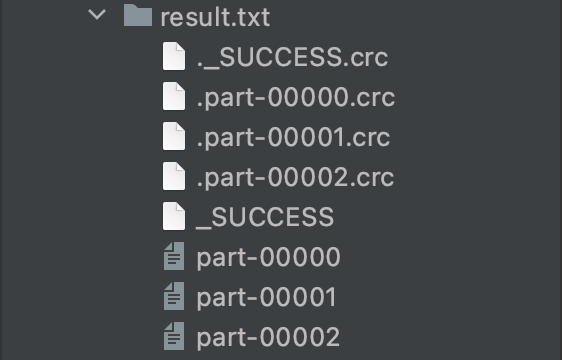

可以看出，保存了三个文件。相当于三个分区。

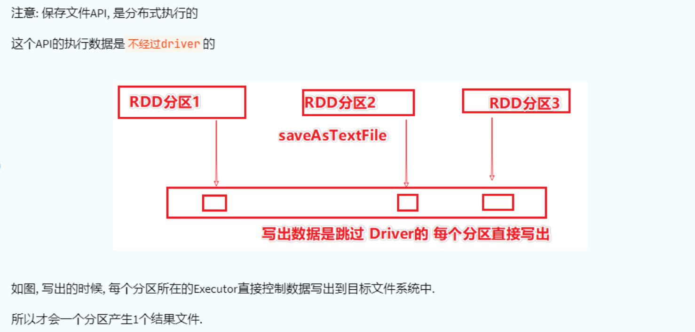

**注意:**

在action算子中，foreach和saveAsTextFile这两个算子是分区(Executor)直接执行的。跳过Driver，由分区所在的Executor直接执行。反之，其余的action算子都会将结果发送到Driver。

#### 分区操作算子

##### mapPartitions算子-Transformation

mapPartition一次传递的是一整个分区的数据，而map是一条一条数据进行传输的，非常慢。


mapPartition传过来是一个分区的数据，将其打包成list对象，我们可以遍历处理。优点就是减少IO

```python
import findspark
findspark.init('/usr/local/spark')
from pyspark import SparkConf, SparkContext

def process(item):
    result = []
    for i in item:
        result.append(i * 10)
    return result

if __name__ == '__main__':
    conf = SparkConf().setMaster("local[*]").setAppName('action-map')

    # 通过SparkConf对象构建SparkContext对象
    sc = SparkContext(conf=conf)
    rdd = sc.parallelize([1, 2, 3, 4, 5, 6, 7, 8, 9], 3)

    print(rdd.mapPartitions(process).collect())
    # [10, 20, 30, 40, 50, 60, 70, 80, 90]
```

##### foreachePartition算子-Action

功能: 和普通的foreach一致，一次处理的是一整个分区的数据。

```python
import findspark

findspark.init('/usr/local/spark')
from pyspark import SparkConf, SparkContext


def process(item):
    print('*'*20)
    result = []
    for i in item:
        result.append(i * 10)
    print(result)


if __name__ == '__main__':
    conf = SparkConf().setMaster("local[*]").setAppName('action-map')

    # 通过SparkConf对象构建SparkContext对象
    sc = SparkContext(conf=conf)
    rdd = sc.parallelize([1, 2, 3, 4, 5, 6, 7, 8, 9], 3)

    rdd.foreachPartition(process)
    # 输出：
    '''
    ********************
    [40, 50, 60]
    ********************
    [70, 80, 90]
    ********************
    [10, 20, 30]
    '''
```

##### partitionBy算子-Transformation

功能: 对RDD进行自定义分区操作。

用法:

```python
rdd.partitionBy(参数1,参数2)
# 参数1: 重新分区后有几个分区
# 参数2: 自定义分区规则，函数传入

# 分区编号从0开始，不要超出分区数-1
```

例子:

```python
import findspark
findspark.init('/usr/local/spark')
from pyspark import SparkConf, SparkContext


def partition_self(key):
    # 数据的key给你，自己决定返回的分区号即可
    if key == 'hadoop':
        return 0
    if key == 'spark' or key == 'flink':
        return 1
    return 2


if __name__ == '__main__':
    conf = SparkConf().setMaster("local[*]").setAppName('action-map')

    # 通过SparkConf对象构建SparkContext对象
    sc = SparkContext(conf=conf)

    rdd = sc.parallelize([('hadoop', 1), ('spark', 1), ('hello', 1),
                          ('flink', 1), ('hadoop', 1), ('spark', 1)])

    print(rdd.partitionBy(3, partition_self).glom().collect())
    # 输出
    # [[('hadoop', 1), ('hadoop', 1)], [('spark', 1), ('flink', 1), ('spark', 1)], [('hello', 1)]]

```

##### repartition算子-Transformation

功能: 对RDD的分区执行重新分区(仅数量)

> 注意: 对分区的数量进行操作，一定要慎重。一般情况下，我们写spark代码，除了要求全局排序设置为1个分区外，多数时候，所有的api中关于分区相关的代码，我们都不太会理会。
>
> 因为，如果你改了分区，会影响并行计算(内存迭代的并行管道数量)，另外，分区如果增加，极大可能导致shuflle

例子:

```python
import findspark
findspark.init('/usr/local/spark')
from pyspark import SparkConf, SparkContext


if __name__ == '__main__':
    conf = SparkConf().setMaster("local[*]").setAppName('action-map')

    # 通过SparkConf对象构建SparkContext对象
    sc = SparkContext(conf=conf)

    rdd = sc.parallelize([1, 2, 3, 4, 5, 6, 7, 8, 9], 3)

    print(rdd.glom().collect())

    # 重新分区
    rdd2 = rdd.repartition(4)
    print(rdd2.glom().collect())

    rdd3 = rdd2.repartition(1)
    print(rdd3.glom().collect())
    
    '''输出
    [[1, 2, 3], [4, 5, 6], [7, 8, 9]]
    [[7, 8, 9], [4, 5, 6], [], [1, 2, 3]]
    [[7, 8, 9, 4, 5, 6, 1, 2, 3]]
    '''
```

##### coalesce算子-Transformation

功能: 对分区进行数量增减

用法:

```python
rdd.coalesce(参数1，参数2)
# 参数1: 分区数
# 参数2: True or False. True表示允许shuffle,也就是可以加分区。False表示不允许shffle,也就是不能加分区，False是默认的
```

例子:

```python
import findspark
findspark.init('/usr/local/spark')
from pyspark import SparkConf, SparkContext


if __name__ == '__main__':
    conf = SparkConf().setMaster("local[*]").setAppName('action-map')

    # 通过SparkConf对象构建SparkContext对象
    sc = SparkContext(conf=conf)

    rdd = sc.parallelize([1, 2, 3, 4, 5, 6, 7, 8, 9], 3)
    print(rdd.glom().collect())
    # [[1, 2, 3], [4, 5, 6], [7, 8, 9]]

    print(rdd.coalesce(5, shuffle=True).glom().collect())
    # [[], [1, 2, 3], [7, 8, 9], [4, 5, 6], []]

    print(rdd.coalesce(5, shuffle=False).glom().collect())
    # [[1, 2, 3], [4, 5, 6], [7, 8, 9]]
```

对比repatition，一般实用coalesce较多，因为加分区要写参数2，这样避免写repartition的时候，手抖加分区。

##### maoValues算子-Transformation

功能: 针对二元元组rdd,对其内部的二元元组的value执行map操作

例子:

```python
import findspark
findspark.init('/usr/local/spark')
from pyspark import SparkConf, SparkContext


if __name__ == '__main__':
    conf = SparkConf().setMaster("local[*]").setAppName('action-map')

    # 通过SparkConf对象构建SparkContext对象
    sc = SparkContext(conf=conf)

    rdd = sc.parallelize([('a', 1), ('b', 2), ('a', 3), ('a', 2)])
    
    # 之前将value乘10
    print(rdd.map(lambda x: (x[0], x[1] * 10)).collect())
    # [('a', 10), ('b', 20), ('a', 30), ('a', 20)]

    # 用mapValues
    print(rdd.mapValues(lambda x: x * 10).collect())
    # [('a', 10), ('b', 20), ('a', 30), ('a', 20)]
```

#### 面试题

groupByKey和reduceByKey的区别?

在功能上的区别

- groupByKey仅仅有分组功能而已。
- reduceByKey除了有ByKey的分组功能外，还有reduce聚合功能，所以是一个分组+聚合一体化的算子。

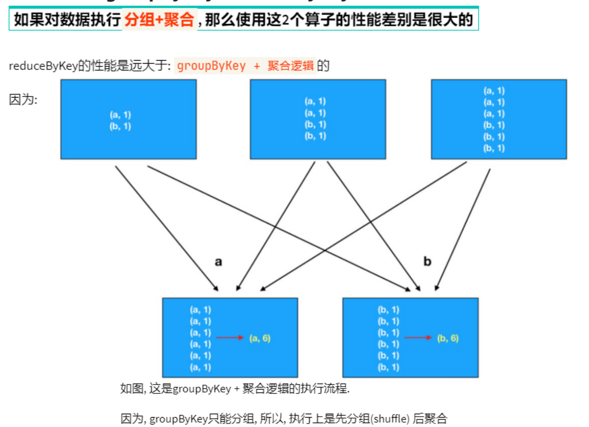

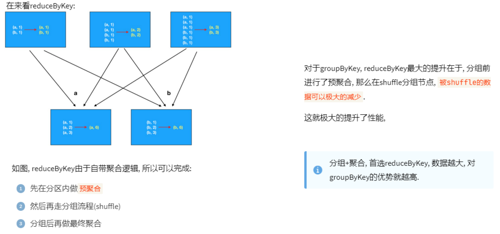

## RDD的持久化

### RDD的数据是过程数据

RDD之间进行相互迭代计算(Transformation的转换)，当执行开启后，新rdd的生成，代表老rdd的消失。

RDD的数据是过程数据，只在处理的过程中存在，一旦处理完成，就不见了。这个特性可以最大化的利用资源，老旧rdd没用了，就从内存中清理，给后续的计算腾出内存空间。

但是，会有一个这样的问题，某个rdd结果的复用。如下图:

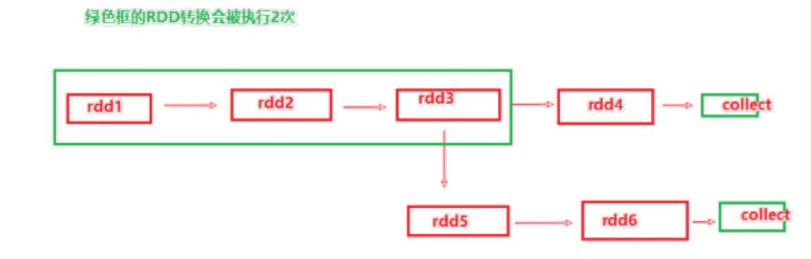

rdd3被两次使用，第一次使用之后，其实rdd3就不存在了，第二次用的时候，只能基于rdd的血缘关系，从rdd1开始，重新执行，构建出rdd3，供rdd5使用。那这样rdd3之前的链条就被多执行了，显然效率会慢，因此引入缓存机制。

### RDD缓存

对于上述的场景，肯定要执行优化，优化的目的: RDD3如果不消失，那么RDD1->RDD2->RDD3这个链条就不会执行2次，或者更多次。

RDD缓存技术: Spark提供了缓存API，可以让我们通过调用api，将指定的RDD数据保存在`内存或者硬盘上`

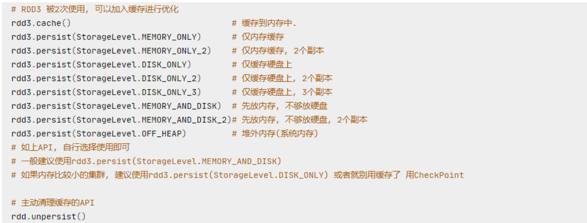

例子:

```python
import findspark
findspark.init('/usr/local/spark')
from pyspark import SparkConf, SparkContext


if __name__ == '__main__':
    conf = SparkConf().setMaster("local[*]").setAppName('action-map')

    # 通过SparkConf对象构建SparkContext对象
    sc = SparkContext(conf=conf)

    rdd1 = sc.textFile('./words.txt')
    rdd2 = rdd1.flatMap(lambda x: x.split(' '))
    rdd3 = rdd2.map(lambda x: (x, 1))

    # 加缓存
    rdd3.cache()

    rdd4 = rdd3.reduceByKey(lambda a, b: a+b)
    print(rdd4.collect())
    # [('hadoop', 3), ('hive', 2), ('flink', 2), ('spark', 2), ('mapreduce', 1)]

    rdd5 = rdd3.groupByKey()
    rdd6 = rdd5.mapValues(lambda x: sum(x))
    print(rdd6.collect())
    # [('hadoop', 3), ('hive', 2), ('flink', 2), ('spark', 2), ('mapreduce', 1)]

    # 可以看出 上面的rdd3复用了 走了两路
    rdd3.unpersist()    # 取消缓存
```

缓存技术可以过程RDD数据持久化保存到内存或硬盘上，但是，这个保存在设定上是认为不安全的。`缓存的数据在设计上是认为有丢失的风险，因此，缓存有一个特点: 其也保留了RDD之间的血缘(依赖)关系`，如果丢失，可以通过依赖关系重新计算出来。

另外RDD的缓存是将数据缓存到当前对应的机器上，即分开存的。

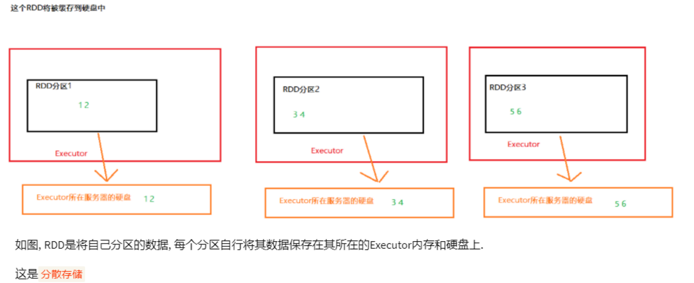


### RDD的CheckPoint

CheckPoint技术，也是将RDD的数据保存起来，但是它`仅支持硬盘存储`，并且它被设计认为是安全的，不保留血缘关系。

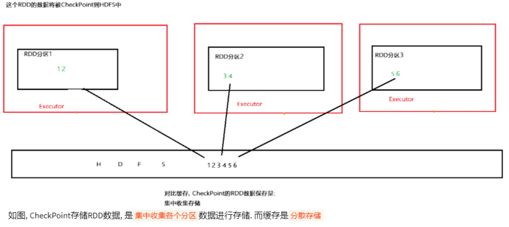

例子:

```python
import findspark
findspark.init('/usr/local/spark')
from pyspark import SparkConf, SparkContext


if __name__ == '__main__':
    conf = SparkConf().setMaster("local[*]").setAppName('action-map')

    # 通过SparkConf对象构建SparkContext对象
    sc = SparkContext(conf=conf)

    # 必须告知spark,开启checkpoint功能
    sc.setCheckpointDir('hdfs://node1:8080?output/ckp')

    rdd1 = sc.textFile('./words.txt')
    rdd2 = rdd1.flatMap(lambda x: x.split(' '))
    rdd3 = rdd2.map(lambda x: (x, 1))

    # 调用checkpoint API保存数据即可
    rdd3.checkpoint()

    rdd4 = rdd3.reduceByKey(lambda a, b: a+b)
    print(rdd4.collect())
    # [('hadoop', 3), ('hive', 2), ('flink', 2), ('spark', 2), ('mapreduce', 1)]

    rdd5 = rdd3.groupByKey()
    rdd6 = rdd5.mapValues(lambda x: sum(x))
    print(rdd6.collect())
    # [('hadoop', 3), ('hive', 2), ('flink', 2), ('spark', 2), ('mapreduce', 1)]

    # 可以看出 上面的rdd3复用了 走了两路
```

### 缓存和CheckPoint对比

- CheckPoint不管分区数量多少，风险是一样的，缓存分区越多，风险越高。
- CheckPoint支持写入HDFS，缓存不行，HDFS是高可靠存储，CheckPoint被认为是安全的。
- CheckPoint不支持内存，缓存可以，缓存如果写内存，性能比CheckPoint要好一些。
- CheckPoint因为设计认为是安全的，所以不保留血缘关系，而缓存因为涉及上认为不安全，所以保留血缘关系。

**注意:**

CheckPoint是一种重量级的使用，也就是RDD的重新计算成本很高的时候，我们采用CheckPoint比较合适，或者数据量很大，用CheckPoint合适。如果数据量小，或者RDD重新计算是非常快的，用CheckPoint没啥必要，直接缓存即可。

>Cache和CheckPoint两个API都不是Action类型，所以，想要它两工作，必须在后面接上Action，接上Action的目的，是让RDD有数据，而不是为了让CheckPoint和Cache工作。

## 案例学习

使用搜狗实验室提供【用户查询日志(SogouQ】数据，使用Spark框架，将数据封装到RDD中进行业务数据处理分析，数据网址:http://www.sogou.com/labs/resource/q.php

数据格式:

```
00:00:00    2982199073774412    传智播客    8   3   http://www.itcast.cn
00:00:00    07594220010824798   黑马程序员   1   1   http://www.itcast.cn
00:00:00    5228056822071097    传智播客    14  5   http://www.itcast.cn
00:00:00    6140463203615646    博学谷 62  36  http://www.itcast.cn
00:00:00    8561366108033201    IDEA    3   2   http://www.itcast.cn
00:00:00    23908140386148713   传智专修学院  1   2   http://www.itcast.cn
23:00:00    1797943298449139    flume   8   5   http://www.itcast.cn
23:00:00    00717725924582846   itcast  1   2   http://www.itcast.cn
23:00:00    41416219018952116   bigdata 2   6   http://www.itcast.cn
23:00:00    9975666857142764    IDEA    2   2   http://www.itcast.cn
23:00:00    21603374619077448   酷丁鱼 1   6   http://www.itcast.cn
...
```


需求:

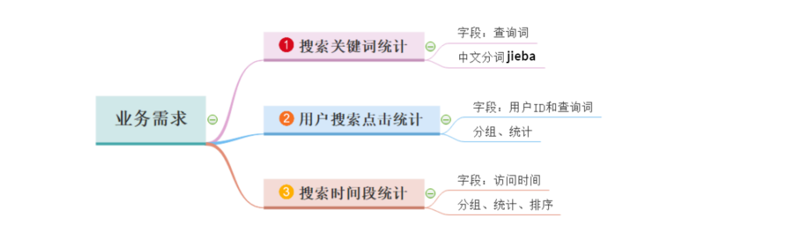

实现代码:

```python
import jieba
import findspark
findspark.init('/usr/local/spark')
from operator import add
from pyspark import SparkConf, SparkContext
from pyspark.storagelevel import StorageLevel


def context_jieba(data):
    seg = jieba.cut_for_search(data)
    res = []
    for word in seg:
        res.append(word)
    return res


def filter_words(data):
    return data not in ['谷', '帮', '客']


def append_words(data):
    if data == '传智播':
        data = '传智播客'
    if data == '院校':
        data = "院校帮"
    if data == '博学':
        data = '博学谷'
    return (data, 1)  # 直接返回这种格式，可以少一次map计算


def extract_user_and_word(data):
    user_id = data[0]
    content = data[1]
    # 对content分词
    words = context_jieba(content)

    return_list = []
    for word in words:
        if filter_words(word):
            return_list.append((user_id + '_' + append_words(word)[0], 1))
    return return_list


if __name__ == '__main__':
    conf = SparkConf().setMaster("local[*]").setAppName('SogouQ-analyse')

    # 通过SparkConf对象构建SparkContext对象
    sc = SparkContext(conf=conf)

    # 读取数据文件
    file_rdd = sc.textFile('./SogouQ.txt')

    # 将数据按\t进行分割 每一条数据形成一个元组
    split_rdd = file_rdd.map(lambda x: x.split('\t'))

    # split_rdd被多次使用，优化一下，比如缓存
    split_rdd.persist(StorageLevel.DISK_ONLY)

    # TODO: 需求1 用户搜索的关键词分析
    # 将所有的搜索内容取出
    context_rdd = split_rdd.map(lambda x: x[2])  # 取出内容
    # 对搜索内容进行分词处理
    words_rdd = context_rdd.flatMap(context_jieba)
    # 对
    # '院校' '帮'
    # '传智播' '客'
    # '博学' '谷'
    # 进行处理，即: 将帮、客、谷过滤 让后将院校、传智播、博学替换成 院校帮、传智播客、博学谷
    filtered_rdd = words_rdd.filter(filter_words)
    final_words_rdd = filtered_rdd.map(append_words)
    # 进行单词的计数，返回top5
    result1 = final_words_rdd.reduceByKey(lambda a, b: a+b).sortBy(
        lambda x: x[1], ascending=False, numPartitions=1).take(5)
    print('需求1结果:', result1)
    # 需求1结果: [('scala', 2310), ('hadoop', 2268), ('博学谷', 2002), ('传智汇', 1918), ('itheima', 1680)]

    # TODO: 需求2 用户和关键词组合分析
    # 提取出哟空户ID和搜索内容(用户ID, 搜索内容)
    user_content_rdd = split_rdd.map(lambda x: (x[1], x[2]))
    user_word_rdd = user_content_rdd.flatMap(extract_user_and_word)

    # 给用户_搜索词 赋予1 用于计数
    user_word_with_one_rdd = user_word_rdd.map(lambda x: (x, 1))

    # 分组聚合排序
    result2 = user_word_with_one_rdd.reduceByKey(lambda a, b: a+b).sortBy(
        lambda x: x[1], ascending=False, numPartitions=1).take(5)
    print('需求2的结果:', result2)
    # 需求2的结果: [(('6185822016522959_scala', 1), 2016), (('41641664258866384_博学谷', 1), 1372), ...]

    # TODO: 需求3 热门搜索时间段分析
    # 取出数据中的时间
    time_rdd = split_rdd.map(lambda x: x[0])
    # 对时间进行处理，只保留小时精度即可
    hour_with_one_rdd = time_rdd.map(lambda x: (x.split(':')[0], 1))

    # 计数
    result3 = hour_with_one_rdd.reduceByKey(add).sortBy(
        lambda x: x[1], ascending=False, numPartitions=1).collect()
    print('需求3的结果:', result3)
    # 需求3的结果: [('20', 3479), ('23', 3087), ('21', 2989), ('22', 2499), ('01', 1365), ...]

```

### 提交到集群执行

`/export/server/spark/bin/spark-submit --master yarn --py-files /root/main.py`

> 注意点:
>
> 1. master部分删除。
> 2. 读取的路径文件改为hdfs才可以。

另外，可以指定executor个数，以及每个executor占多少内存。

```shell
bin/spark-submit --master yarn --py-files /root/main.py  \
--executor-memory 2g \
--executor-cores 1 \
--num-executor 6 
```

每个executor吃2g内存，吃1个cpu核心，总共6个executor。

## 共享变量

### 广播变量

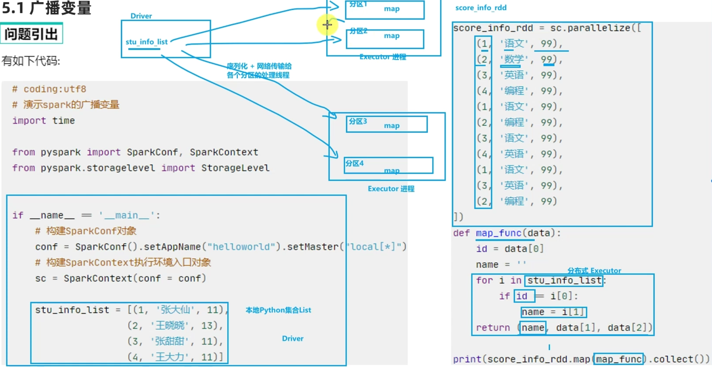

上述的代码中需要将rdd中的数据的编号转为对应的名字，即1是张大仙，2是王晓晓...，这样就会引发一个问题，即: stu_info_list数据存在在driver中，后面执行的rdd的时候，是在每个executor中，所以，需要将stu_info_list通信传输到每台机器上，但是每台机器有可能有多个executor(即进程)，这样一台机器其实只需要传一份数据即可，但是目前存在的问题是: 每一个executor都会传一份数据，这样显然会浪费带宽，而且会很占内存，并影响速度。

解决方案: 

如果将本地list对象标记为广播变量对象，那么当上述场景出现的时候，spark只会:给每个executor来一份数据，而不是像原来那样，每个分区的处理线程都会来一份，节省内存。

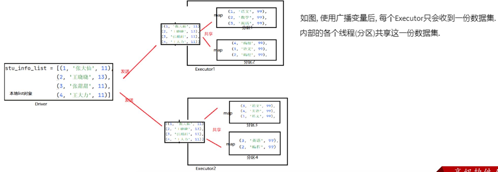

例子:

```python
import findspark
findspark.init('/usr/local/spark')
from pyspark import SparkConf, SparkContext


def map_func(data):
    id = data[0]
    name = ''
    # 注意 使用的时候 要取value
    value = broadcast.value
    for i in value:
        if id == i[0]:
            name = i[1]
    return (name, data[1], data[2])


if __name__ == '__main__':
    conf = SparkConf().setMaster("local[*]").setAppName('action-map')

    # 通过SparkConf对象构建SparkContext对象
    sc = SparkContext(conf=conf)

    stu_info_list = [(1, '张大仙', 11), (2, '王晓晓', 13), (3, '张甜甜', 11), (4, '王大力', 11)]

    # 注意，这里将本地list标记为广播变量即可
    broadcast = sc.broadcast(stu_info_list)

    score_info_rdd = sc.parallelize([
        (1, '语文', 99), (2, '数学', 99), (3, '英语', 99), (4, '编程', 99),
    ])
    print(score_info_rdd.map(map_func).collect())
    # [('张大仙', '语文', 99), ('王晓晓', '数学', 99), ('张甜甜', '英语', 99), ('王大力', '编程', 99)]
```

总结:

场景: 本地集合对象 和 分布式集合对象(RDD进行关联的时候，需要将本地集合对象 封装成广播变量。

可以节省:

- 网络IO的次数
- Executor的内存占用

### 累加器

想要对map算子计算中的数据，进行计数累加，得到全部数据计算完后的累加结果。

首先，写一个没有累加器的代码演示:

```python
import findspark
findspark.init('/usr/local/spark')
from pyspark import SparkConf, SparkContext


def map_func(data):
    global count
    count += 1
    print(count)


if __name__ == '__main__':
    conf = SparkConf().setMaster("local[*]").setAppName('action-map')

    # 通过SparkConf对象构建SparkContext对象
    sc = SparkContext(conf=conf)

    rdd = sc.parallelize([1, 2, 3, 4, 5, 6, 7, 8, 9, 10], 2)   # 两分区

    count = 0
    rdd.map(map_func).collect()
    print(count)
    '''
    输出:
    1
    2
    3
    4
    5
    1
    2
    3
    4
    5
    0
    '''
    # 上面可以看出打印了两组1，2，3，4，5是因为有两个分区，driver将count=0发到两个分区，它们都是从
    # 零开始累加的，因此，都类加到5，为啥最后打印的是0呢？因为你最后打印的是driver上的count,显然
    # driver上的count没有进行累加，所以是零。
```

对于上述代码的问题，可以参考下图的解释:

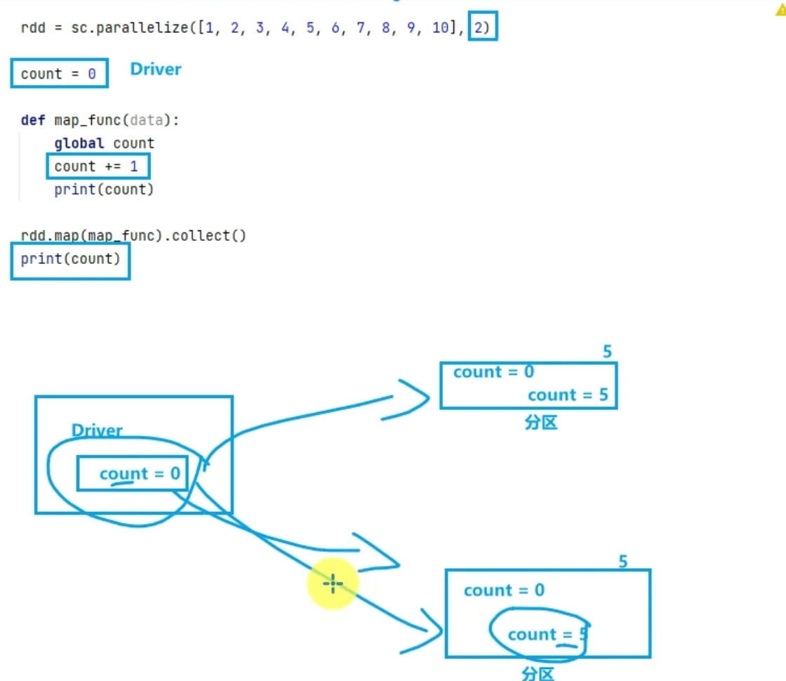

那怎样解决累加的问题呢？将变量设置为累加器变量即可。

例子:

```python
import findspark
findspark.init('/usr/local/spark')
from pyspark import SparkConf, SparkContext


def map_func(data):
    global acmlt
    acmlt += 1
    print(acmlt)


if __name__ == '__main__':
    conf = SparkConf().setMaster("local[*]").setAppName('action-map')

    # 通过SparkConf对象构建SparkContext对象
    sc = SparkContext(conf=conf)

    rdd = sc.parallelize([1, 2, 3, 4, 5, 6, 7, 8, 9, 10], 2)   # 两分区

    # 累加器变量
    acmlt = sc.accumulator(0)
    rdd.map(map_func).collect()
    print(acmlt)
    '''
    1
    1
    2
    3
    4
    5
    2
    3
    4
    5
    10
    '''
    # 可以看出，虽然每个分区还是自己加自己的，但是我们最后的累加变量是10。
```

### 综合案例

数据:

```
   hadoop spark # hadoop spark spark
mapreduce ! spark spark hive !
hive spark hadoop mapreduce spark %
   spark hive sql sql spark hive , hive spark !
!  hdfs hdfs mapreduce mapreduce spark hive

  #


```

对上面的数据执行:

1. 正常的单词进行单词计数
2. 特殊字符统计出现有多少个

代码实现:

```python
import re
from operator import add
import findspark
findspark.init('/usr/local/spark')
from pyspark import SparkConf, SparkContext


def filter_func(data):
    # 过滤单词 保留正常的单词
    global acmlt
    abnormal_char = broadcast.value
    if data in abnormal_char:
        acmlt += 1
        return False
    else:
        return True


if __name__ == '__main__':
    conf = SparkConf().setMaster("local[*]").setAppName('action-map')

    # 通过SparkConf对象构建SparkContext对象
    sc = SparkContext(conf=conf)

    # 1. 读取文件
    file_rdd = sc.textFile('./accumulator_broadcast_data.txt')

    # 特殊字符的list集合，注册成广播变量，节省内存和网络的IO开销
    abnormal_char = [",", ".", "!", "#", "$", "%"]
    broadcast = sc.broadcast(abnormal_char)

    # 注册一个累加器，用于对特殊字符出现的次数累加
    acmlt = sc.accumulator(0)

    # 2. 过滤空行
    # 字符串的.strip()方法，可以去除 前后的空格，然后返回字符串本身，如果是空行数据，返回None
    # 不是空行，处理后  就有字符串返回，在判断中属于True, 如果是空行，返回则是None,在判断中属于False
    lines_rdd = file_rdd.filter(lambda x: x.strip())

    # 3. 将前后空格去除
    data_rdd = lines_rdd.map(lambda x: x.strip())

    # 4. 在字符串中使用空格切分
    # 由于数据中 有的单词之间是多个空格进行分割的，所以使用正则切分
    # \s+ 在正则中表示 任意数量的空格
    words_rdd = data_rdd.flatMap(lambda x: re.split("\s+", x))

    # 5. 过滤出正常的单词  顺便统计了特殊字符出现的次数
    normal_words_rdd = words_rdd.filter(filter_func)

    # 6. 正常单词计数统计
    result_rdd = normal_words_rdd.map(lambda x: (x, 1)).reduceByKey(add)
    print('正常单词计数结果:', result_rdd.collect())
    # 正常单词计数结果: [('hadoop', 3), ('hive', 6), ('hdfs', 2), ('spark', 11), ('mapreduce', 4), ('sql', 2)]
    print('特殊字符数量:', acmlt)
    # 特殊字符数量: 8
```

## Spark内核调度

### DAG概念

Spark的核心是根据RDD来实现的，Spark Scheduler则为Spark核心实现的重要一环，其作用就是任务调度。Spark的任务调度就是如何组织任务去处理RDD中每个分区的数据，根据RDD的依赖关系构建DAG，基于DAG划分Stage，将每个Stage中的任务发到指定节点运行。基于Spark的任务调度原理，可以合理规划资源利用，做到尽可能用最少的资源高效地完成任务计算。

以词频统计WordCount程序为例，DAG图：

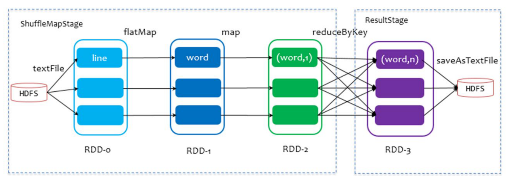

DAG： 有向无环图。有方向L RDD1->RDD2->RDD3->...->collect结束。

**Job和Action的区别**

答:1个action会产生1个DAG，如果在代码中有3个action就产生3个DAG。一个action产生一个DAG,会在程序运行中产生一个Job，所以: `1个ACTION = 1个DAG =1个JOB`。如果一个代码中，写了3个action,那么这个代码运行起来产生3个JOB,每个JOB有自己的DAG,一个代码运行起来，在Spark中称之为: Application。层级关系: 1个application中可以有多个Job,每个Job内含一个DAG，同时每一个JOB都是有一个Action产生的。

### DAG的宽窄依赖和阶段划分

在SparkRDD前后之间的额关键，分为: 宽依赖、窄依赖。

- 窄依赖: 父RDD的一个分区，全部将数据发送为子RDD的一个分区。
- 宽依赖: 父RDD的一个分区，将数据发给子RDD的多个分区。宽依赖还有一个别名: shuffle。

如下图,都为窄依赖:

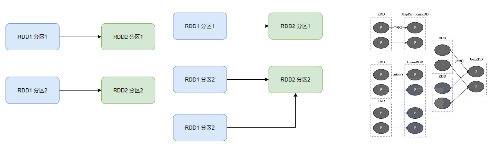

如下图，都为宽依赖:

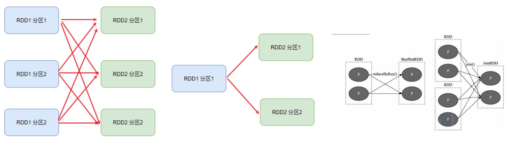

**阶段划分**

对于spark来说，会根据DAG，按照宽依赖，划分不同的DAG阶段。

划分依据: 从后往前，遇到宽依赖就划分出一个阶段，称之为stage。

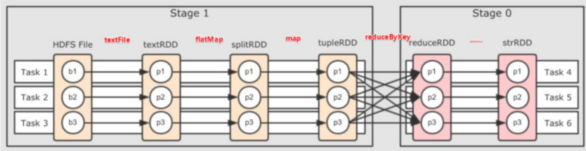

如上图，可以看出，在DAG中，基于宽依赖，将DAG划分为2个stage。在stage的内部，显然一定都是窄依赖。

### 内存迭代计算

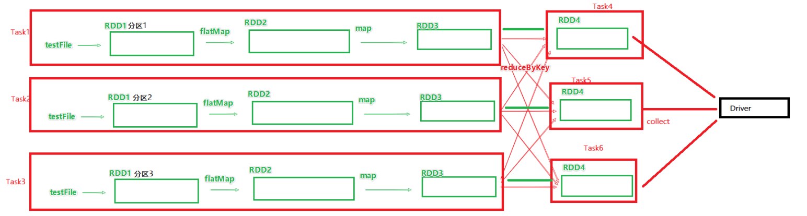

如上图，基于带有分区的DAG以及阶段划分，可以从图中得到 逻辑上最优的task分配，一个task由一个线程来执行。那么，如上图，task1中rdd1、rdd2、rdd3的迭代计算，都是由一个task(线程完成)，这一阶段的这一条线，是纯内存计算。如上图，task1、task2、task3就形成了三个并行的`内存计算管道`。

spark默认受到全局并行度的限制，除了个别算子有特殊分区情况，大部分的算子，都会遵循全局并行度的要求，来规划自己的分区数，如果全局并行度是3，其实大部分算子分区都是3.

> 注意: Spark中我们一般推荐值设置全局并行度，不要在算子上设置并行度，除了一个排序算子外，计算算子就让它默认开分区就可以了。

### 面试题

1. Spark是怎么做内存计算的？DAG的作用？Stage阶段划分的作用?
   - Spark会产生DAG
   - DAG图会基于分区和宽窄依赖关系划分阶段。
   - 一个阶段的内部都是窄依赖，窄依赖内部，如果形成前后1:1的分区对应关系，就可以产生许多内存迭代计算管道。
   - 这些内存迭代计算管道，就是一个个具体的执行task
   - 一个task是一个具体的线程，任务跑在一个线程内，就是走内存计算。
2. Spark为什么比MapReduce块？
   - Spark的算子丰富，MapReduce算子匮乏(Map和Reduce算子)，MapReduce这个编程模型，很难在一套MR中处理复杂的任务，很多复杂任务，是需要些多个MapReduce进行串联的，多个MR串联通过磁盘交互数据。
   - Spark可以执行内存迭代，算子之间形成DAG，基于依赖划分阶段后，在阶段内形成内存迭代管道。但是MapReduce的Map和Reduce之间的交互依旧是通过硬盘来交互的。

### Spark并行度

Spark的并行: 在同一时间内，有多少个task在同时运行。

比如设置并行度6，其实就是要6个task并行在跑，在有6个task并行的前提下，rdd的分区就被规划成6个分区。

**如何设置并行度**

1. 配置文件中:

   ```shell
   conf/spark-defaults.conf中设置
   spark.default.parallelism 100
   ```

2. 在客户端提交参数中:

   ```shell
   bin/spark-submit --conf "spark.default.parallelism=100"
   ```

3. 在代码中设置:

   ```python
   conf = SparkConf()
   conf.set("spark.default.parallelism", "100")
   ```

针对RDD的并行度设置-不推荐

一般这种设置，只能在代码中写，算子: repartition算子、coalesce算子、partitionBy算子。

**集群中如何规划并行度**

结论: 设置为CPU总核心的2~10倍。

比如集群可以CPU核心是100个，我们建议并行度是200~1000

**为什么要设置最少两倍**

CPU的一个核心同一时间只能干一件事情，所以，在100个核心的情况下，设置100个并行，就能让CPU 100%出力，这种设置下，如果task的压力不均衡，某个task先执行完了，就导致某个CPU核心空闲，所以，我们将task(并行)分配的数量变多，比如800个并行，同一时间只有100个运行，700个在等待，就可以确保，某个task运行完了，后续有task能补上，不让cpu空闲，最大程度利用资源。

### Spark的任务调度

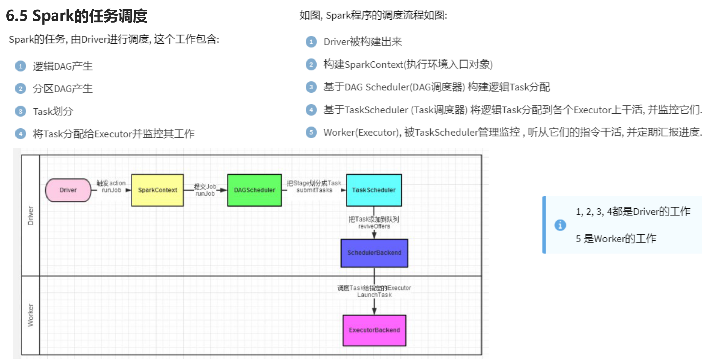

Driver内的两个组件:

- DAG调度器，工作内容: 将逻辑DAG图进行处理，最终得到逻辑上的TASK划分。
- TASK调度器，工作内容: 基于DAG Scheduler的产出，来规划这些逻辑的task，应该在哪些executor上运行，以及监控管理它们的运行。

### 层级关系梳理

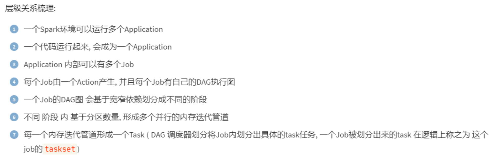

# 第三章: SparkSQL

## 概念

SparkSQL是Spark的一个模块，用于处理海量结构化数据。限定: 结构化数据处理。

SparkSQL的特点:

- 融合性: SQL可以无缝集成在代码中，随时可用SQL处理的结果。
- 统一数据访问: 一套标准API可读写不同数据源。
- Hive兼容: 可以使用SparkSQL直接计算并产生Hive数据表。
- 标准化连接: 支持标准化JDBC\ODBC连接，方便和各种数据库进行数据交互。

给个例子感受一下SparkSQL:

```python
results = spark.sql("SELECT * FROM people")
names =results.map(lambda p: p.name)
```

### SparkSQL和Hive的异同

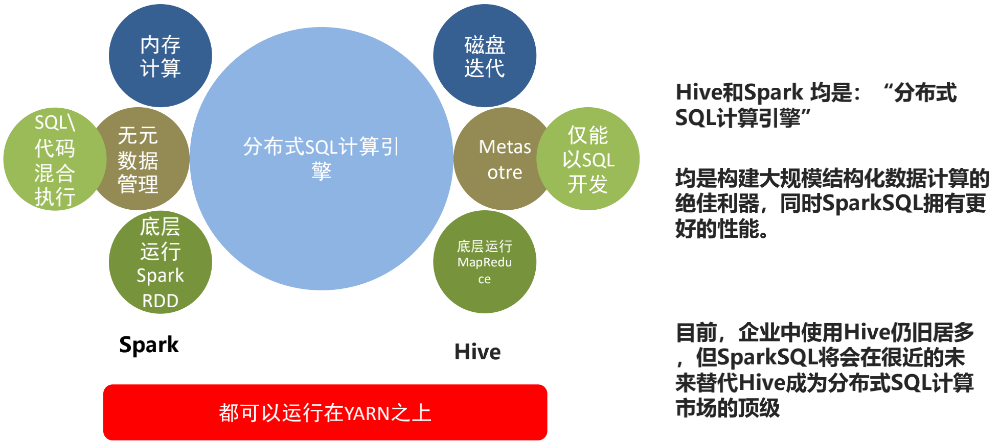

### SparkSQL的数据抽象

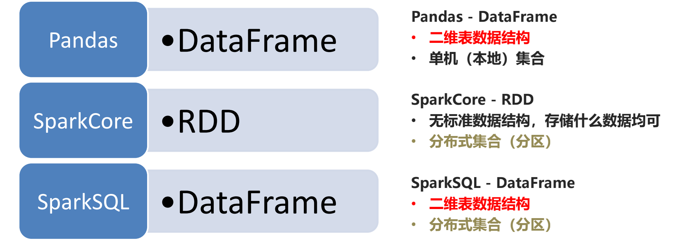

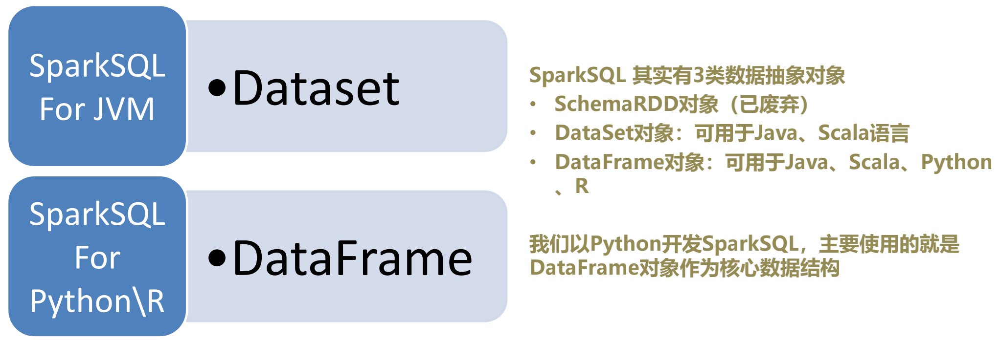

**DataFrame概述**

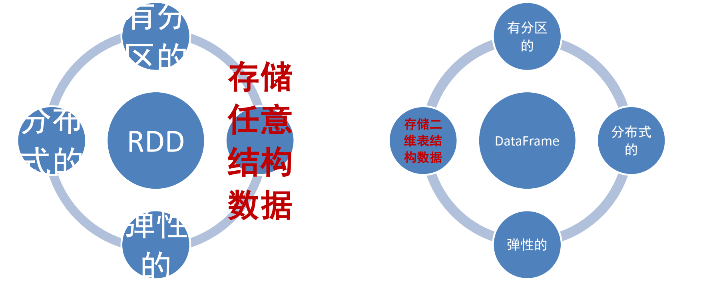

DataFrame和RDD都是: 弹性的、分布式的、数据集，只是DataFrame存储的数据结构"限定"为: 二维表结构化数据。而RDD可以存储的数据没有任何限制，想处理什么格式就处理什么格式。

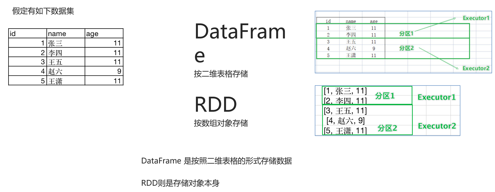

### SparkSession对象

在RDD阶段，程序的执行入口对象是： SparkContext。在Spark 2.0后，推出了SparkSession对象，作为Spark编码的统一入口对象。

SparkSession对象可以： 

- 用于SparkSQL编程作为入口对象
- 用于SparkCore编程，可以通过SparkSession对象中获取到SparkContext

所以，后续的代码，执行环境入口对象统一变更为SparkSession对象。

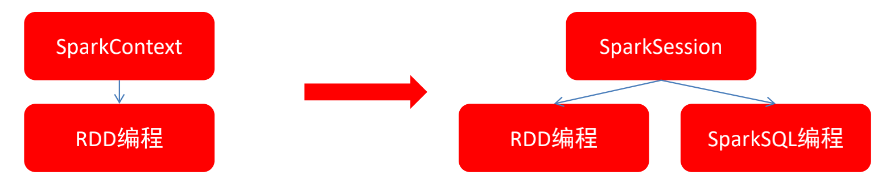

SparkSession对象的创建

```python
import findspark
findspark.init('/usr/local/spark')
from pyspark.sql import SparkSession


if __name__ == '__main__':
    # 构建SparkSession对象，这个对象是 构建起模式，通过builder方法来构建
    spark = SparkSession.builder.appName('name').master('local[*]').config(
        'spark.sql.shuffle.partitions', '4').getOrCreate()
    # appName设置程序名称，config设置一些常用属性
    # 最后通过getOrCreate()方法 创建SparkSession对象。
```

### 实例

接下来做个演示

有如下数据集: 列1 ID, 列2 学科，列3 分数

```
1,语文,99
2,语文,99
3,语文,99
4,语文,99
5,语文,99
6,语文,99
7,语文,99
8,语文,99
9,语文,99
10,语文,99
...
```

读取文件，找出语文的数据，并限制输出5条。

```python
import findspark
findspark.init('/usr/local/spark')
from pyspark.sql import SparkSession


if __name__ == '__main__':
    # 构建SparkSession对象，这个对象是 构建起模式，通过builder方法来构建
    spark = SparkSession.builder.appName('test').master('local[*]').getOrCreate()

    # 下面可以获取sparkContext，也就可以进行rdd的操作。但是本实例不用这个
    sc = spark.sparkContext

    # 1. 读取数据
    df = spark.read.csv('./stu_score.txt', sep=',', header=False)
    df2 = df.toDF('id', 'name', 'score')  # 设置表头
    df2.printSchema()   # 打印表的属性
    '''
    root
     |-- id: string (nullable = true)
     |-- name: string (nullable = true)
     |-- score: string (nullable = true)
    '''
    df2.show()
    '''
    +---+----+-----+
    | id|name|score|
    +---+----+-----+
    |  1|语文|   99|
    |  2|语文|   99|
    ...
    '''

    # 给表起个名字
    df2.createTempView('score')

    # SQL分格走起
    spark.sql("""SELECT * FROM score WHERE name='语文' LIMIT 5""").show()
    '''
    +---+----+-----+
    | id|name|score|
    +---+----+-----+
    |  1|语文|   99|
    |  2|语文|   99|
    |  3|语文|   99|
    |  4|语文|   99|
    |  5|语文|   99|
    +---+----+-----+
    '''

    # DSL风格
    df2.where("name='语文'").limit(5).show()
    # 和上面输出一样
```

## DataFrame入门和操作

### DataFrame的组成

在结构层面:

- StructType对象描述整个DataFrame的表结构
- StructField对象描述一个列的信息

在数据层面:

- Row对象记录一行数据
- Column对象记录一列数据并包含列的信息。

下面通过一个示例加深理解一下上述的概念:

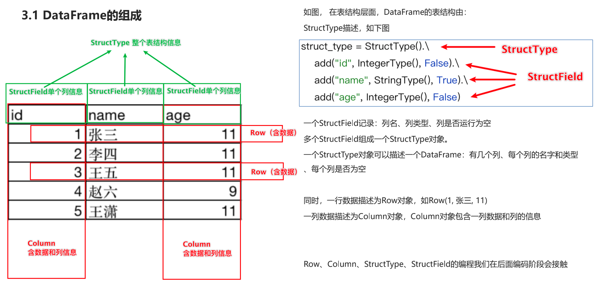

### DataFrame的构建

#### DataFrame的构建-基于RDD方式1

DataFrame对象可以从RDD转换而来，都是分布式数据集其实就是转换一下内部存储的结构，转换为二维表结构

数据:

```
Michael, 29
Andy, 30
Justin, 19
```

将其加载并构建成表。

```python
import findspark
findspark.init('/usr/local/spark')
from pyspark.sql import SparkSession


if __name__ == '__main__':
    # 构建SparkSession对象，这个对象是 构建起模式，通过builder方法来构建
    spark = SparkSession.builder.appName('test').master('local[*]').getOrCreate()

    sc = spark.sparkContext

    # 基于RDD转换成DataFrame
    rdd = sc.textFile('./people.txt').map(lambda x: x.split(',')).map(lambda x: (x[0], int(x[1])))
    # 上一句最后  是为了将年龄转为整型。

    # 构建DataFrame
    # 参数1: 被转换的rdd
    # 参数2: 指定列表，通过list的形式指定，按照顺序一次提供字符串名称即可
    df = spark.createDataFrame(rdd, schema=['name', 'age'])
    
    # 打印DataFrame的表结构
    df.printSchema()
    '''
    输出:
    root
    |-- name: string (nullable = true)
    |-- age: long (nullable = true)
    '''

    # 打印df中的数据
    # 参数1: 表示展示多少条数据，默认不传的话 显示20条
    # 参数2: 表示是否对列进行截断，如果列的数据长度超过20个字符串长度，后续的内容不显示，用...代替
    # 如果给False 表示不截断 全部显示，默认是False
    df.show(20, False)
    '''
    输出:
    +-------+---+
    |name   |age|
    +-------+---+
    |Michael|29 |
    |Andy   |30 |
    |Justin |19 |
    +-------+---+
    '''
```

#### DataFrame的构建-基于RDD方式2

将RDD转换为DataFrame的方式2: 通过StructType对象来定义DataFrame的表结构转换RDD

```python
import findspark
findspark.init('/usr/local/spark')
from pyspark.sql import SparkSession
from pyspark.sql.types import StructType, StringType, IntegerType

if __name__ == '__main__':
    # 构建SparkSession对象，这个对象是 构建起模式，通过builder方法来构建
    spark = SparkSession.builder.appName('test').master('local[*]').getOrCreate()

    sc = spark.sparkContext

    # 基于RDD转换成DataFrame
    rdd = sc.textFile('./stu_score.txt').map(lambda x: x.split(',')).map(lambda x: (int(x[0]), x[1], int(x[2])))
    # 上一句最后  是为了将年龄转为整型。

    # StructType类
    # 这个类可以定义整个DataFrame中的Schema
    schema = StructType().add('id', IntegerType(), nullable=False).add(
        'name', StringType(), nullable=True).add('score', IntegerType(), nullable=False)

    # 一个add方法 定义一个列信息 如果有三个列 就写三个add
    # add方法: 参数1: 列名， 参数2: 列类型，参数3: 是否允许为空。

    df = spark.createDataFrame(rdd, schema)

    # 打印DataFrame的表结构
    df.printSchema()
    df.show()
```

#### DataFrame的构建-基于RDD方式3

将RDD转换为DataFrame方式3：使用RDD的toDF方法转换RDD

```python
import findspark
findspark.init('/usr/local/spark')
from pyspark.sql import SparkSession
from pyspark.sql.types import StructType, StringType, IntegerType

if __name__ == '__main__':
    # 构建SparkSession对象，这个对象是 构建起模式，通过builder方法来构建
    spark = SparkSession.builder.appName('test').master('local[*]').getOrCreate()

    sc = spark.sparkContext

    # 基于RDD转换成DataFrame
    rdd = sc.textFile('./stu_score.txt').map(lambda x: x.split(',')).map(lambda x: (int(x[0]), x[1], int(x[2])))
    # 上一句最后  是为了将年龄转为整型。

    # StructType类
    # 这个类可以定义整个DataFrame中的Schema
    schema = StructType().add('id', IntegerType(), nullable=False).add(
        'name', StringType(), nullable=True).add('score', IntegerType(), nullable=False)

    # 一个add方法 定义一个列信息 如果有三个列 就写三个add
    # add方法: 参数1: 列名， 参数2: 列类型，参数3: 是否允许为空。

    # 方式1: 只传列名 类型靠推断，是否允许为空是true
    df = rdd.toDF(['id', 'name', 'score'])
    df.printSchema()
    df.show(5)

    # 方式2: 传入完整的schema描述对象StructType
    df = rdd.toDF(schema)
    df.printSchema()
    df.show(5)
```

#### DataFrame的构建-基于Pandas的DataFrame

将Pandas的DataFrame对象，转变为分布式的SparkSQL DataFrame对象

```python
import findspark
findspark.init('/usr/local/spark')
import pandas as pd
from pyspark.sql import SparkSession


if __name__ == '__main__':
    # 构建SparkSession对象，这个对象是 构建起模式，通过builder方法来构建
    spark = SparkSession.builder.appName('test').master('local[*]').getOrCreate()

    sc = spark.sparkContext

    # 构建pandas的DataFrame
    pdf = pd.DataFrame({
        'id': [1, 2, 3],
        'name': ['张大仙', '王晓晓', '王大锤'],
        'age': [11, 11, 11]
    })

    # 将Pandas的DataFrame对象转换为Spark的DataFrame
    df = spark.createDataFrame(pdf)
    df.printSchema()
    df.show()
```

#### DataFrame的代码构建-读取外部数据

通过SparkSQL的统一API进行数据读取构建DataFrame.

通过API示例代码:

```python
sparksession.read.format('text|csv|json|parquet|orc|avro|jdbc|...')
        .option("K", "V")   # option可选
    .schema(StructType | String)  
    .load("被读取文件的路径，支持本地文件系统和HDFS")
```

##### 读取text文件

```
Michael, 29
Andy, 30
Justin, 19
```

代码:

```python
import findspark
findspark.init('/usr/local/spark')
from pyspark.sql import SparkSession
from pyspark.sql.types import StructType, StringType


if __name__ == '__main__':
    # 构建SparkSession对象，这个对象是 构建起模式，通过builder方法来构建
    spark = SparkSession.builder.appName('test').master('local[*]').getOrCreate()

    # 构建StructType, text数据源，读取数据的特点是，将一整行作为一个列读取，默认列名为value 类型为string
    schema = StructType().add('data', StringType(), nullable=True)
    df = spark.read.format('text').schema(schema=schema).load('./data/people.txt')
    df.printSchema()
    df.show()
    '''
    输出:
    root
     |-- data: string (nullable = true)

    +-----------+
    |       data|
    +-----------+
    |Michael, 29|
    |   Andy, 30|
    | Justin, 19|
    +-----------+
    '''
```

##### 读取json文件

数据:

```
{"name":"Michael"}
{"name":"Andy", "age":30}
{"name":"Justin", "age":19}
```

代码:

```python
import findspark
findspark.init('/usr/local/spark')
from pyspark.sql import SparkSession
from pyspark.sql.types import StructType, StringType


if __name__ == '__main__':
    # 构建SparkSession对象，这个对象是 构建起模式，通过builder方法来构建
    spark = SparkSession.builder.appName('test').master('local[*]').getOrCreate()

    df = spark.read.format('csv').load('./data/people.json')

    df.printSchema()
    df.show()

```

##### 读取csv文件

数据:

```
name;age;job
Jorge;30;Developer
Bob;32;Developer
Ani;11;Developer
Lily;11;Manager
Put;11;Developer
...
```

代码:

```python
import findspark
findspark.init('/usr/local/spark')
from pyspark.sql import SparkSession
from pyspark.sql.types import StructType, StringType


if __name__ == '__main__':
    # 构建SparkSession对象，这个对象是 构建起模式，通过builder方法来构建
    spark = SparkSession.builder.appName('test').master('local[*]').getOrCreate()

    df = spark.read.format('csv').option('sep', ';').option(
        'header', True).option('encoding', 'utf8').schema(
        'name STRING, age INT, job STRING').load('./data/people.csv')
    df.printSchema()
    df.show(5)
    '''
    root
     |-- name: string (nullable = true)
     |-- age: integer (nullable = true)
     |-- job: string (nullable = true)
    
    +-----+---+---------+
    | name|age|      job|
    +-----+---+---------+
    |Jorge| 30|Developer|
    |  Bob| 32|Developer|
    |  Ani| 11|Developer|
    | Lily| 11|  Manager|
    |  Put| 11|Developer|
    +-----+---+---------+
    '''
```

##### 读取parquet数据

parquet: 是Spark中常用的一种列式存储文件格式，和Hive中的ORC差不多。

parquet对比普通文本文件的区别:

- parquet内置schema(列名\列类型\是否为空)
- 存储是以列作为存储格式
- 存储是序列化存储在文件中的(有压缩属性体积小)

```python
import findspark
findspark.init('/usr/local/spark')
from pyspark.sql import SparkSession
from pyspark.sql.types import StructType, StringType


if __name__ == '__main__':
    # 构建SparkSession对象，这个对象是 构建起模式，通过builder方法来构建
    spark = SparkSession.builder.appName('test').master('local[*]').getOrCreate()

    df = spark.read.format('parquet').load('./data/users.parquet')
    df.printSchema()
    df.show(5)
    '''
    root
     |-- name: string (nullable = true)
     |-- favorite_color: string (nullable = true)
     |-- favorite_numbers: array (nullable = true)
     |    |-- element: integer (containsNull = true)
    
    +------+--------------+----------------+
    |  name|favorite_color|favorite_numbers|
    +------+--------------+----------------+
    |Alyssa|          null|  [3, 9, 15, 20]|
    |   Ben|           red|              []|
    +------+--------------+----------------+
    '''
```

### DataFrame的入门操作

DataFrame支持两种风格编程，分别是:

- DSL风格，DSL被称为领域特定语言。其实就是DataFrame的特有API，DSL风格意思就是以调用API的方式来处理data，比如: df.where().limit()
- SQL风格，SQL风格就是使用SQL语句处理DataFrame的数据，比如: spark.sql("SELECT * FROM xxx ")

#### DSL语法学习

##### show方法

简单了解一下语法即可，前面已经用过很多次了。

```python
df.show(参数1, 参数2)
# 参数1: 默认显示20条，可以随便给数据
# 参数2: 是否截断列，默认只输出20个字符的长度，过长不显示，要显示，设置为True
```

##### printSchema方法

功能: 打印输出df的schema信息

```python
df.printSchema()
```

##### select方法

功能: 选择DataFrame中的指定列（通过传入参数进行指定）

例子:

```python
import findspark
findspark.init('/usr/local/spark')
from pyspark.sql import SparkSession


if __name__ == '__main__':
    # 构建SparkSession对象，这个对象是 构建起模式，通过builder方法来构建
    spark = SparkSession.builder.appName('test').master('local[*]').getOrCreate()

    df = spark.read.format('csv').option('sep', ';').option(
        'header', True).option('encoding', 'utf8').schema(
        'name STRING, age INT, job STRING').load('./data/people.csv')
    
    # select 支持字符串形式传入
    df.select(['name', 'age']).show()
    df.select(['job']).show()

    # 也支持column对象
    df.select(df['name'], df['age']).show()
```

##### filter和where方法

功能：过滤DataFrame内的数据，返回一个过滤后的DataFrame

```python
import findspark
findspark.init('/usr/local/spark')
from pyspark.sql import SparkSession


if __name__ == '__main__':
    # 构建SparkSession对象，这个对象是 构建起模式，通过builder方法来构建
    spark = SparkSession.builder.appName('test').master('local[*]').getOrCreate()

    df = spark.read.format('csv').option('sep', ';').option(
        'header', True).option('encoding', 'utf8').schema(
        'name STRING, age INT, job STRING').load('./data/people.csv')

    # filter
    # 选出年龄大于10岁的
    # 传字符串形式
    df.filter('age > 10').show()

    # 传column的形式
    df.filter(df['age'] > 10).show()

    # where和filter等价
    df.where('age > 10').show()
    df.where(df['age'] > 10).show()
```

##### groupBy分组

功能：按照指定的列进行数据的分组， 返回值是GroupedData对象。

```python
import findspark
findspark.init('/usr/local/spark')
from pyspark.sql import SparkSession


if __name__ == '__main__':
    # 构建SparkSession对象，这个对象是 构建起模式，通过builder方法来构建
    spark = SparkSession.builder.appName('test').master('local[*]').getOrCreate()

    df = spark.read.format('csv').option('sep', ';').option(
        'header', True).option('encoding', 'utf8').schema(
        'name STRING, age INT, job STRING').load('./data/people.csv')

    # 统计每中工作 有几个人在干
    df.groupBy('job').count().show()

    df.groupBy(df['job']).count().show()
    '''
    +---------+-----+
    |      job|count|
    +---------+-----+
    |     null|    1|
    |Developer|    4|
    |  Manager|    6|
    +---------+-----+
    '''
```

GroupedData对象其实也有很多API，比如前面的count方法就是这个对象的内置方法。除此之外，像：min、max、avg、sum、等等许多方法都存在，后续会再次使用它。

#### SQL语法学习

##### 查询

DataFrame的一个强大之处就是我们可以将它看作是一个关系型数据表，然后可以通过在程序中使用spark.sql() 来执行SQL语句查询，结果返回一个DataFrame。如果想使用SQL风格的语法，需要将DataFrame注册成表,采用如下的方式：

```python
df.createTempView('score')   # 注册一个临时视图(表)
df.createOrReplaceTempView('score')   # 注册一个临时表，如果存在 进行替换。
df.createGlobalTempView('score')   # 注册一个全局表
```

注册好表之后，可以通过`sparksession.sql(sql语句)`来执行sql查询。返回值是一个新的df。

示例:

```python
df2 = spark.sql("""SELECT * FROM score WHERE score < 99""")
df2.show()
```

##### 函数

PySpark提供了一个包: pyspark.sql.functions。这个包里面提供了 一系列的计算函数供SparkSQL使用

调用的话，直接导包:`from pyspark.sql import functions as F`，然后就可以用F对象调用函数计算了，这些功能函数，返回值多数都是Column对象。

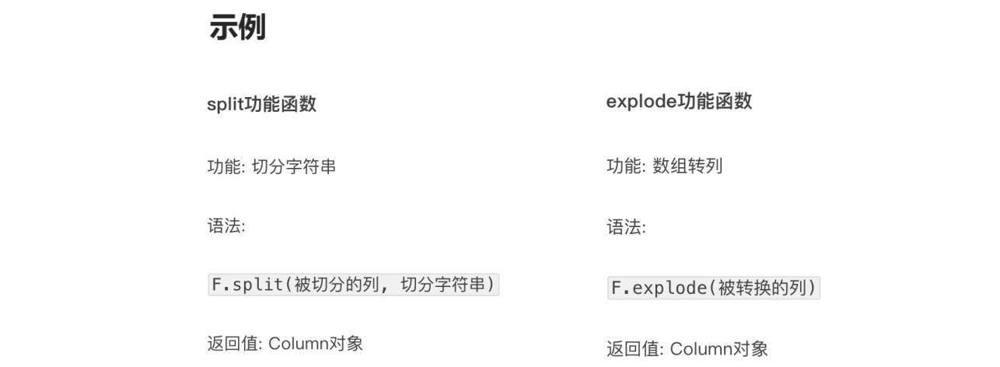

#### 案例学习

##### 词频统计案例学习

我们来完成一个单词计数需求，使用DSL和SQL两种风格来实现。

```python
import findspark
findspark.init('/usr/local/spark')
from pyspark.sql import SparkSession
from pyspark.sql import functions as F


if __name__ == '__main__':
    # 构建SparkSession对象，这个对象是 构建起模式，通过builder方法来构建
    spark = SparkSession.builder.appName('test').master('local[*]').getOrCreate()

    sc = spark.sparkContext

    # TODO: 1.SQL风格处理，以RDD为基础做数据加载
    rdd = sc.textFile('./words.txt').flatMap(lambda x: x.split(' ')).map((lambda x: [x]))

    # 转换rdd到df
    df = rdd.toDF(['word'])

    # 注册df为表
    df.createTempView('words')
    # 使用sql语句处理df注册的表
    spark.sql("""SELECT word, COUNT(*) AS cnt FROM words GROUP BY word ORDER BY cnt DESC""").show()

    # TODO: 2. DSL风格处理，纯sparksql api做数据加载
    df = spark.read.format('text').load('./words.txt')
    df.select(F.explode(F.split(df['value'], ' '))).show()

    # 通过withColumn方法  对一个列操作
    # 方法功能: 对老列执行操作，返回一个全新的列，如果列名一样，就替换 不一样 就拓展出一个列
    df2 = df.withColumn('value', F.explode(F.split(df['value'], ' ')))
    df2.groupBy('value').count().withColumnRenamed('count', 'cnt').orderBy('cnt', ascending=False).show()
    '''
    +---------+---+
    |    value|cnt|
    +---------+---+
    |   hadoop|  3|
    |    spark|  2|
    |    flink|  2|
    |     hive|  2|
    |mapreduce|  1|
    +---------+---+
    '''
```

##### 电影评分数据分析案例

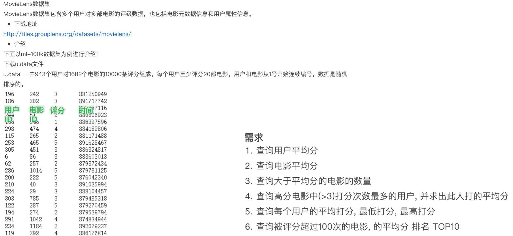

代码:

```python
import findspark
findspark.init('/usr/local/spark')
from pyspark.sql import SparkSession
from pyspark.sql import functions as F
from pyspark.sql.types import StringType, StructType, IntegerType


if __name__ == '__main__':
    # 构建SparkSession对象，这个对象是 构建起模式，通过builder方法来构建
    spark = SparkSession.builder.appName('test').master('local[*]').getOrCreate()

    sc = spark.sparkContext
    '''
    需求:
    1. 查询用户的平均分
    2. 查询电影平均分
    3. 查询大于平均分的电影的数量
    4. 查询高分电影中(>3)打分次数最多的用户，并求出此人打的平均分
    5. 查询每个用户的平均打分，最低打分，最高打分
    6. 查询被评分超过1000次的电影的平均分 排名top10
    '''
    # 读取数据集 并注册成表
    schema = StructType().add('user_id', StringType(), nullable=True).\
        add('movie_id', IntegerType(), nullable=True).\
        add('rank', IntegerType(), nullable=True).\
        add('ts', StringType(), nullable=True)
    df = spark.read.format('csv').option('sep', '\t').option('header', False).\
        option('encoding', 'utf8').schema(schema=schema).load('./data/u.data')

    df.createTempView('movie')

    # TODO: 1 用户平均分
    df.groupBy('user_id').avg('rank').withColumnRenamed('avg(rank)', 'avg_rank').\
        withColumn('avg_rank', F.round('avg_rank', 2)).orderBy('avg_rank', ascending=False).show()

    # TODO: 2 查询电影平均分
    spark.sql("""SELECT movie_id, ROUND(AVG(rank), 2) AS avg_rank FROM movie
    GROUP BY movie_id ORDER BY avg_rank DESC""").show()

    # TODO: 3. 查询大于平均分的电影数量
    print('大于平均分的电影数量: ',
          df.where(df['rank'] > df.select(F.avg(df['rank'])).first()['avg(rank)']).count())

    # TODO: 4. 查询高分电影(>3)打分次数最多的用户 并求出此人打的平均分
    # 先找出这个人
    user_id = df.where('rank > 3').groupBy('user_id').count().\
        withColumnRenamed('count', "cnt").orderBy('cnt', ascending=False).\
        limit(1).first()['user_id']
    # 计算这个人打的平均分
    df.filter(df['user_id'] == user_id).select(F.round(F.avg('rank'), 2)).show()

    # TODO: 5. 查询每个用户的平均分，最低打分 最高打分
    df.groupBy('user_id').agg(
        F.round(F.avg('rank'), 2).alias('avg_rank'),
        F.min('rank').alias('min_rank'),
        F.max('rank').alias('max_rank')
    ).show()

    # 或者用sql
    # select user_id, min(rank) as min_rank, max(rank) as max_rank, avg(rank) as avg_rank
    # from movie group by user_id;

    # TODO: 6. 查询被评分超过100次的电影，的平均分，排名top10
    df.groupBy('movie_id').agg(
        F.count('movie_id').alias('cnt'),
        F.round(F.avg('rank'), 2).alias('avg_rank')
    ).where('cnt > 100').orderBy('avg_rank', ascending=False).limit(10).show()

    # 或者用sql
    # select movie_id, count(movie_id) as cnt, avg(rank) as avg_rank
    # from movie group by movie_id having cnt > 100
    # order by avg_rank desc limit 10;
```

#### SparkSQL Shuffle分区数目

运行上述程序时，查看web ui监控页面发现，某个stage中有200个task任务，也就是说RDD有200分区partition

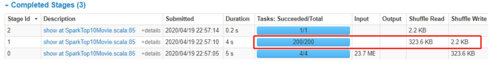

原因: 在SparkSQL中当job中产生shuffle时，默认的分区数(spark.sql.shuffle.partitions)为200，在实际项目中要合理的设置，可以设置在:
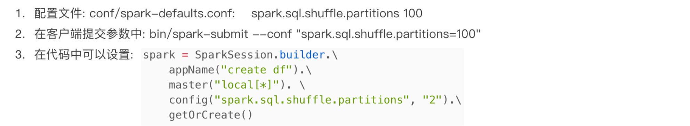

#### SparkSQL清洗数据API

##### dropDuplicates去重方法

功能: 对DF的数据进行去重，如果重复数据有多条，取第一条。

```python
# 去重API dropDuplicates，无参数是对数据进行整体去重。
df.dropDuplicates().show()
# API可以针对字段去重，
df.dropDuplicates(['age', 'job']).show()
```

##### dropna删除缺失值

功能: 如果数据中包含null，通过dropna来进行判断，符合条件就删除这一行数据

```python
# 如果有缺失值，进行数据删除
# 无参数 为how=any执行，只要有一列是null 数据整行删除，如果填入how='all' 表示全部列为空 才会删除，how参数默认是all
df.dropna().show()
# 指定阈值进行删除 tresh=3表示，有效的列最少有三个，这行数据才保留。
# 设定thresh后，how参数就无效了
df.dropna(thresh=3).show()
# 可以指定阈值，以及配合指定列进行工作
# thresh=2, subset=['name', 'age'] 表示针对这两列 有效列至少为2个才保留数据。
df.drop(thresh=2, subset=['name', 'age']).show()
```

##### fillna填充缺失值

功能: 根据参数的规则，来进行null的替换。

```python
# 将所有的空，按照你指定的值进行填充，不理会列，任何空都被填充
df.fillna('loss').show()

# 指定列填充
df.fillna('loss', subset=['job']).show()

# 给定字典 设定各个列的填充规则
df.fillna({'name': '未知姓名', 'age': 1, 'job': 'worker'}).show()
```

#### DataFrame的数据写出

统一的api语法:

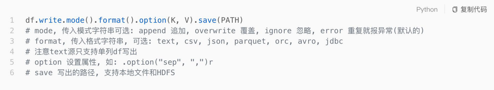

常见的源写出:

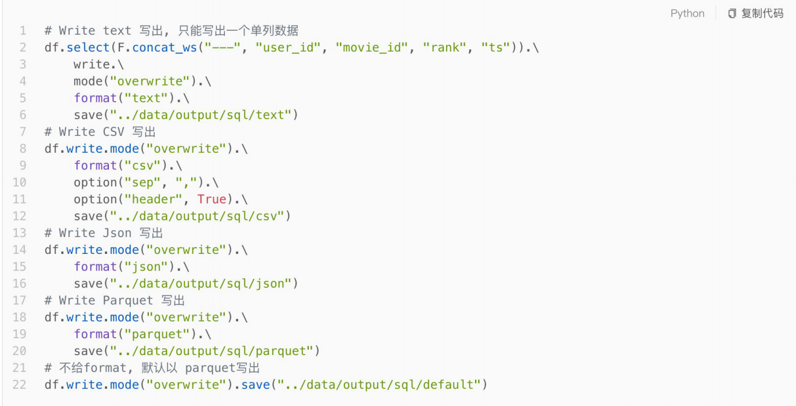

## SparkSQL函数定义

无论Hive还是SparkSQL分析处理数据时，往往需要使用函数，SparkSQL模块本身自带很多实现公共功能的函数，在pyspark.sql.functions中，SparkSQL与Hive一样支持定义函数: UDF（python只支持这一种）和UDFA，尤其是UDF函数在实际项目中使用最为广泛。

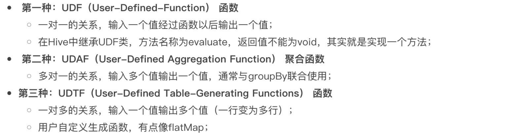

### SparkSQL定义UDF函数

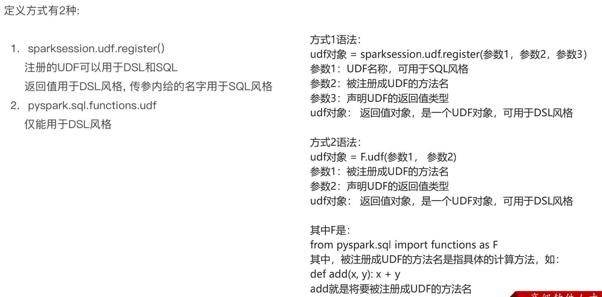

#### sparksql定义udf函数

```python
import findspark
findspark.init('/usr/local/spark')
from pyspark.sql import SparkSession
from pyspark.sql import functions as F
from pyspark.sql.types import IntegerType


if __name__ == '__main__':
    spark = SparkSession.builder.appName('test').master('local[*]').getOrCreate()

    sc = spark.sparkContext

    # 1. 构建rdd
    rdd = sc.parallelize([1, 2, 3, 4, 5, 6]).map(lambda x: [x])
    df = rdd.toDF(['num'])

    # TODO: 1. 方式1 sparksession.udf.register()  DSL和SQL风格均可使用。
    # udf的处理函数:
    def num_ride_10(num):
        return num * 10

    # 参数1: 注册的udf的名称，这个udf名称 仅可以用于sql风格
    # 参数2: udf的处理逻辑，是一个单独的方法
    # 参数3: 声明udf的返回值类型，注意: udf注册时候，必须声明返回值类型
    # 返回值对象: 这是一个udf对象，仅可以用于DSL风格
    # 当这种方式定义udf,可以通过参数1的名称用于sql风格，通过返回值对象用于dsl风格。
    udf2 = spark.udf.register('udf1', num_ride_10, IntegerType())

    # sql风格的使用
    # selectExpr 以select的表达式执行，表达式sql风格的表达式
    # select方法，接受普通的字符串字段名，或者返回值是column对象的计算
    df.selectExpr('udf1(num)').show()

    # dsl风格的使用
    # 返回值udf对象，如果作为方法使用，传入的参数一定是column对象。
    df.select(udf2(df['num'])).show()

    # TODO: 2 方式2: 仅能用DSL
    # 参数1: udf的本体方法(处理逻辑)   参数2: 返回类型。
    udf3 = F.udf(num_ride_10, IntegerType())
    df.select(udf3(df['num'])).show()
```

#### 注册一个Float返回值类型

```python
import findspark
findspark.init('/usr/local/spark')
from pyspark.sql import SparkSession
from pyspark.sql import functions as F
from pyspark.sql.types import IntegerType, FloatType


if __name__ == '__main__':
    spark = SparkSession.builder.appName('test').master('local[*]').getOrCreate()

    sc = spark.sparkContext

    # 1. 构建rdd
    rdd = sc.parallelize([1.1, 2.2, 3.3, 4.4, 5.5, 6.6]).map(lambda x: [x])
    df = rdd.toDF(['num'])

    def num_ride_10(num):
        return num * 10

    udf2 = spark.udf.register('udf1', num_ride_10, FloatType())

    df.select(udf2(df['num'])).show()
    df.selectExpr('udf1(num)').show()
    
    udf3 = F.udf(num_ride_10, FloatType())
    df.select(udf3(df['num'])).show()
```

#### 注册一个ArrayType类型的返回值udf

```python
import findspark
findspark.init('/usr/local/spark')
from pyspark.sql import SparkSession
from pyspark.sql import functions as F
from pyspark.sql.types import ArrayType, StringType


if __name__ == '__main__':
    spark = SparkSession.builder.appName('test').master('local[*]').getOrCreate()

    sc = spark.sparkContext

    # 1. 构建rdd
    rdd = sc.parallelize([['hadoop spark flink'], ['hadoop flink java']])
    df = rdd.toDF(['line'])

    def split_line(line):
        return line.split(' ')

    # 方式1
    udf2 = spark.udf.register('udf1', split_line, ArrayType(StringType()))
    df.select(udf2(df['line'])).show()
    df.selectExpr('udf1(line)').show()

    # 方式2
    udf3 = F.udf(split_line, ArrayType(StringType()))
    df.select(udf3(df['line'])).show(truncate=False)
```

#### 注册一个字典类型的返回值的udf

```python
import string
import findspark
findspark.init('/usr/local/spark')
from pyspark.sql import SparkSession
from pyspark.sql import functions as F
from pyspark.sql.types import ArrayType, StringType, StructType, IntegerType


if __name__ == '__main__':
    spark = SparkSession.builder.appName('test').master('local[*]').getOrCreate()

    sc = spark.sparkContext

    # 1. 构建rdd
    rdd = sc.parallelize([[1], [2], [3]])
    df = rdd.toDF(['num'])

    def split_line(num):
        return {'num': num, 'letter_str': string.ascii_letters[num]}

    struct_type = StructType().add('num', IntegerType(), nullable=True).\
        add('letter_str', StringType(), nullable=True)

    udf2 = spark.udf.register('udf1', split_line, struct_type)
    df.select(udf2(df['num'])).show()

    # select udf1(num)
    df.selectExpr('udf1(num)').show()

    udf3 = F.udf(split_line, struct_type)
    df.select(udf3(df['num'])).show(truncate=False)

```

### SparkSQL使用窗口函数

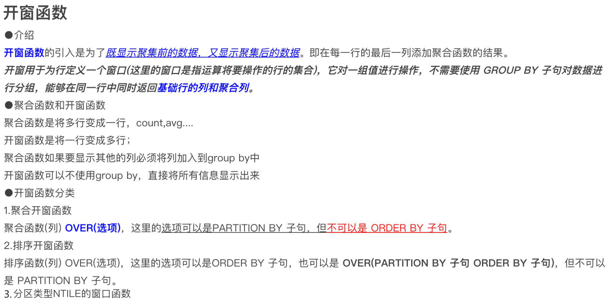

```python
import findspark
findspark.init('/usr/local/spark')
from pyspark.sql import SparkSession
from pyspark.sql import functions as F
from pyspark.sql.types import ArrayType, StringType, StructType, IntegerType


if __name__ == '__main__':
    spark = SparkSession.builder.appName('test').master('local[*]').getOrCreate()

    sc = spark.sparkContext

    rdd = sc.parallelize([
        ('张三', 'class_1', 99),
        ('王五', 'class_2', 35),
        ('王三', 'class_3', 56),
        ('李四', 'class_4', 42),
        ('王麻子', 'class_1', 98),
        ('李留', 'class_2', 35),
        ('王琦', 'class_3', 56),
        ('周军', 'class_4', 42)
    ])

    schema = StructType().add('name', StringType()).\
        add('class', StringType()).\
        add('score', IntegerType())
    df = rdd.toDF(schema)

    df.createTempView('stu')

    # TODO 聚合窗口
    spark.sql("""
        SELECT *, AVG(score) OVER() AS avg_score FROM stu
    """).show()
    """
    # 输出结果:
    +------+-------+-----+---------+
    |  name|  class|score|avg_score|
    +------+-------+-----+---------+
    |  张三|class_1|   99|   57.875|
    |  王五|class_2|   35|   57.875|
    |  王三|class_3|   56|   57.875|
    |  李四|class_4|   42|   57.875|
    |王麻子|class_1|   98|   57.875|
    |  李留|class_2|   35|   57.875|
    |  王琦|class_3|   56|   57.875|
    |  周军|class_4|   42|   57.875|
    +------+-------+-----+---------+
    """

    spark.sql('''
        SELECT *, AVG(score) OVER(PARTITION BY class) AS avg_score FROM stu
    ''').show()

    # TODO 排序窗口
    spark.sql("""
        SELECT *, ROW_NUMBER() OVER(ORDER BY score DESC) AS row_number_rank,
        DENSE_RANK() OVER(PARTITION BY class ORDER BY score DESC) as dense_rank,
        RANK() OVER(ORDER BY score) AS rank
        FROM stu
    """).show()
    """
    # 输出结果:
    +------+-------+-----+---------------+----------+----+
    |  name|  class|score|row_number_rank|dense_rank|rank|
    +------+-------+-----+---------------+----------+----+
    |  张三|class_1|   99|              1|         1|   8|
    |王麻子|class_1|   98|              2|         2|   7|
    |  王五|class_2|   35|              7|         1|   1|
    |  李留|class_2|   35|              8|         1|   1|
    |  王三|class_3|   56|              3|         1|   5|
    |  王琦|class_3|   56|              4|         1|   5|
    |  李四|class_4|   42|              5|         1|   3|
    |  周军|class_4|   42|              6|         1|   3|
    +------+-------+-----+---------------+----------+----+
    """

    # TODO NTILE
    spark.sql('''
        SELECT *, NTILE(6) OVER(ORDER BY score DESC) FROM stu
    ''').show()
    '''
    # 输出结果:
    +------+-------+-----+----------------------------------------------------------------+
    |  name|  class|score|ntile(6) OVER (ORDER BY score DESC NULLS LAST ROWS BETWEEN UNBOUNDED PRECEDING AND CURRENT ROW)|
    +------+-------+-----+----------------------------------------------------------------+
    |  张三|class_1|   99|                                            1|
    |王麻子|class_1|   98|                                            1|
    |  王三|class_3|   56|                                            2|
    |  王琦|class_3|   56|                                            2|
    |  李四|class_4|   42|                                            3|
    |  周军|class_4|   42|                                            4|
    |  王五|class_2|   35|                                            5|
    |  李留|class_2|   35|                                            6|
    +------+-------+-----+---------------------------------------------------------------+
    '''
```

## SparkSQL的运行流程

在sql中的优先级: FROM > WHERE > GROUP BY > HAVING > SELECT > ORDER BY > LIMIT

RDD的执行流程: 代码-> DAG调度器逻辑任务-> TASK调度器任务分配和管理监控-> Worker干活。

### SparkSQL的自动优化

RDD的运行会完全按照开发者的代码执行， 如果开发者水平有限，RDD的执行效率也会受到影响。而SparkSQL会对写完的代码，执行“自动优化”， 以提升代码运行效率，避免开发者水平影响到代码执行效率。

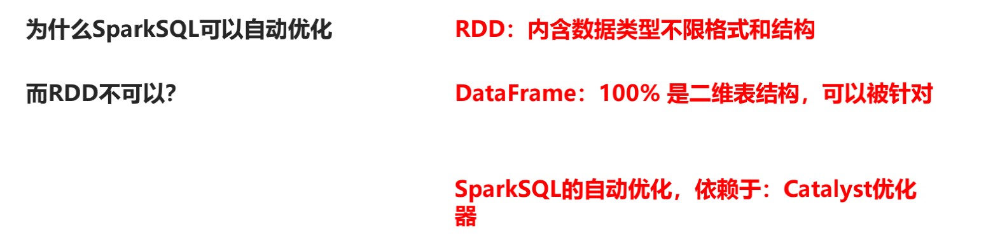

### Catalyst优化器

为了解决过多依赖Hive的问题，SparkSQL使用了一个新的SQL优化器替代Hive中的优化器，这个优化器就是Catalyst，整个SparkSQL的架构大致如下:

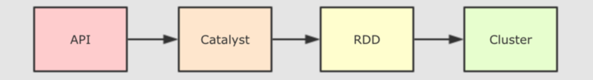

1. API层简单的说就是Spark会通过一些API接受SQL语句。
2. 收到SQL语句以后，将其交给Catalyst，Catalyst负责解析SQL，生成执行计划。
3. Catalyst的输出应该是RDD的执行计划。
4. 最终交由集群运行。

**Catalyst的具体优化**

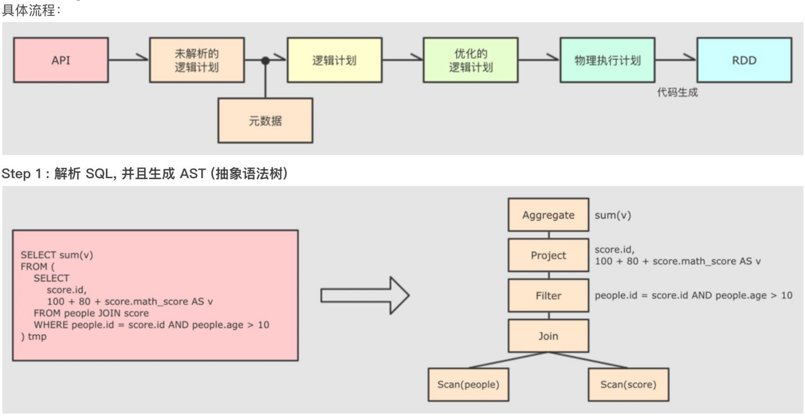

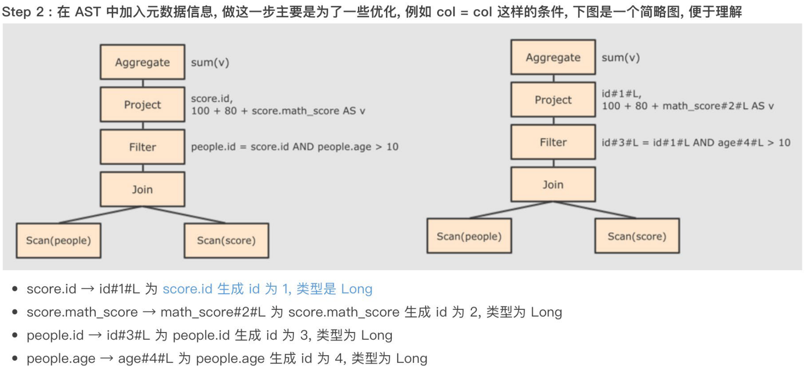

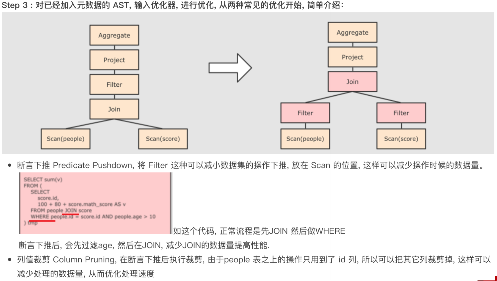

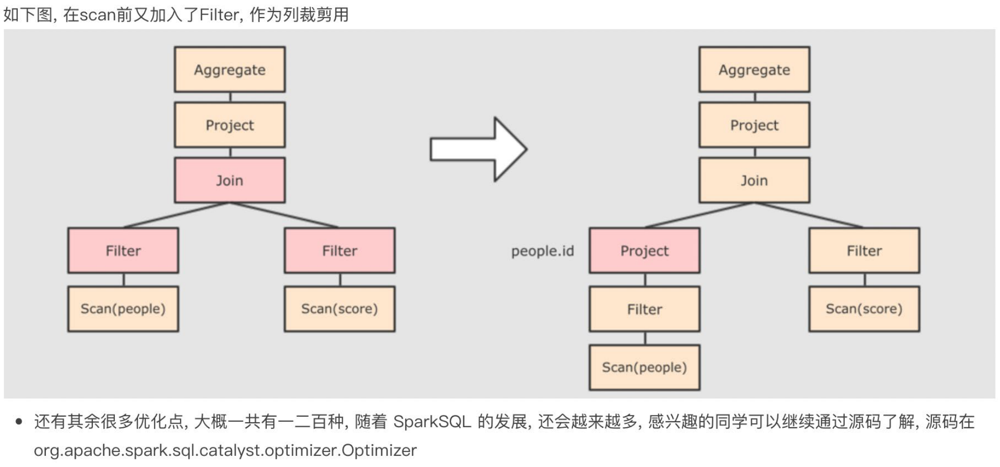

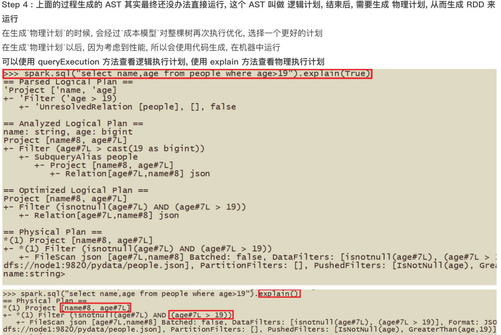

总结:
Catalyst的各种优化细节非常多，大方面的优化点有2个:

- 谓词下推(Predicate Pushdown)\断言下推: 将逻辑判断提到前面，以减少shuffle阶段的数据量。
- 列值裁剪(Column Pruning): 将加载的列进行裁剪，尽量减少被处理数据的宽度。

大白话理解:

- 行过滤，提前执行where
- 列过滤，提前规划select的字段数量。

因此，最终SparkSQL的执行流程如下:

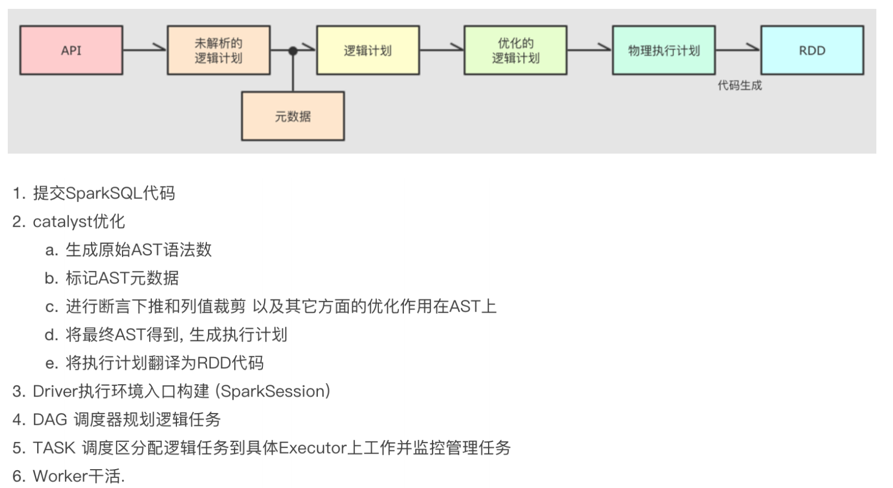

## SparkSQL整合Hive


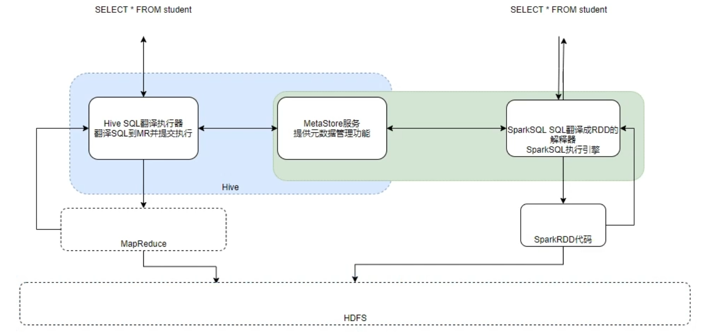

Spark借用MetaStore服务。做元数据的处理。

代码:

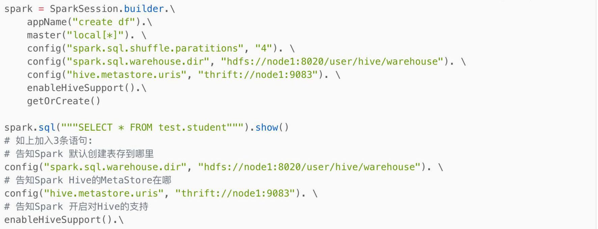


